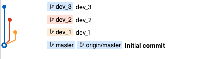
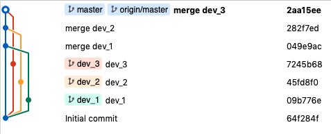
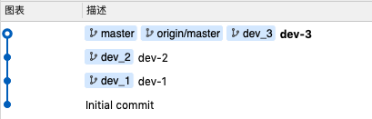

# 分支

其实很简单，就是来源**功能驱动开发（Feature-driven developer，简称 FDD）**，协作开发就得有版本管理，管理的自然就是分支了。

功能驱动开发就是：需求来了，若是功能，则建立功能分支（feature branch）；若是 bug，则建立补丁分支（hotfix branch）。完成开发后，该分支就合并到相应主分支，然后删除，版本发布后记得打上 git 标签。

## 新建/切换分支

1.新建分支

```js
git branch branchName
```


2.切换分支：

- 本地有该分支，直接切换；
- 本地没有该分支，远程有，就检出远程分支；
- 本地和远程都没有，就报错；
  
```js
git checkout branchName
```

3.切换分支：新建别切换分支，模板为当前分支

```js
git checkout -b branchName
```

4.切换分支：新建并切换分支，模板为指定分支模板

```js
git checkout -b branchName copyBranch
// 比如
git checkout -b dev origin/dev
```

5.切换分支：切换到上一个分支

```js
git checkout -
```

## 重命名分支

```js
git branch -m dev_1.0.0 feature_1.0.0
```

## 提交分支

```js
git add .
git commit -m "提交信息"
```


## 查看分支

1.查看本地分支，本地当前分支会有*号标记

```js
git branch
```

2.查看远程分支

```js
git branch -r
```

3.查看所有分支

```js
git branch -a
```

## 删除分支

1.删除本地已经合并过的分支，`-d` 是 `--delete` 缩写

```js
git branch -d branchName
```

2.丢弃没有被合并过的分支

```js
git branch -D branchName
```

3.强制删除，加参数 `-f` 或 `--force`

```js
git branch -d branchName -f
```

4.删除远程分支

- 删除分支; 
- 推送空内容，等于删除；

```js
git push origin -d branchName
git push origin --delete branchName
git push origin :branchName
```

## 贮藏分支

本地有修改，未提交的，远程也有修改的，那就本地贮藏，然后获取远程，最后在获取本地贮藏。

1.贮藏工作区代码

```js
git stash
git stash save "贮藏名称"
```

2.查看贮藏列表

```js
git stash list
```

3.使用贮藏代码

```js
// 使用后立即删除贮藏
git stash pop

// 使用后不删除贮藏
git stash apply

// 接着再删除
git stash drop
```

## 遴选

修复提交版本复制到当前开发分支

```js
git cherry—pick commitId
```

## 同步分支

删除远程仓库已经删除的分支

```js
git pull -p
```

`-p` 即 `--prune`，修剪的意思，

## 合并分支

### merge 与 rebase

比如现在开发分支是这样的



1.merge 合并：会生成一个新的节点，之前的提交分开显示



2.rebase 合并：不会生成新的节点，将两个分支融合成一个线性的提交，就好像你从公共分支又重新拉出来这个分支一样，即重新设置基线



### 两者冲突如何解决

1.merge

```js
解决冲突
git add .
git commit -m "解决冲突说明"
```

2.rebase

保持 `master` 分支是最新状态 `git pull --rebase`，然后切换到 `dev_1` 分支，然后 `git rebase master`

```js
1.解决冲突
2.git add .
3.git rebase --continue
```

重复1、2、3，直至出现输出 `applying` 

解决完冲突，再切换到 `master` 分支，然后 `git merge dev_1`

## 总结一下

- 如果想要简洁的提交树，那就使用 `rebase`，从而方便 code review;
- 如果想看到合并过程记录，那就使用 `merge --no-ff`;
- 详细[rebase信息可查看](./rebase.md)

## 选项参数说明

- 删除 `-d`、`--delete`
- 强制 `-f`、`--force`
- 强制删除 `-D`、`--delete --force`
- 移动或重命名 `-m`、`--move`
- 强制移动或重命名 `-M`、`--move --forece`
- 远程 `-r`、`--remote`
- 所有 `-a`、`--all`