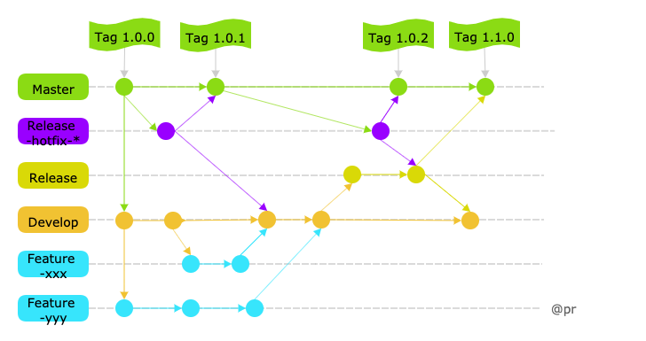
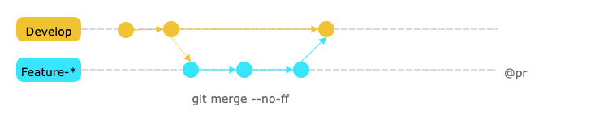
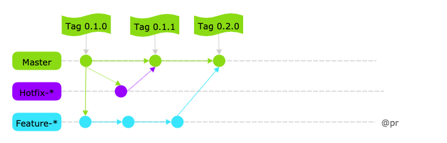
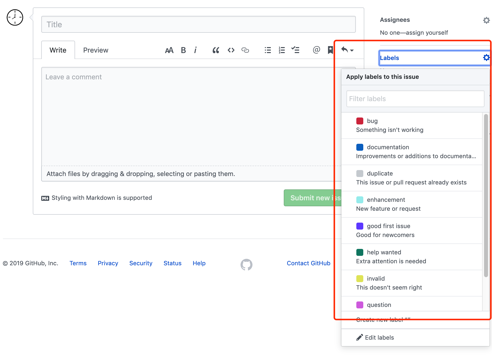
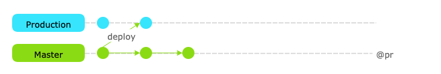
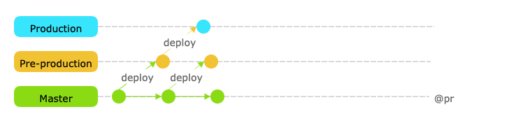
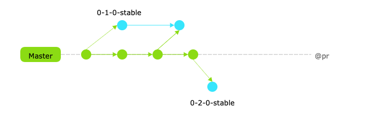

# 工作流

Git 作为一个源码管理系统，多人协作才能看到其价值。这和 github 社会化编程相互辉映，成就彼此。既然协作，就得有一个规范化的工作流程，让大家有效地合作，使得项目井井有条地发展下去。**工作流程**可以称为 "workflow" 或"flow"，即水流，比喻项目像水流那样，顺畅、自然地向前流动。

对于工作流程方式，常用 3 种方式

- Git flow
- Github flow
- Gitlab flow

## Git flow

这个工作流是 Vincent Driessen 2010 年发布出来的分支管理模型，热度非常高，我安利的也是这个，公司管理项目也是这么玩的。

- 按功能划分，可分为 5 种分支**Master、Develop、Release、Feature 和 Hotfix**；
- 按生命周期划分，可分为**长期分支和暂时分支**，更贴切地说，主要分支和协助分支；

| 分支           | 分支名称 | 生命周期 | 描述                                                                                                                |
| :------------- | :------- | :------- | :------------------------------------------------------------------------------------------------------------------ |
| Master         | 主分支   | 长期     | 从这个分支上检出的都是稳定的发布版，版本发布后记得打上 git 标签。好处是，在测试的时候，不影响下一个版本功能并行开发 |
| Release-hotfix | 修复分支 | 暂时     | 用于线上紧急 bug 修复，修复后，合并回 Master 和 Develop，然后删除分支                                               |
| Release        | 预发分支 | 暂时     | 从 Develop 检出 Release 分支，修改后提交，测试发布后，合并到 Master 和 Develop，然后删除分支                        |
| Develop        | 开发分支 | 长期     | 用于日常开发，存放最新的功能，完成一个版本合并到这里                                                                |
| Feature        | 功能分支 | 暂时     | 用来做功能开发，从 Develop 检出，有 5 个人开发可建 5 个 Feature-* 分支，完成后再合并到 Develop，然后删除分支        |



总结下

- Master 检出 Hotfix、Develop 分支，合并 Hotfix、Release 分支，然后打标签；
- Develop 检出 Feature、Release 分支，合并 Feature、Release、Master 分支；
- 被合并的分支删可立即除掉；

### Merge

即合并分支，这个阶段加上参数 `no-ff`，即策略合并，这这种方式会多以合并提交，好处是保证一个非常清楚的提交历史，可以看到被合并分支的存在，我想这也是分支存在的一起所在。相反，不要选择默认合并方式 `Fast-Forword`。




怎么样，上面流程配色是否很舒服和分支流向是否很清晰？

### 完美背后的瑕疵

虽然 Git Flow 解决了项目管理的分支管理，但实际使用过程中，还是有一些问题：

- Release 分支在版本快速迭代的项目中，几乎用不到，刚开发完就直接合并到 Master 发版，出现问题 Develop 分支直接修复发布下个版本就可以了；
- Hotfix 从 Master 检出，完成后合并到 Master 分支；Release 分支 Develop 检出，完成后合并到 Master 分支和 Develop 分支，实际项目管理中，很多开发者会忘记合并回 Master 分支和 Develop 分支；

## Github flow

最简单的一种工作流程方式，开源项目就是采用这种方式，含**Master + Feature(含 Hotfix)**。

- Master 主分支
- Feature 功能分支（Hotfix 补丁分支，补丁也可以看做功能）



### 说明

- Master 是唯一分支，永远是可发布状态。一般主分支都设置 `protected` 分支保护，只有有权限的人才能推送代码到 Master；
- 若有新功能（补丁也是一种功能），从 Master 检出新分支；
- 本地分支提交代码，保证按时向远程仓库推送；
- 功能开发完毕，可以发起一个 pull request（PR），PR 既是一个通知，让别人注意到你的请求，也是一种对话机制，社会开发人员一起评审和讨论你的代码，这个过程中可继续提交代码;
- 当 review 或者讨论通过后，代码会合并到目标分支；
- 一旦合并到 Master，应该立即发布，部署后，检出的分支立即删除（本地与远程同步）；

### 最大特色

在我看来，Github flow 最大特色就是 PR，这是一个伟大的发明，除了**分支合并**功能，还有

- 可以很好控制分支合并权限；
- 分支不是你想合并就合并，需要对方同意；
- 对于"持续发布"的产品，再合适不过；
- 问题讨论或寻求其他小伙伴们的帮助，就和拉个群差不多，可以选择相关的人参与，而且参与的人还可以向你的分支提交代码，可以说，是非常适合社会化编程代码交流。
- 代码 Review，如果代码写的不友好，有了 pull request 提供的评论功能支持，可以接受 review 的实时吐槽；
  
### 问题追踪

日常开发中，会用到第三方库。使用过程中，出现了问题，第一个反应是去这个第三方库的 GitHub 仓库去搜索一下 issue ，看没有人遇到过，项目维护者修复了没有，一般未解决的 issue 是 open 状态，已解决的会被标记为 closed。这就是问题追踪 issue tracking（issue 解决效率也是选用第三方库的一个标准）。

如果你第三方库（开源项目）的维护者，除了标记 issue 的状态（open 和 closed），还可以给它标记上不同的标签，来优化项目。当提交的时候，如果提交信息中有 fix #1 等字段，可以自动关闭对应编号的 issue。



不得不说**问题追踪**非常适合开源项目。Github 社区使用的就是这个工作流模型，可以建个项目耍耍，拉进直男间的距离，哈哈。

### Github flow 完美背后的瑕疵

GitHub Flow 是简化了 Git Flow，就一个长期分支 Master，同时提供了图形界面工具，一定程度上避免了一些问题，但还是有一些实际问题:

- 版本的延迟发布（例如 iOS 应用审核到通过中间，此时要往 Master 上推送代码）;
- 不同环境的部署；
- 不同版本发布与修复，一个 Master 分支不够用啊（臣妾做不到啊）；

## Gitlab flow

年轻的工作流模式，站在巨人的肩膀上，集两种方式之长，补其之短。既有适应不同开发环境的弹性（分支策略），又有单一主分支的简单和便利（PR 和 issue tracking）。

### 版本的延迟发布

一个 Master 分支不够，那就添加了一个分支 Prodution，专门用来发布版本。



### 不同环境的部署及上游优先

在 Master 分支之外，再建两个环境分支：

| 分支           | 环境分支 | 上下游                       |
| :------------- | :------- | :--------------------------- |
| Master         | 开发分支 | 功能分支是开发分支的"上游"   |
| Pre-production | 预发分支 | 开发分支是预发分支的"上游"   |
| Production     | 生产分支 | 预发分支又是生产分支的"上游" |

```js
Feature -> Master -> Pre-production -> Production
```

若代码的变化，必须由"上游"向"下游"发展，即合并顺序，按环境依次推送，确保代码测试过，从上游分支合并到下游分支。紧急情况下，才允许跳过上游，直接合并到下游分支，即 upstream first，上游优先。



### 版本发布分支

对外发布版本的记录是非常重要的。线上出现了一个问题，需要拿到问题出现对应版本的代码，才能准确定位问题。在 Git Flow，版本记录是通过 Master 上的 Tag 来记录。发现问题，创建 Hotfix 分支，完成之后合并到 Master 和 Develop。

在 GitLab Flow ，建议的做法是每一个稳定版本，都要从 Master 分支拉出一个分支，比如 0-1-0-stable、0-2-0-stable 等等。发现问题，就从对应版本分支创建修复分支，完成之后，先合并到 Master。若此时还有预发布分支，还要合并到 Release 分支，遵循 “上游优先” 原则。



## 参考

- [Git 工作流程](http://www.ruanyifeng.com/blog/2015/12/git-workflow.html)
- [Git三大特色之WorkFlow(工作流)](https://blog.csdn.net/qq_32452623/article/details/78905181)
