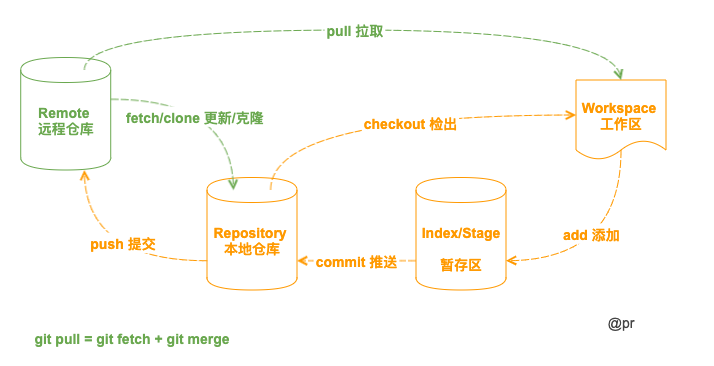
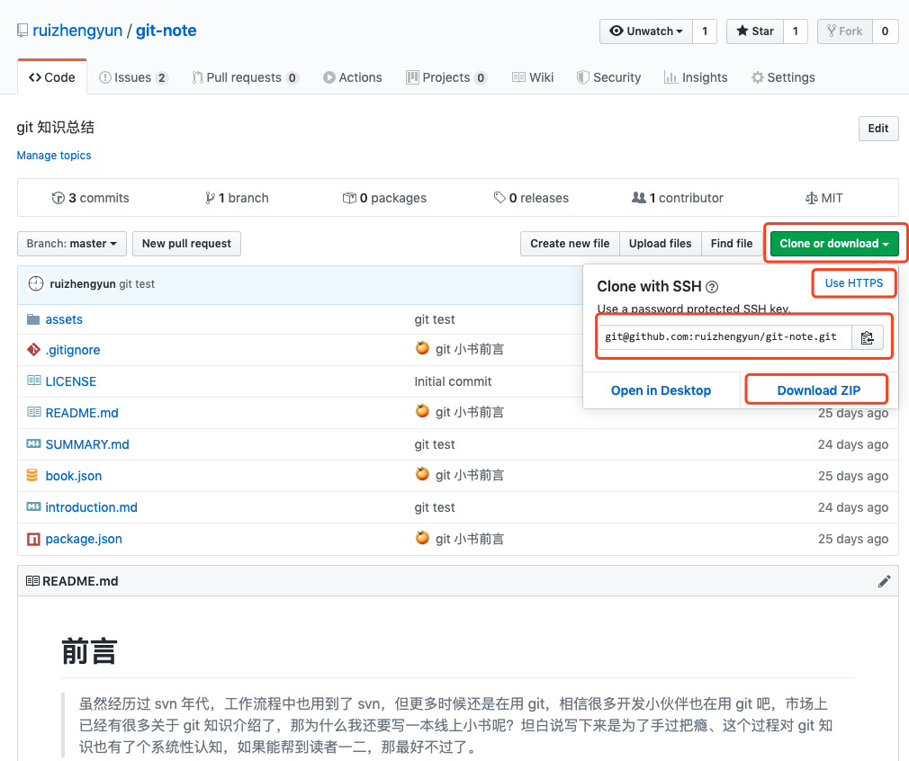
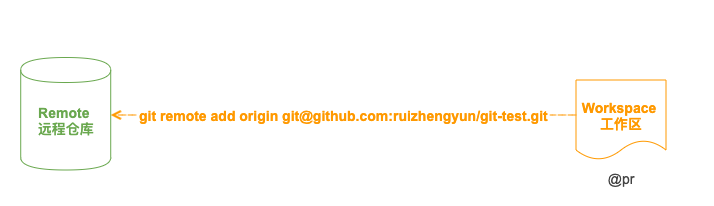

# Git

Git 原型程序是 Linux 创始人 Linux Torvalds 在2015年开发的。

## 什么是版本管理

管理更新的历史记录。记录软件添加、更改的过程，回滚到特定阶段，恢复误删除的文件等。

## 初始设置

```js
// 查看列表
git config --list
// 或
git config -l

// 设置用户名和邮箱
git config --global user.name "你的名字"
git config --global user.email "你的邮箱地址"

// 设置编码
git config --global gui.encoding utf-8
git config --global i18n.commitencoding utf-8
git config --global i18n.logoutputencoding gbk
```

可通过命令 `cat ~/.gitconfig` 查看设置文件

> 提高命令输出的可读性

```js
git config --global color.ui auto

[color]
    ui = auto
```

## 版本库



## 创建版本库

1.从远程检出目录（从远程库克隆）

- 默认将用远程项目的名字作为项目文件夹名称；
- 如果检出的远程项目的名字已存在且不为空，就会报错；
- 默认情况下 clone 只能检出 Master 分支，检出后 `git branch -r `查看远程分支，然后在 checkout 对应的远程分支;



```js
git clone url

// 自定义项目名称
git clone url projectName
```

2.新建一个目录

```js
git init projectName
```

3.初始化仓库。当前目录创建好后，会有一个空的仓库（empty Git repository），该目录下多了一个 `.git` 的目录，用来跟踪管理版本库的，不要手动修改这个文件，不然容易把仓库给破坏了。

```js
git init
```

## 关联远程仓库

- github 站点建一个空仓库；
- 把一个已有的本地仓库与之关联；



```js
// 关联
git remote add origin git@github.com:ruizhengyun/git-test.git

// 查看详细信息
git remote -v
```

## 拉取代码

1.将某个远程主机的更新全部取回本地

```js
git fetch <远程主机名>
```

2.取回特定分支的更新

```js
git fetch <远程主机名> <分支名>
```

3.获取回更新后，会返回一个 FETCH_HEAD ，指的是分支所在服务器上的最新状态（查看红色与绿色部分）

```js
git log -p FETCH_HEAD
```

## 更新代码

1.默认更新

- 从远程主机的分支拉取最新内容 
- 将拉取下来的最新内容合并到当前所在的分支中
  
```js
git pull
git pull = git fetch + git merge FETCH_HEAD

git pull --rebase
或 git pull -r
git pull -r = git fetch + git rebase FETCH_HEAD
```

2.拉取的具体的远程分支

```js
git pull origin develop
```

3.如果抓取的分支有更新，此时你的工作区也有修改

```js
// 建立本地分支和远程分支的关联
git branch --set-upstream-to=origin/dev dev
git pull origin branchName
```

4.本地有修改，但想用远程分支覆盖本地分支

```js
git fetch
git reset --hard orgin/master
```

5.本地有修改，未提交的，远程也有修改的，那就本地贮藏，然后获取远程，最后在获取本地贮藏

```js
git stash
git pull
git stash list
git stash pop stash@{0}
```

6.同步远程分支（远程删除分支，本地执行该命令）

```js
git pull -p
```

## 提交代码

1.查看仓库的状态

```js
git status
```

2.提交代码到暂存区，`.` 代表所有文件

```js
git add .
```

3.如果遇到并行进程提交而失败，删除锁文件即可

```js
rm -f ./.git/index.lock
```

4.将暂存区代码提交到本地仓库

```js
git commit -m "就提交内容作个提交说明"
```

5.提交之前从远程拉取项目，更新一下，避免提交失败

```js
git pull
```

6.如果有冲突文件，针对冲突文件进行处理

```js
git diff
```

7.提交

```js
// 分支首次提交，远程还没有该分支，远程新建分支
git push --set-upstream origin branchName

// 指定推送到具体分支，与上面的代码等效
git push origin branchName

// 默认推送到对应分支
git push
```

## 日志提交记录

1.查看提交历史，以便确定要回退到哪个版本

```js
// 默认都有一个 SHA-1 校验和、作者的名字和电子邮件地址、提交时间
git log

// 格式化
git log --pretty=online

// 图形展示
git log --graph --pretty=oneline --abbrev-commit

// 显示文件的改动（提交后的）
git log -p [fileName]
```

2.查看命令历史，以便确定要回到未来的哪个版本

```js
git reflog
```

3.参数组合

```js
// 查看某人的提交记录
git log --author=提交人名字
```

4.格式化

```js
git log --pretty=format:"%h - %an, %ar : %s" --author=提交人名字 
git log --pretty=format:"%h - %an, %ar : %s" --author=提交人名字 --since=2.weeks
git log --grep=收退款 --oneline --pretty=format:"%h - %an, %ar : %s"

// 2019 年 8-11 月期间，ranhj 提交的记录
git log --pretty=format:"%h - %an, %cd : %s" --author=ranhj --since="2019-08-01" --before="2019-11-30"
```

> 格式占位符写法及其代表的意义

| 选项 | 说明                                       |
| :--- | :----------------------------------------- |
| %H   | 提交对象（commit）的完整哈希字串           |
| %h   | 提交对象的简短哈希字串                     |
| %T   | 树对象（tree）的完整哈希字串               |
| %t   | 树对象的简短哈希字串                       |
| %P   | 父对象（parent）的完整哈希字串             |
| %p   | 父对象的简短哈希字串                       |
| %an  | 作者（author）的名字                       |
| %ae  | 作者的电子邮件地址                         |
| %ad  | 作者修订日期（可以用 -date= 选项定制格式） |
| %ar  | 作者修订日期，按多久以前的方式显示         |
| %cn  | 提交者(committer)的名字                    |
| %ce  | 提交者的电子邮件地址                       |
| %cd  | 提交日期                                   |
| %cr  | 提交日期，按多久以前的方式显示             |
| %s   | 提交说明                                   |

> 命令支持的选项

| 选项              | 说明                                                                                                  |
| :---------------- | :---------------------------------------------------------------------------------------------------- |
| -p                | 按补丁格式显示每个更新之间的差异。                                                                    |
| --word-diff       | 按 word diff 格式显示差异。                                                                           |
| --stat            | 显示每次更新的文件修改统计信息。                                                                      |
| --shortstat       | 只显示 --stat 中最后的行数修改添加移除统计。                                                          |
| --name-only       | 仅在提交信息后显示已修改的文件清单。                                                                  |
| --name-status     | 显示新增、修改、删除的文件清单。                                                                      |
| --abbrev-commit   | 仅显示 SHA-1 的前几个字符，而非所有的 40 个字符。                                                     |
| --relative-date   | 使用较短的相对时间显示（比如，“2 weeks ago”）。                                                       |
| --graph           | 显示 ASCII 图形表示的分支合并历史。                                                                   |
| --pretty          | 使用其他格式显示历史提交信息。可用的选项包括 oneline，short，full，fuller 和 format（后跟指定格式）。 |
| --oneline         | --pretty=oneline --abbrev-commit 的简化用法。                                                         |
| -(n)              | 仅显示最近的 n 条提交                                                                                 |
| --since, --after  | 仅显示指定时间之后的提交。                                                                            |
| --until, --before | 仅显示指定时间之前的提交。                                                                            |
| --author          | 仅显示指定作者相关的提交。                                                                            |
| --committer       | 仅显示指定提交者相关的提交。                                                                          |

## 查看改动

1.查看工作区与暂存区间更改前后的差别

```js
git diff [filename]
```

## 撤销（还没 `git commit`）

```js
// 暂存区撤销（就是已经 add 过了）
git reset HEAD file

// 工作区的撤销
git checkout -- file
```

注意

- `HEAD` 表示最新的版本；
- 命令中的 `--`，如果不加上就是切换分支了，是不是？

## 版本回退（已经 `git commit` 过了）

```js
// 回退到上 1 个版本就用 1 个 ^
git reset --hard HEAD^

// 回退到上 2 个版本就用 2 个 ^
git reset --hard HEAD^^

// 回退到上 20 个版本就用 20 个 ^（肯定不能这么干），可以
git reset --hard HEAD~20

// 回退到具体版本，可用 commit id
git reset --hard f13202
```

你会发现版本回退速度非常快，因为其内部有个指向当前版本的 HEAD 指针，当回退版本时，只需把 HEAD 指针改变指向，所以当你让 HEAD 指针指向哪个版本号，工作区文件就更新到那个版本了。

```js
┌────┐
│HEAD│
└────┘
   │
   └──> ○ react
        │
        ○ vue
        │
        ○ angular

改为指向 vue：

┌────┐
│HEAD│
└────┘
   │
   │    ○ react
   │    │
   └──> ○ vue
        │
        ○ angular
```

## 删除文件

```js
git rm file
```
