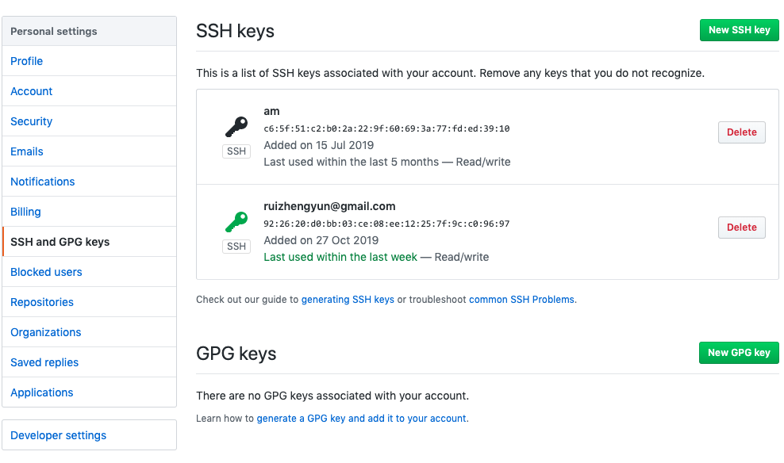
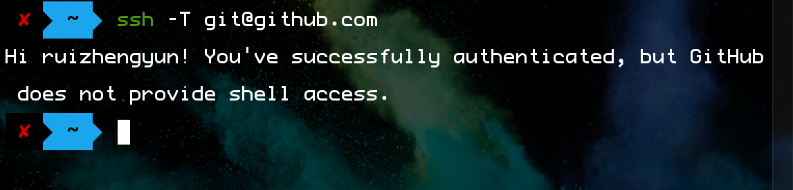
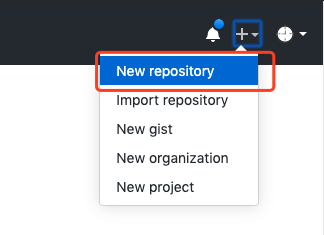
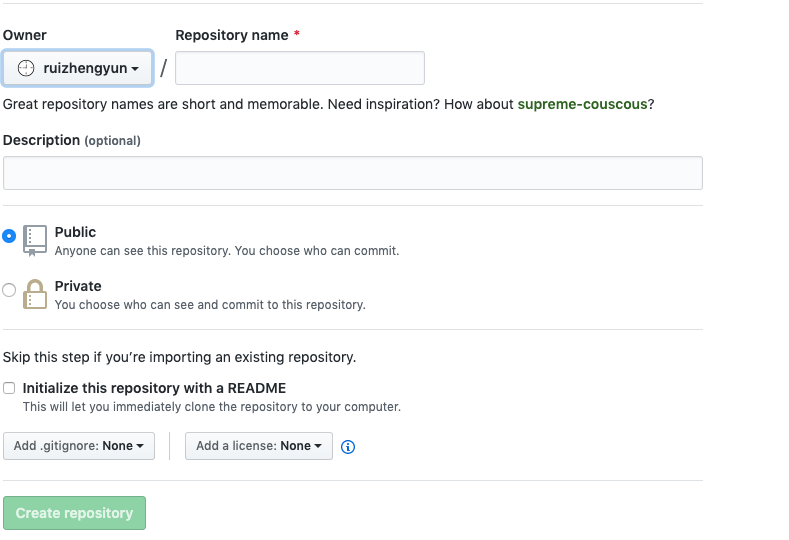
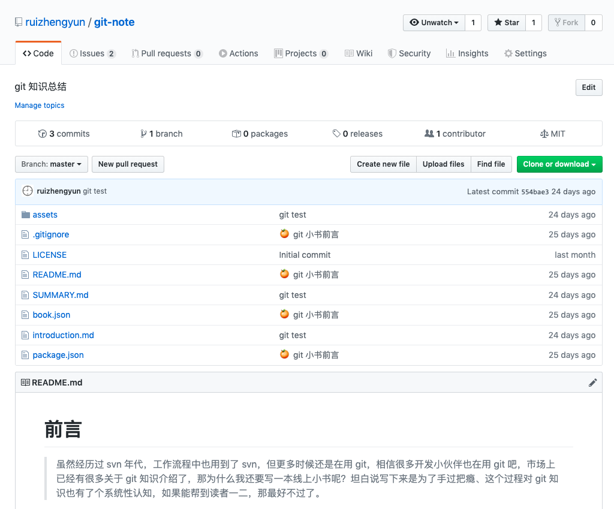
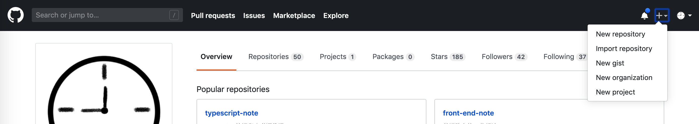
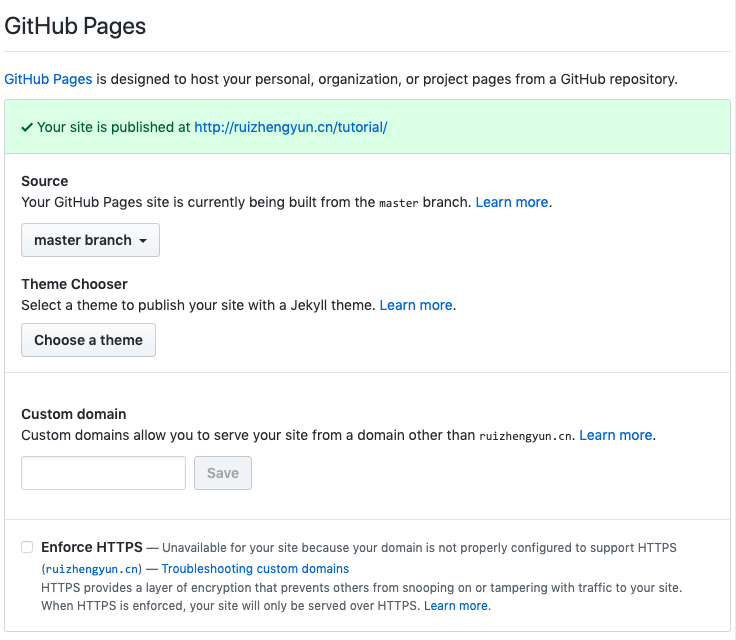
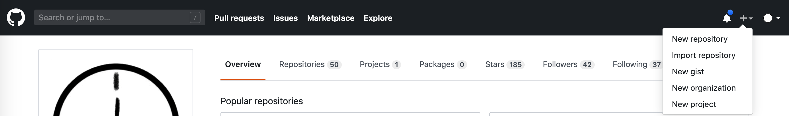
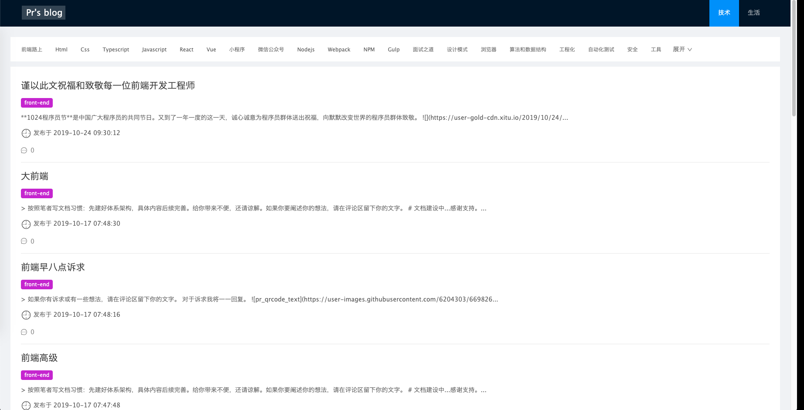

# Github 介绍

## 什么是 Github

GitHub 是为开发者提供Git仓库的托管服务，一个让开发者与朋友、同事、同学及陌生人共享代码的场所。

## Github 带来的变化

- 协作形式变化
  - 开发者间的化学作用PR（pull Request）
  - @用户进行评论
  - GFM（Github Flavored Markdown）语法
- 看到企业内部其他团队的软件
  - watch 仓库便能实时看到新功能和bug修正信息
  - 可以参与，pr代码
- 与开源软件相同的开发模式

## 社会化编程

Social coding，这一形式影响了全世界的程序员，试一次软件开发革命。在 Github 出现之前，软件开发只有小部分人拥有更改源代码的权利。现在，所有人都可以平等地拥有这种权利。

## 账户创建

### 设置 SSH Key

Github 上的仓库连接是使用 SSH 的公开密钥认证方式进行的。这也是克隆项目如果用 HTTP 没什么问题，但是用 ssh，如果你的 key 没有添加到 github 账户中就会报错。那如何生成 key 并添加到账户呢？

一路回车到底

```js
ssh-keygen -t rsa -C xxx@163.com
```

### 添加公钥

1.查看公钥

```js
cat ~/.ssh/id_rsa.pub
```

2.添加到 github 账户中



3.检测是否成功

```js
ssh -T git@github.com
```



## 仓库的创建

1.创建



2.表单填写



- Repository name
- Description
- Public/Private
- Initialize this repository with a README（建议不勾选，手动push）
- Add .gitignore，把不需要在 Git 仓库中管理的文件省略，比如 `node_modules`
- Add a license，许可协议文件

2.完成后



## 键盘快捷键

各个页面按下 `shift + /` 都可以打开键盘快捷键一览表。

## 工具栏



- **LOGO**，点击GitHub的LOGO就会进入控制面板。
- **Search（搜索）**，输入想找的用户或代码片段，就可以搜索到与之相关的信息
- **Pull requests（拉取请求）**，这里查看用户仓库最新的推送请求信息。
- **Issues（问题）**，查看用户最新的问题推送信息。
- **Marketplace（市场）**，提供最新的软件，是代码软件集市。
- **Explore（探索）**，从各个角度介绍GitHub上的热门软件。
- **+**，创建新的仓库、旧仓库搬家、管理发布一些没有必要保存在仓库中的代码、登录组织和项目（绑定仓库）
- **头像、用户**，查看用户资料、仓库、项目、关注仓库、Gists、帮助、设置、退出登录

## 控制面板

- **News Feed - Recent activity and All activity（新闻提要）**，显示当前已 Follow 的用户和已 Watch 的项目的活动信息，可以在这里查看最新动向。
- **Your repositories**，按更新时间顺序显示用户的仓库。标有钥匙图案的是非公开仓库，标有类似字母Y图案的是用户Fork过的仓库。

## 个人信息

- **访问地址**，`https://github.com/用户名`
- **用户信息**，显示注册用户的基本信息，包括姓名、所属公司、邮箱地址、已加入的 Organization 等。如果对该用户感兴趣，可以点击页面下方的Follow按钮。这样一来，这个人在 GitHub 上的活动都会显示在您的 News Feed 中。
- **Overview（概述）**，展示固定的仓库、贡献活跃度和贡献活动。
- **Repositories（所有仓库）**，显示该用户公开的仓库，仓库名称、简要说明、使用的语言、最终更新日期都会出现在列表中。星星图案旁边的数字表示给这个仓库添加 Star 的人数，旁边是 Fork 数。
- **Projects（所有项目）**，项目可以和仓库绑定，提供看板等。
- **Stars（所有仓库的收藏、点赞数）**
- **Followers（用户被关注的）**
- **Following（用户关注的）**

## 仓库

- **地址形式**，`https://github.com/用户名/仓库名`
- Used by/Watch/Star/Fork
- **Code（文件列表）**，仓库名下方是该仓库的简单说明和URL。
  - **commits**，查看当前分支的提交历史
  - **branches**，查看仓库的分支列表
  - **packages**
  - **releases**，显示仓库的标签（Tag）列表。同时可以将标签加入时的文件以归档形式（ZIP、tar.gz）下载到本地。软件在版本升级时一般都会打标签，如果需要特别版本的文件，可以从这里寻找 `git show tagName`，然后可以根据 commitId 回滚
  - **contributors**，显示对该仓库进行过提交的程序员名单。如果您也对该仓库发送过Pull Request并被采纳，那么在这里就能找到自己的名字。左边的数字是程序员的人数。
  - **MIT**，协议 
- **Issues**，用于 BUG 报告、功能添加、方向性讨论等，将这些以 Issue 形式进行管理。Pull Requests 时也会创建 Issue。旁边显示的数字是当前处于 Open 状态的Issue 数。
- **Pull Requests**，在 Pull Requests 中可以列表查看并管理 Pull Request。代码的更改和讨论都可以在这里进行。旁边显示的数字表示尚未 Close 的 Pull Request 的数量。
- **Actions**，GitHub 的持续集成服务
- **Projects**，
- **Wiki**，是一种比HTML语法更简单的页面描述功能。常用语记录开发者之间共享的信息或软件文档。数字表示当前 Wiki 的页面数量。
- **Security**，
- **Insights**，洞察信息
  - **Pulse（脉率）**：显示该仓库最近的活动信息。该仓库中的软件是 无人问津，还是在火热的开发之中，从这里可以一目了然。
  - **Graphs（图表）**：以图表形式显示该仓库的各项指标。让用户轻松了解该仓库的活动倾向。
- **Setting**，更改当前仓库的设置。用户必须拥有更改设置的权限才能看到这个菜单。

## 文件的相关操作

点开文件后会显示出文件的内容，同时右上角会显示用于该文件的菜单。

- **Edit**，可以对文件内容进行编辑并提交。
- **Raw**，可以直接在浏览器中显示该文件的内容。使用这个URL，就能通过HTTPS协议获取该文件。
- **Blame**，能够按行显示最新提交的信息。
- **History**，可以查看该文件的历史记录。
- **Delete**，可以删除这个文件。

文件内容的左侧会显示该文件的行号。假如我们点击**第 10 行的行号**，这一行就会被高亮标记为黄色，同时URL末尾会自动添加 `#L10`。使用这儿 URL，程序员们在交流时，就可以将讨论明确指向某一行。另外，如果将 `#L10` 改为 `#L10-L20`（使用 `shift + 单击行号 20` 也可以），则会标记该文件的**第 10 到 20 行**。

## 查看差别

在GitHub上，直接修改URL就可以让用户以多种形式查看差别

- 查看分支间的差别，`https://github.com/umijs/umi/compare/master...2.5.x`，这样，就可以查看两个分支间的差别了。
- 查看与几天前的差别，`https://github.com/umijs/umi/compare/master@{90.day.ago}...master`，指定期间可以使用以上四个时间单位。如果差别过大则不会列出所有提交，只显示最近的比部分。
  - day
  - week
  - month
  - year
- 查看与指定日期之间的差别，`https://github.com/umijs/umi/compare/master@{2019-10-1}...master`，查看 master 分支2019年10月1日与现在的区别

> 由于可以从多种角度查看差别，所以GitHub也称得上是一个优秀的源代码查看器。

## Issue

在软件开发过程中，开发者为了跟踪BUG及进行软件相关讨论，进而方便管理，创建了Issue。管理Issue的系统成为BTS（Bug Tracking System，BUG跟踪系统）。
GitHub也为自身加入了BTS功能。在GitHub上，可以将它作为软件开发者之间的交流工具，多多加以利用。一下几种情况可以使用这个功能：

- 发现软件的BUG并报告
- 有事想向作者咨询、探讨
- 事先列出今后准备实施的任务
- 博客文章

Issue 除 BUG 管理之外还有许多其他用途。在软件开发者的圈子中，将 Issue 用于多种用途的情况已经司空见惯。

## Setting

- **GitHub Pages**，GitHub有一个名为 GitHub Pages 的仓库，用户可以利用该仓库中的资料创建 Web 页，用来发布仓库中软件的相关信息。如果已经创建国 GitHub Pages，则会显示相应 URL。





## 其他功能

- [GitHub API](https://developer.github.com/)，比如我的博客就是用 github api 读取 github issues 列表和详情

