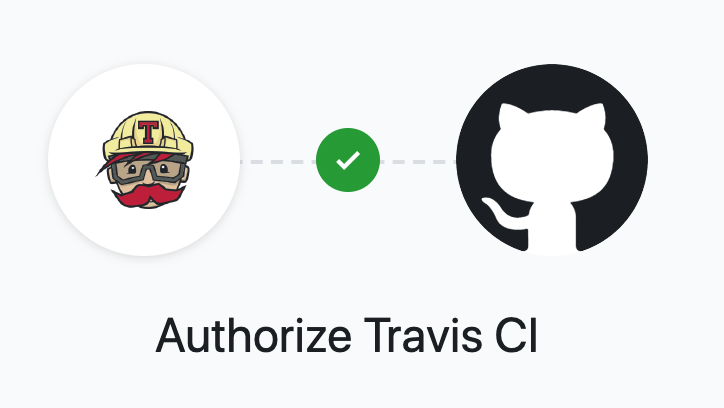
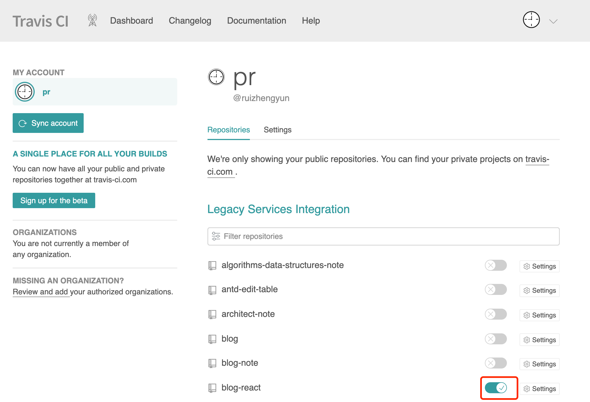

# Travis CI

软件开发除了要编写代码，还需要**构建（build）和测试（test）**。为了提高开发效率，同时也使开发流程更可靠和专业化，就需要自动化工具。今天介绍的就是 [Travis CI][]。不过我们先了解下持续集成。



## 持续集成

持续集成指的是只要代码有变更，就自动运行构建和测试，反馈运行结果。确保符合预期以后，再将新代码"集成"到主干。其作用在于，每次代码的小幅变更，就能看到运行结果，从而不断累积小的变更，而不是在开发周期结束时，一次合并大量代码。

## Travis CI 作用

- 提供的是持续集成服务（Continuous Integration，简称 CI）。
- 绑定 Github 上面的项目，只要有新的代码，就会自动抓取。
- 提供一个运行环境，执行测试，完成构建，还能部署到服务器。

## 前提条件

Travis CI 只支持 Github，不支持其他代码托管服务。即必须满足以下条件：

- 拥有 Github 账号
- 帐号下面至少有一个项目
- 项目里有可运行的代码
- 项目包含构建或测试脚本

## 步骤流程

### 关联 Github 账号

访问 [Travis CI][] 官网，点击右上角个人头像，使用 Github 账户登录。此时，Travis 会列出你在 Github 上的所有仓库，打开你需要 Travis 帮你构建仓库（比如下图 `blog-react` 仓库）的开关，此时该仓库就被激活，Travis 就会监听这个仓库的所有变化。




### 配置 `.travis.yml`

在仓库（项目）根目录下建一个 `.travis.yml` 文件（如果没有的话，这是配置文件，即设置 Travis 行为（编写命令），另外必须存在 Github 仓库里。只要仓库有 commit 提交，Travis 就会找 `.travis.yml`，然后执行里面的命令。

既然以 `.yml` 为后缀名，那就有相应的格式规范，这个文件采用的是 [YAML](./yaml.md) 格式。

```js
language: node_js
node_js:
  - 8
script: test.js
before_install:
  - npm i -g npm@version-number
```

- `language` 字段指定默认运行环境，对于[支持的环境可参考](https://docs.travis-ci.com/user/languages)
- `script` 指定运行的脚本，`true` 表示不执行任何脚本，状态直接设为成功

[Travis CI]: https://travis-ci.org/