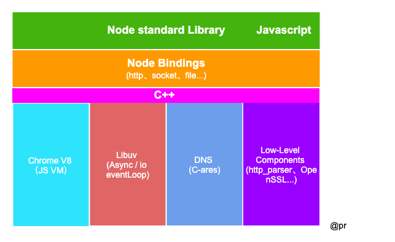

# 前言

学习新事物，我觉得得知道她的一些属性，比如是什么，能解决什么问题，来自哪里等等。没有最好的，只有最合适的。接下来的日子或者说岁月里，就来浅谈 Nodejs。

正如 [Node.js 官方]所说 Node.js® is a JavaScript runtime built on Chrome's V8 JavaScript engine. 即 Node.js 是一个基于 Chrome V8 引擎的 JavaScript 运行环境。可以看出 Node.js 不是一门新的编程语言，而是 JavaScript 的运行环境（服务端的运行环境，之如客户端的浏览器环境），而 Nodejs 的编程语言指的是 JavaScript（这之间的关系还是要梳理清楚）。

2009 年之前，当时的 JavaScript 还是一个在浏览器环境里的一门脚本语言，实现前端页面交互和一些动态特效。时间的分水岭就在这里，Javascript 就不只运行于浏览器，还可以运行于服务端，仿佛打通了前后端的任督二脉，这要归功于 Node.js 之父 Ryan Dahl。

## 为什么选 Javascript

JavaScript 是一个**单线程**的语言，单线程的优点是不会像 Java 这些多线程语言在编程时出现线程同步、线程锁问题，同时也避免了上下文切换带来的性能开销问题。想象一下多线程对同一个 DOM 进行操作会怎样？不是乱套了吗？可能你会想一个问题：单线程是不是前面一个执行不完，后面就被卡住了？

JavaScript 是一种采用了事件驱动、异步回调的模式（主线程是单线程）。JavaScript 在虚拟机上由于有了 Chrome V8 的支持，使得 JavaScript 成为了 Node.js 的首选语言。所以，Node.js 使用了一个**事件驱动、非阻塞式 I/O 的模型**，使其轻量又高效。

## 架构

首先，Node.js 由 Libuv、Chrome V8、一些核心 API 构成，如图所示：

- Node Standard Library：Node.js 的标准库，对外提供的 JavaScript 接口，如 `http、buffer、fs、stream` 等;
- Node bindings：是 JavaScript 与 C++ 连接的桥梁，对下层模块进行封装，向上层提供基础的 API 接口;
- [V8]()：Google 开源的高性能 JavaScript 引擎，使用 C++ 开发，应用于谷歌浏览器；
- [Libuv]()：是一个跨平台的支持事件驱动的 I/O 库，使用 C 和 C++ 语言开发；
- C-ares：一个异步 DNS 解析库；
- Low-Level Components：提供了 http 解析、OpenSSL、数据压缩（zlib）等功能；

## 特点

### 跨平台

最初 Node.js 只运行于 Linux 平台，V0.6.0 版本后在 Libuv 的加持下可运行在 Windows 平台

### 单线程

使用单线程运行，不像 Apache HTTP 之类的服务器，每发生一个请求就产生一个线程。这种方法避免了 CPU 上下文切换和内存中的大量执行堆栈，解决了 Nginx 和其它服务器的 “上一个 10 年，著名的 C10K 并发连接问题”。

### 非阻塞 I/O

避免了等待输入或输出（文件系统、Web服务器、数据库等）响应造成的 CPU 时间损失，得益于 Libuv 的异步 I/O。

### 事件驱动

事件与回调在 JavaScript 中屡见不鲜，是一种高性能的服务模型，对于习惯同步思路编程的同学一时很难理解。Node.js 与 Nginx 均是基于这种方式，只是 Nginx 采用 C 编写，适用于 Web 服务器，Node.js 是可扩展、高性能的平台。

## 场景

### I/O 密集型场景

Node.js 的特点就是事件驱动，非阻塞异步 I/O，只开一个主线程，不会每个请求都去创建一个线程，从而节省资源开销。

### Resutful API

使用 Node.js 来做为中间层，整合数据并提供 API 接口，这些数据源一般来自第三方接口或者数据库，后端就可以更专注于业务开发。推荐一个去哪儿开源的 API 管理工具 [YAPI]()，就是使用的 Node.js 进行开发的。

### BFF

Backend For Frontend（服务于前端的后端），逻辑上的分层并不是新技术。可做一些资源的整合。场景是：原先需要从多个地方获取数据，有了这一层（做个聚合），统一处理之后返回一个数据源，同时后期也不会因为后端数据迁移而重构。

### RPC

Remote Procedure Call（远程过程调用）。当今微服务模式下，主要是针对功能或业务进行服务化，服务间的通信常见的模式都是通过 HTTP 实现，HTTP 属于应用层协议，如果通过 TCP 的方式（传输层），那岂不是更高效。RPC 服务就是采用的 TCP，比如 Google 的 gRPC、阿里的 Dubble。

### 基础工具

比如编译器、构建工具、搭建脚手架等，我们知道的 Gulp、Webpack 就是成功案例。

### 论坛社区

Nodeclub 是使用 Node.js 和 MongoDB 开发的社区系统，界面优雅，功能丰富，小巧迅速，已在Node.js 中文技术社区 [CNode]() 得到应用，但你完全可以用它搭建自己的社区。

### Serverless

无服务器架构，开发者只需关注于业务本身，不需要去关心运维、流量处理这些工作。我们知道 JavaScript 中函数是一等一的公民，写个函数就实现一个 API 接口给到前端，对开发工作减轻很多（函数即服务）。

### Microservices

微服务，小型服务、以独立进程运行、可使用不同语言。根据业务形态来选择不同的语言实现，Node.js 本身也是很轻量级的，实现起来也很快。**最好的打不过合适的！**

[Node.js 官方]: https://nodejs.org/en/
[V8]: https://v8.dev/
[Libuv]: https://github.com/luohaha/Chinese-uvbook
[YAPI]: https://github.com/YMFE/yapi
[Cnode]: https://cnodejs.org/
[Nodeclub]: https://github.com/cnodejs/nodeclub