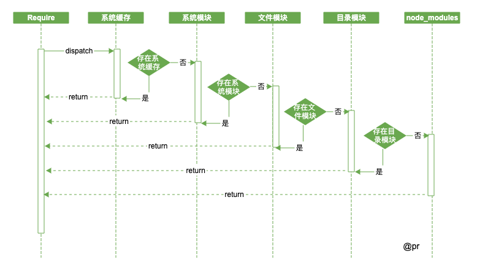
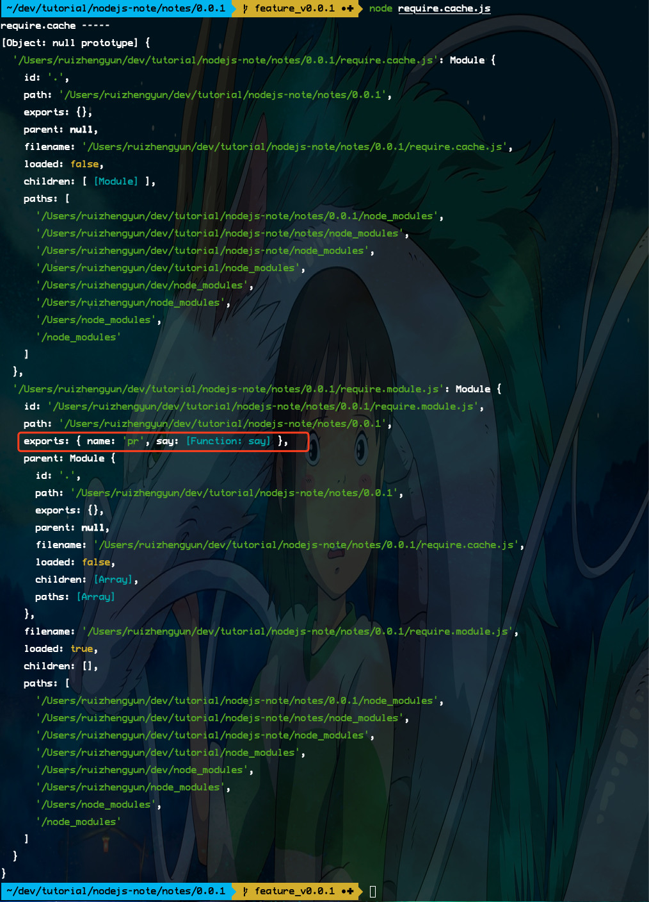
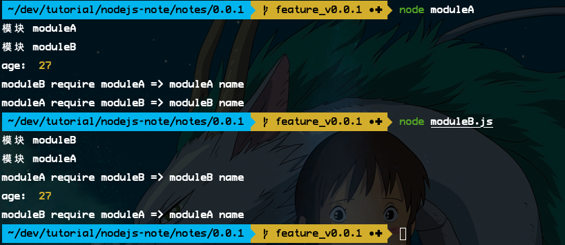

# 模块

采用了 Commonjs 规范，通过 `module.exports、require` 来导出和导入模块。模块加载机制中，采用了延迟加载的策略。就是说在用到的情况下，系统模块才会被加载，等加载完成后会放到 binding_cache 中。

## 系统模块

- 核心模块（native 模块），`http、buffer、fs` 等，底层调用的内建模块 (C/C++)；
- C/C++ 模块（built-in 内建模块），供 native 模块调用；

## 第三方模块

- 第三方维护的模块，比如 `express、koa、moment.js` 等；
- 本地维护的模块（以路径形式的文件模块）比如 `.`、`..`、`/` 开头的;

## 文件形式

- javaScript 模块，`module.js`；
- json 模块，`module.json`；
- C/C++ 模块，编译后扩展名为 .node，`module.node`；

## 加载步骤

经历 `路径分析`、`文件定位`和`编译执行`。

## 加载顺序

- 系统缓存，一个模块被执行后会被缓存起来，提高再次加载速度；
- 系统模块，即原生模块，部分核心模块已经被编译成二进制，省略了 `路径分析、文件定位`，会直接被加载到了内存中，其中系统模块定义在源码的 lib 目录下；
- 文件模块，优先加载 `.、..、/` 开头的，会依次按照 `.js、.json、.node` 进行扩展名补足尝试（文件没有加上扩展名），最好还是加上文件的扩展名。
- 目录模块，文件模块加载过程中，没有找到，但发现一个同样的目录名，就会将这个目录当作一个**包**来处理。这块采用了 Commonjs 规范，在文件 `package.json` 中查找；
- node_module 模块，如果系统模块、路径文件模块都找不到，Node.js 会从当前模块的父目录开始查找，直到系统的根目录；



## 关于缓存问题

模块缓存后，可以通过 `require.cache` 查看已缓存的模块。

```javascript
// 模块文件 require.module.js
module.exports = {
    name: 'pr',
    say(){ }
}
```

```javascript
// 引用模块文件 require.cache.js
require('./require.module');

console.log('require.cache ----- ');
console.log(require.cache);
```



## 对象引用

1.exports 与 module.exports 关系
```javascript
const exports =  module.exports;
```
所以就不能改变 exports 的指向，可以这样

```javascript
exports.info =  {
    name: 'pr',
    age: 30
}

module.exports = {
    name: 'pr',
    age: 30
}
```

## 模块循环引用

模块 `moduleA.js` 和 `moduleB.js` 两个模块互相引用，会怎样？

```javascript
// moduleA.js
console.log('模块 moduleA');
exports.name = 'moduleA name';

age = 27;

const moduleB = require('./moduleB.js');
console.log('moduleA require moduleB =>', moduleB.name);
```

```javascript
// moduleB.js
console.log('模块 moduleB');
exports.name = 'moduleB name';

const moduleA = require('./moduleA.js');
console.log('moduleB require moduleA =>', moduleA.name);
```



- 启动模块 `node moduleA.js`，会打印 `模块 moduleA`；
- 模块 `moduleA.js` 中加载 `moduleB.js`，打印 `模块 moduleB`；
- 模块 `moduleB.js` 中又加载 `moduleA.js`，此时模块 `moduleA.js` 还没有执行完，返回模块 `moduleA.js` 的 `exports` 对象给到模块 `moduleB.js`；
- 模块 `moduleB.js` 加载完后，其中有个 `moduleA.js` 中挂载了全局的变量 `age`，所以能打印出来，最后将模块 `moduleB.js` 的 `exports` 对象给到模块 `moduleA.js`；

很有意思的是，在代码执行前，会用一个封装器将执行代码段封装起来

```javascript
(function(exports, require, module, __filename, __dirname) {
    // something
});
```

[本次代码 Github](https://github.com/ruizhengyun/nodejs-note/tree/master/notes/0.0.1)
