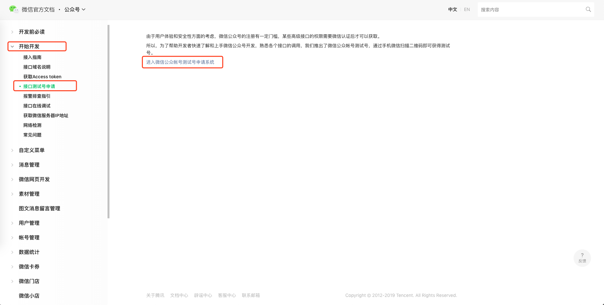
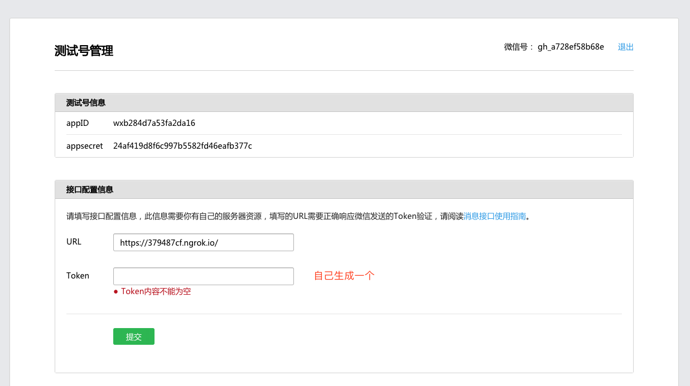
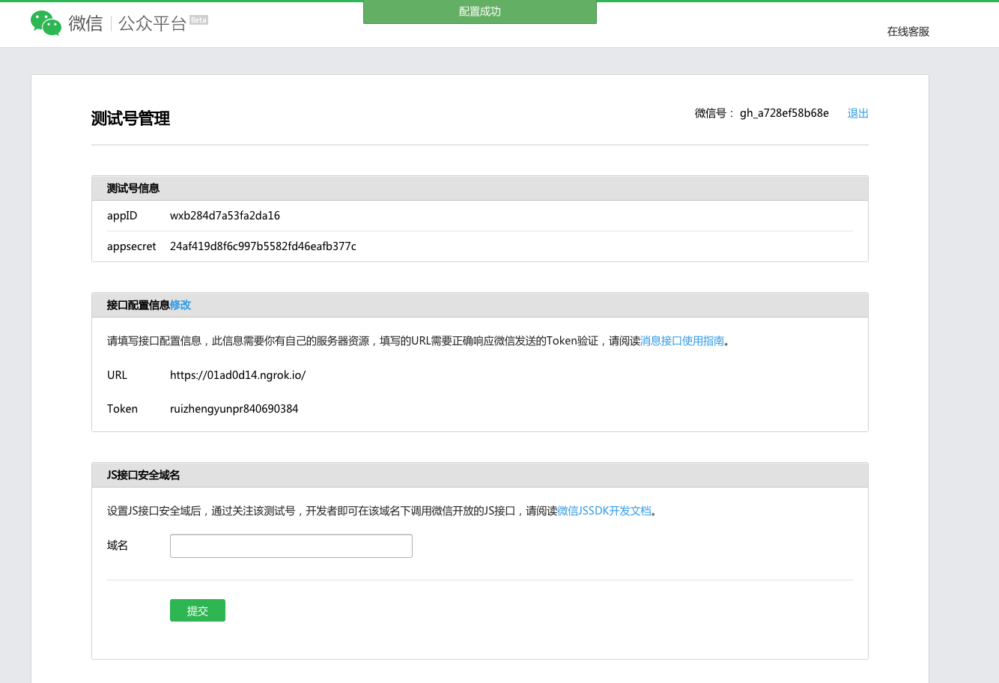
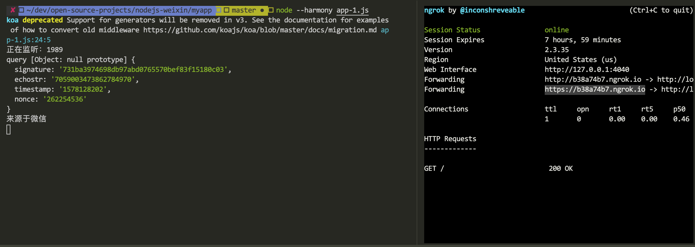
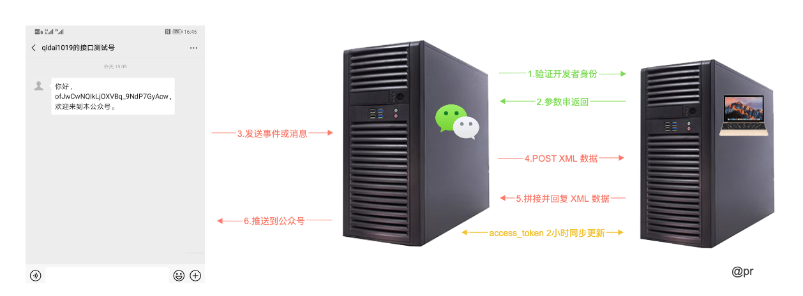
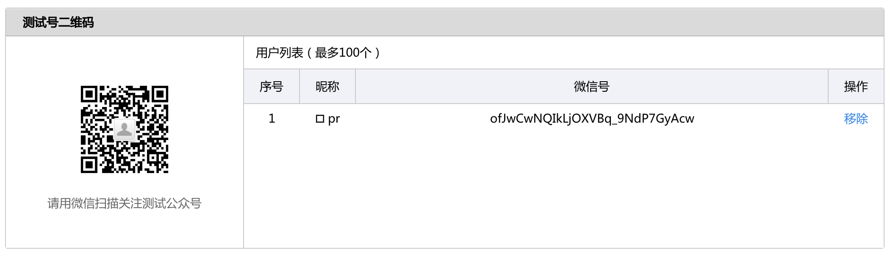
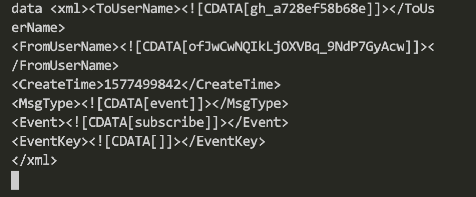
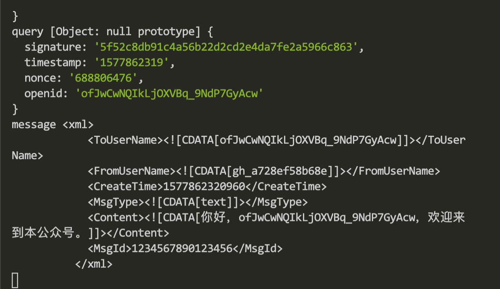
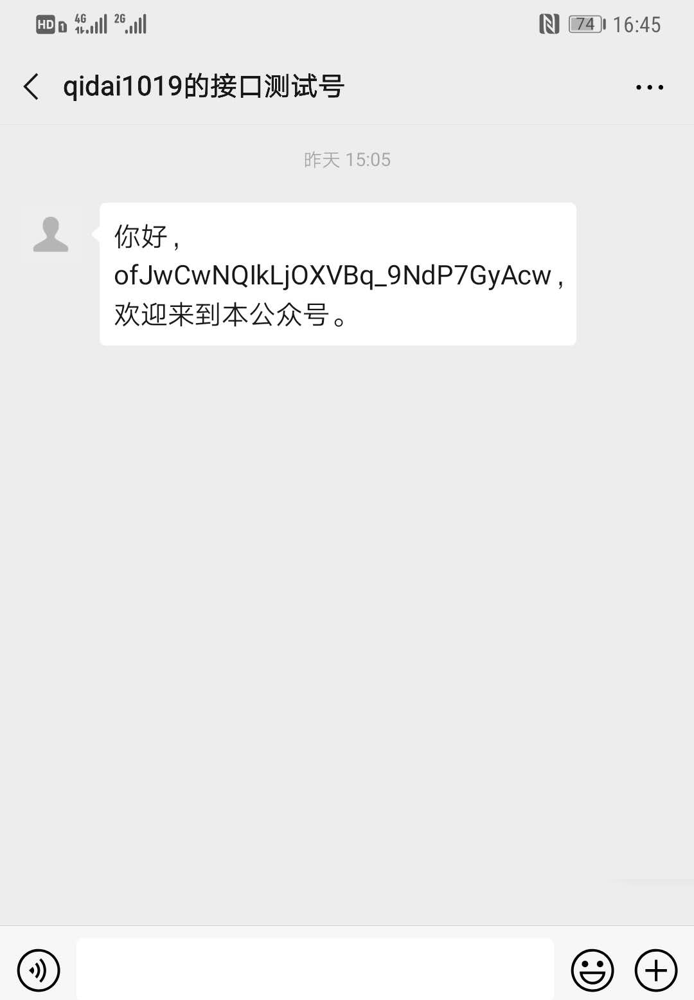

# 编码

## 版本一，测通公众号

### 配置测试公众号

1.[进入微信官方文档（公众号）](https://developers.weixin.qq.com/doc/offiaccount/Message_Management/Receiving_standard_messages.html);

2.接口测试号申请，微信公众号的注册有一定门槛，需要占用太多的开发时间，这与我们初衷相违背。可以用测试账号，我们的目的是为了尝试编程，要明白真正要关注的点。


3.测试账号管理

Token- ruizhengyunpr840690384

### 验证公众号

交互：微信 -> token、timestamp、nonce 字典排序 -> 拼接为字符串再 sha1 加密 -> (result === signature) -> return echostr

- 将 **token、timestamp、nonce** 三个参数进行**字典排序**；
- 将三个参数字符串拼接成一个字符串进行 **sha1** 加密；
- 将加密后的字符串与 **signature** 对比，如果相同，表示这个请求来源于微信，直接原样返回 **echostr** 参数内容，接入验证就成功了；

1.启动项文件

```js
// app-1.js
const Koa = require('koa');
const sha1 = require('sha1');

// 配置文件
const config = {
  wechat: {
    appID: 'wxb284d7a53fa2da16',
    appSecret: '24af419d8f6c997b5582fd46eafb377c',
    token: 'ruizhengyunpr840690384'
  }
};
const PORT = 1989;
const app = new Koa();

// 中间件
app.use(function*(next) {
  console.log('query', this.query);

  const token = config.wechat.token;
  const signature = this.query.signature;
  const nonce = this.query.nonce;
  const timestamp = this.query.timestamp;
  const echostr = this.query.echostr;
  const str = [token, timestamp, nonce].sort().join('');
  const sha = sha1(str);
  
  if (sha === signature) {
    this.body = echostr + '';
  } else {
    this.body = '不是来源于微信';
  }
});

app.listen(PORT);
console.log(`正在监听：${PORT}`);
```

2.启动本地服务

```js
node --harmony app-1.js
```

3.ngrok 启动代理本地服务

```js
./ngrok http 1989
```

4.拷贝 ngrok 产生的 **https 地址**到**微信公众号 > 接口配置信息 > URL** 中，然后点击 `提交`，结果如下



5.查看本地服务控制台



## 版本二，抽取公众号参数的校验中间件

版本一，我们实现了微信公众号验证成功，本着专业人做专业事，单一文件实现单一功能的原则，可以将中间件抽离处理独立成为一个文件，然后启动项文件引入传参再调用。

1.启动项文件

```js
// app-2.js
const Koa = require('koa');
const weChatMiddleWare = require('./app-2/weChat');

// 配置文件
const config = {
  wechat: {
    appID: 'wxb284d7a53fa2da16',
    appSecret: '24af419d8f6c997b5582fd46eafb377c',
    token: 'ruizhengyunpr840690384'
  }
};
const PORT = 1989;
const app = new Koa();

// 中间件
app.use(weChatMiddleWare(config.wechat));

app.listen(PORT);
console.log(`正在监听：${PORT}`);
```

2.中间件

```js
// app-2/weChat.js
const sha1 = require('sha1');

// 中间件
module.exports = function(opts) {
  return function*(next) {
    console.log('query', this.query);

    const token = opts.token;
    const signature = this.query.signature;
    const nonce = this.query.nonce;
    const timestamp = this.query.timestamp;
    const echostr = this.query.echostr;
    const str = [token, timestamp, nonce].sort().join('');
    const sha = sha1(str);

    if (sha === signature) {
      console.log('来源于微信');
      this.body = echostr + '';
    } else {
      console.log('不是来源于微信');
      this.body = '不是来源于微信';
    }
  };
};
```

3.本地启动、ngrok 启动代理本地服务、拷贝 ngrok 产生的 **https 地址**，然后是否公众号是否验证成功。这个版本只是改写，并未产生新的功能代码，所以没什么难题。

## 版本三，解决 access_token（凭证）失效问题

### access_token 特性

- access_token **每2小时（7200秒）**自动失效，需要重新获取；
- 只要更新了 access_token，之前的 access_token 就没用了；

### 设计方案

- 系统每隔 2 小时启动去刷新一次 access_token，这样无论什么时候调用接口，都是最新的；
- 为了方便频繁调用，所以的把更新 access_token 存储在一个唯一的地方（一定不要存内存）；

1.启动项，这块要建个 `/app-3/config/access-token.txt`

```js
// app-3.js
const Koa = require('koa');
const path = require('path');
const util = require('./app-3/util');
const weChatMiddleWare = require('./app-3/weChat');
const wechat_file = path.join(__dirname, './app-3/config/access-token.txt');

// 配置文件
const config = {
  wechat: {
    appID: 'wxb284d7a53fa2da16',
    appSecret: '24af419d8f6c997b5582fd46eafb377c',
    token: 'ruizhengyunpr840690384',
    getAccessToken: () => {
      return util.readFileAsync(wechat_file);
    },
    saveAccessToken: data => {
      data = JSON.stringify(data);
      return util.writeFileAsync(wechat_file, data);
    }
  }
};
const PORT = 1989;
const app = new Koa();

// 中间件
app.use(weChatMiddleWare(config.wechat));

app.listen(PORT);
console.log(`正在监听：${PORT}`);
```

2.中间件

```js
// app-3/util.js
// 依赖包引入
const sha1 = require('sha1');
const Promise = require('bluebird');
const request = Promise.promisify(require('request'));

// 参数定义
const prefix = 'https://api.weixin.qq.com/cgi-bin/';
const api = {
  accessToken: `${prefix}token?grant_type=client_credential`
};

// 判断 access_token 是否过期
function AccessTokenInfo(opts) {
  const that = this;
  this.appID = opts.appID;
  this.appSecret = opts.appSecret;
  this.getAccessToken = opts.getAccessToken;
  this.saveAccessToken = opts.saveAccessToken;

  that
    .getAccessToken()
    .then(function(data) {
      try {
        data = JSON.parse(data);
      } catch (e) {
        // 不合法就重新更新 access_token
        return that.updateAccessToken();
      }

      if (that.isValidAccessToken(data)) {
        // 判断是否有效
        return Promise.resolve(data);
      } else {
        // 不合法就重新更新 access_token
        return that.updateAccessToken();
      }
    }).then(data => {
      // 取到合法 access_token
        that.access_token = data.access_token;
        that.expires_in = data.expires_in;
        that.saveAccessToken(data);
    });
}

// 验证 access_token 是否有效
AccessTokenInfo.prototype.isValidAccessToken = function(data) {
  if (!data || !data.access_token || !data.expires_in) {
    return false;
  }

  const now = new Date().getTime();
  if (now < data.expires_in) {
    return true;
  }
  return false;
};

// 更新 access_token
AccessTokenInfo.prototype.updateAccessToken = function() {
  const url = `${api.accessToken}&appid=${this.appID}&secret=${this.appSecret}`;
  console.log('url', url);
  return new Promise((resolve, reject) => {
    request({
      url,
      json: true
    }).then(res => {
      const data = res.body;
      console.log('data', data);

      const now = new Date().getTime();

      // 缩短 20 秒（算上网络请求时间）
      const expires_in = now + (data.expires_in - 20) * 1000;

      data.expires_in = expires_in;
      resolve(data);
    });
  });
};

// 中间件
module.exports = function(opts) {
  const accessTokenInfo = new AccessTokenInfo(opts);

  return function*(next) {
    console.log('query', this.query);

    const token = opts.token;
    const signature = this.query.signature;
    const nonce = this.query.nonce;
    const timestamp = this.query.timestamp;
    const echostr = this.query.echostr;
    const str = [token, timestamp, nonce].sort().join('');
    const sha = sha1(str);

    if (sha === signature) {
      console.log('来源于微信');
      this.body = echostr + '';
    } else {
      console.log('不是来源于微信');
      this.body = '不是来源于微信';
    }
  };
};
```

3.编写工具库

```js
const fs = require('fs');
const Promise = require('bluebird');

// access_token 读操作
exports.readFileAsync = (fpath, encoding) => {
  return new Promise((resolve, reject) => {
    fs.readFile(fpath, encoding, function(err, content) {
      if (err) {
        reject(err);
      } else {
        resolve(content);
      }
    });
  });
};

// access_token 写操作
exports.writeFileAsync = (fpath, content) => {
  return new Promise((resolve, reject) => {
    fs.writeFile(fpath, content, function(err, content) {
      if (err) {
        reject(err);
      } else {
        resolve();
      }
    });
  });
};
```

4.本地启动、ngrok 启动代理本地服务、拷贝 ngrok 产生的 **https 地址**

5.你会发现 `/app-3/config/access-token.txt` 文件**生成 access_token 信息内容**


## 版本四，实现自动回复

这次我们要实现，关注公众号后自动回复订阅成功的消息。

### 实现流程



- **处理 POST 类型**的控制逻辑，接收这个 XML 数据包；
- **解析 XML** 数据包；
- **拼写**需要定义的消息；
- **包装**成 XML 格式；
- **5 秒内**返回回去；

### 测试号二维码

关注公众号后


关注公众号后


- ToUserName，接收方账号；
- FromUserName，发送方账号，即 openid；
- CreateTime，发送消息时间；
- MsgType，消息类型。


### 代码实现

1.启动项

```js
// app-4.js
const Koa = require('koa');
const path = require('path');
const fileAsync = require('./app-4/util/fileAsync');
const weChatMiddleWare = require('./app-4/middleWare/weChat');
const wechat_file = path.join(__dirname, './app-4/config/access-token.txt');

// 配置文件
const config = {
  wechat: {
    appID: 'wxb284d7a53fa2da16',
    appSecret: '24af419d8f6c997b5582fd46eafb377c',
    token: 'ruizhengyunpr840690384',
    getAccessToken: () => {
      // 读取文件
      return fileAsync.readFileAsync(wechat_file);
    },
    saveAccessToken: data => {
      // 写入文件
      return fileAsync.writeFileAsync(wechat_file, JSON.stringify(data));
    }
  }
};
const PORT = 1989;
const app = new Koa();

// 中间件
app.use(weChatMiddleWare(config.wechat));

app.listen(PORT);
console.log(`正在监听：${PORT}`);
```

2.编写中间件

```js
// app-4/middleWare/weChat.js
// 依赖包引入
const sha1 = require('sha1');
const rawBody = require('raw-body');
const fileAsync = require('../util/fileAsync');
const AccessTokenInfo = require('../util/AccessTokenInfo');

// 中间件
module.exports = function(opts) {
  const accessTokenInfo = new AccessTokenInfo(opts);

  return function*(next) {
    console.log('query', this.query);

    const token = opts.token;
    const signature = this.query.signature;
    const nonce = this.query.nonce;
    const timestamp = this.query.timestamp;
    const echostr = this.query.echostr;
    const str = [token, timestamp, nonce].sort().join('');
    const sha = sha1(str);

    /**
     * GET 验证开发者身份
     * POST
     */
    if (sha !== signature) {
      this.body = '❌';
      return false;
    }
    if (this.method === 'GET') {
      this.body = echostr + '';
    } else if (this.method === 'POST') {
      // 依赖包 raw-body 可以把 this 上的 request 对象（http 模块中的 request 对象），拼写它的数据，最终拿到一个 buffer 的 XML
      const data = yield rawBody(this.req, {
        length: this.length,
        limit: '1mb',
        encoding: this.charset
      });

      const content = yield fileAsync.parseXMLAsync(data);
      const message = fileAsync.formatMessage(content.xml);
      if (message.MsgType === 'event') {
        if (message.Event === 'subscribe') {
          const now = new Date().getTime();
          this.status = 200;
          this.type = 'application/xml';
          // 文本模板，后面可以把这块业务抽离处理
          this.body = `<xml>
            <ToUserName><![CDATA[${message.FromUserName}]]></ToUserName>
            <FromUserName><![CDATA[${message.ToUserName}]]></FromUserName>
            <CreateTime>${now}</CreateTime>
            <MsgType><![CDATA[text]]></MsgType>
            <Content><![CDATA[${`你好，${message.FromUserName}，欢迎来到本公众号。`}]]></Content>
            <MsgId>1234567890123456</MsgId>
          </xml>`;
          console.log('message', this.body);
          return;
        }
      }
      console.log('message', message);
    }
  };
};
```

3.编写工具库

```js
// app-4/uitl/fileAsync.js
const fs = require('fs');
const Promise = require('bluebird');
const xml2js = require('xml2js');

// access_token 读操作
exports.readFileAsync = (fpath, encoding) => {
  return new Promise((resolve, reject) => {
    fs.readFile(fpath, encoding, function(err, content) {
      if (err) {
        reject(err);
      } else {
        resolve(content);
      }
    });
  });
};

// access_token 写操作
exports.writeFileAsync = (fpath, content) => {
  return new Promise((resolve, reject) => {
    fs.writeFile(fpath, content, function(err, content) {
      if (err) {
        reject(err);
      } else {
        resolve();
      }
    });
  });
};

// 格式化 xml 消息
function formatMessage(data) {
  const message = {};
  if (typeof data === 'object') {
    const keys = Object.keys(data);
    for (let i = 0; i < keys.length; i++) {
      const key = keys[i];
      const item = data[key];
      const len = item.length;
      if (!(item instanceof Array) || len === 0) {
        continue;
      }

      if (len === 1) {
        const value = item[0];
        if (typeof value === 'object') {
          message[key] = formatMessage(value);
        } else {
          message[key] = (value || '').trim();
        }
      } else {
        message[key] = [];
        for (let i = 0; i < len; i++) {
          message[key].push(formatMessage(item[i]));
        }
      }
    }
  }
  return message;
}

exports.formatMessage = formatMessage;

exports.parseXMLAsync = function(xml) {
  return new Promise(function(resolve, reject) {
    xml2js.parseString(xml, { trim: true }, function(err, data) {
      if (err) {
        reject(err);
      } else {
        resolve(data);
      }
    });
  });
};
```

```js
// app-4/util/AccessTokenInfo.js
// 依赖包引入
const Promise = require('bluebird');
const request = Promise.promisify(require('request'));

// 参数定义
const prefix = 'https://api.weixin.qq.com/cgi-bin/';
const api = {
  accessToken: `${prefix}token?grant_type=client_credential`
};

// 判断 access_token 是否过期
function AccessTokenInfo(opts) {
  const that = this;
  this.appID = opts.appID;
  this.appSecret = opts.appSecret;
  this.getAccessToken = opts.getAccessToken;
  this.saveAccessToken = opts.saveAccessToken;

  that.getAccessToken().then(function(data) {
    try {
      data = JSON.parse(data);
    } catch (e) {
      // 不合法就重新更新 access_token
      return that.updateAccessToken();
    }

    if (that.isValidAccessToken(data)) {
      //判断是否有效
      // Promise.resolve(data);
      // 取到合法 access_token
      that.access_token = data.access_token;
      that.expires_in = data.expires_in;
      that.saveAccessToken(data);
    } else {
      // 不合法就重新更新 access_token
      return that.updateAccessToken();
    }
  });
  // .then(function(data) {
  //   // 取到合法 access_token
  //   that.access_token = data.access_token;
  //   that.expires_in = data.expires_in;
  //   that.saveAccessToken(data);
  // });
}

// 验证 access_token 是否有效
AccessTokenInfo.prototype.isValidAccessToken = function(data) {
  if (!data || !data.access_token || !data.expires_in) {
    return false;
  }

  const now = new Date().getTime();
  if (now < data.expires_in) {
    return true;
  }
  return false;
};

// 更新 access_token
AccessTokenInfo.prototype.updateAccessToken = function() {
  const url = `${api.accessToken}&appid=${this.appID}&secret=${this.appSecret}`;
  console.log('url', url);
  return new Promise((resolve, reject) => {
    request({
      url,
      json: true
    }).then(res => {
      const data = res.body;
      const now = new Date().getTime();

      // 缩短 20 秒（算上网络请求时间）
      const expires_in = now + (data.expires_in - 20) * 1000;

      data.expires_in = expires_in;
      resolve(data);
    });
  });
};

module.exports = AccessTokenInfo;
```

5.本地启动、ngrok 启动代理本地服务、拷贝 ngrok 产生的 **https 地址**

6.扫描关注公众号





## 文档和示例地址

- [github 地址](https://github.com/ruizhengyun/nodejs-weixin)
- [欢迎评论](https://github.com/ruizhengyun/nodejs-weixin/issues/4)

[配置测试公众号]: https://mp.weixin.qq.com/debug/cgi-bin/sandboxinfo?action=showinfo&t=sandbox/index