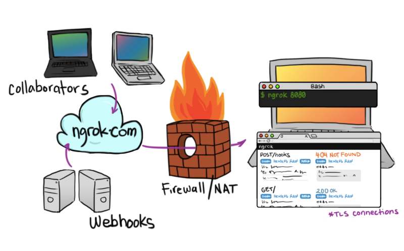

# 本地访问和外网访问

作为一个 Web 开发者，我们有时候会需要临时地将一个本地的 Web 网站部署到外网，以供他人访问、测试、调试等。你可以

- 购买域名和服务器
- 内网穿透

## 购买域名和服务器

- 找到一台运行于外网的 Web 服务器；
- 服务器上有网站所需要的环境，否则自行搭建；
- 将网站部署到服务器上；
- 调试结束后，再将网站从服务器上删除；
- 对应微信服务器实现流程【微信 - 微信的服务器 - 你的域名的服务器】；

如果是一个浏览网站，这么个流程一点儿问题都没有，但是现在的场景临时项目，只是访问、调试等，如此复杂步骤，实非所愿，耗费太多精力在部署环境上，累觉不爱。再看看另一种方式吧。

## 内网穿透

拿 ngrok 举例，类似软件会很多。你会发现：有了 ngrok 之后，世界是如此美好。

### ngrok

ngrok 是一个**反向代理**，通过在公共的端点和本地运行的 Web 服务器之间建立一个安全的通道。

**反向代理**在计算机网络中是**代理服务器**的一种。服务器根据客户端的请求，从其关系的一组或多组后端服务器（如 Web 服务器）上获取资源，然后再将这些资源返回给客户端。也就是说客户端只知道代理的IP地址，不知道代理服务器后面的服务器集群的存在。比如 CDN。

顺便再说下**前向代理**，它是**代理客户端**的一种。客户端借由前向代理可以间接访问很多不同互联网服务器（集群）的资源，服务端（如Web服务器）只知道代理的 IP 地址，不知道代理客户端的 IP 地址。



### 实现流程

微信 - 微信的服务器 - 内网穿透的域名的服务器 - 内网穿透工具通道 - 本地代理服务

### 具体实现

1.本地起个服务

```js
python -m SimpleHTTPServer 1989
```
本地访问 `http://localhost:1989`，此刻也就限于你自己访问。

2.[ngrok][]（花生壳、localtunnel）等工具实现

```js
./ngrok http 1989
```

3.外网查看
此刻，任何人访问 `https://1922e6ad.ngrok.io`，都可以看到你本地 `http://localhost:1989` 所启服务的内容了。


## 文档和示例地址

- [github 地址](https://github.com/ruizhengyun/nodejs-weixin)
- [欢迎评论](https://github.com/ruizhengyun/nodejs-weixin/issues/3)
