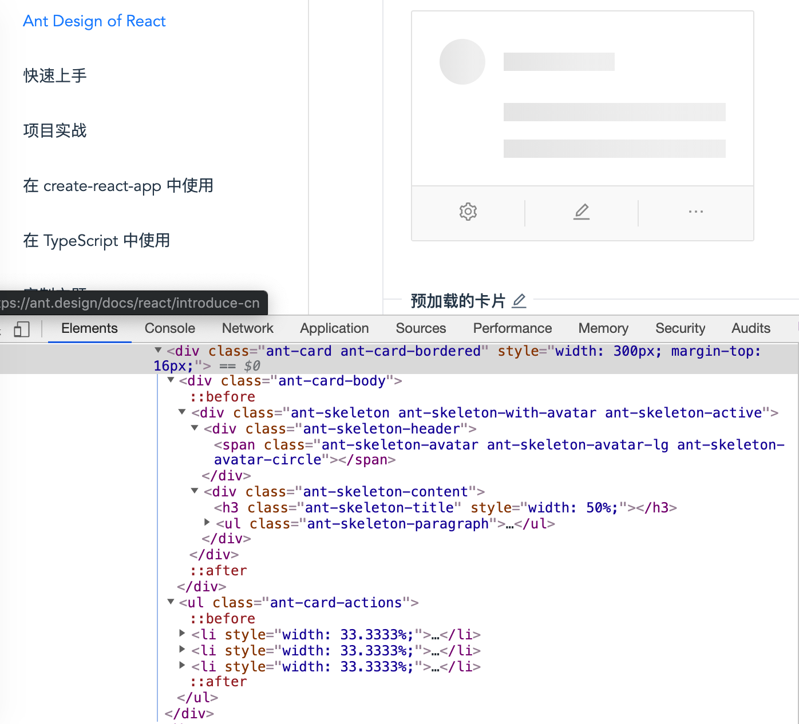

# CSS 模块化

## OOCSS

面向对象的 CSS，Object-Oriented CSS，我们熟悉的 bootstrap 就是这样的。以卡片组件为例

```html
<section class="card simple open">
    <header class="card-header">
        <h2 class="card-title">标题</h2>
        <span class="card-status">开启</span>
    </header>
    <div class="card-body">
        内容
    </div>
</section>
```

- 分离结构和外观，比如 CSS 类名 `card` 后面使用了 `simple` 默认卡面是直角，那也可以加上 `complex` 圆角，加上 `shadow` 阴影等
- 分离容器和内容，比如 `h2` 上还是应用了 CSS 类名 `card-title`

## SMACSS

模块化架构的可扩展 CSS，Scalable and Modular Architecture for CSS，还是以卡片组件为例

```html
<section class="card card-simple is-active">
    <header class="card-header">
        <h2 class="card-title">标题</h2>
        <span class="card-status">开启</span>
    </header>
    <div class="card-body">
        内容
    </div>
</section>
```

这个咋一看与 OOCSS 差不多，但是还是有不同之处的，容我道来，SMACSS 把样式划分为 **5 个具体类别**

- 基础
- 布局
- 模块
- 状态
- 主题

例子中，

- 模块 `card、card-title、card-body`
- 子模块 `card-simple`，OOCSS 是皮肤 `simple`
- 状态 `is-active` 前面加了前缀 `is-`

antd > card 就是这种做法，不过也有其自己的特色，[antd 卡片地址](https://ant.design/components/card-cn/)



## BEM

块元素修饰符，Block Element Modifier，一种 CSS 类名命名规则。还是以卡片组件为例

```html
<section class="card card--simple card--active">
    <header class="card__header">
        <h2 class="card__title">标题</h2>
        <span class="card__status">开启</span>
    </header>
    <div class="card__body">
        内容
    </div>
</section>
```

- 块名，组件名称，`card`
- 元素，元素在块里的名称，前面加双下划线，`card__title`
- 修饰符，与块和元素相关的修饰符，前面加双横杠，`card-simple card--active`

> 文末，不需要拘泥于哪一种，只要适合项目产品的场景，可以混合使用，方便团队持续开发就好。