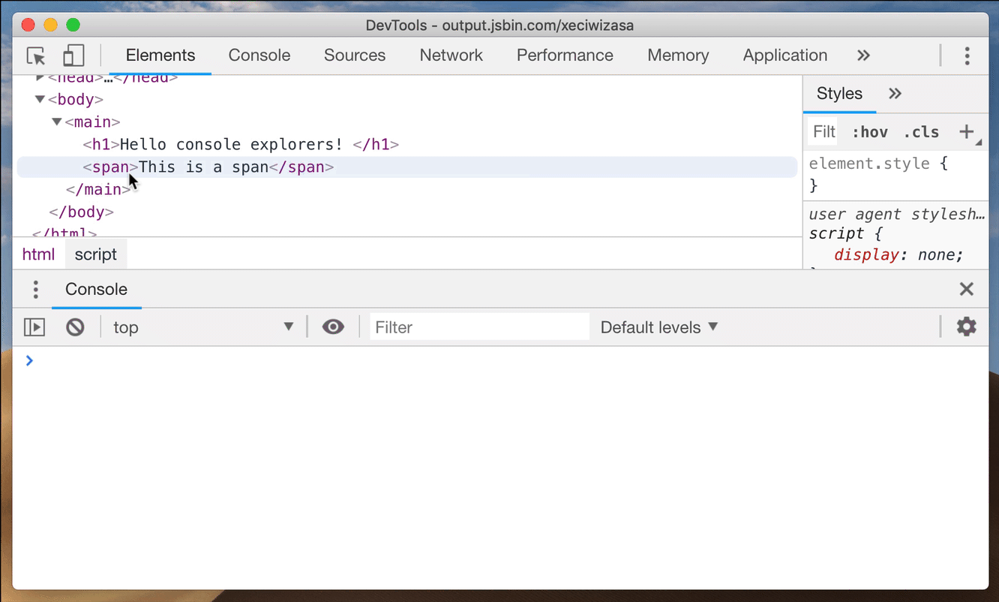
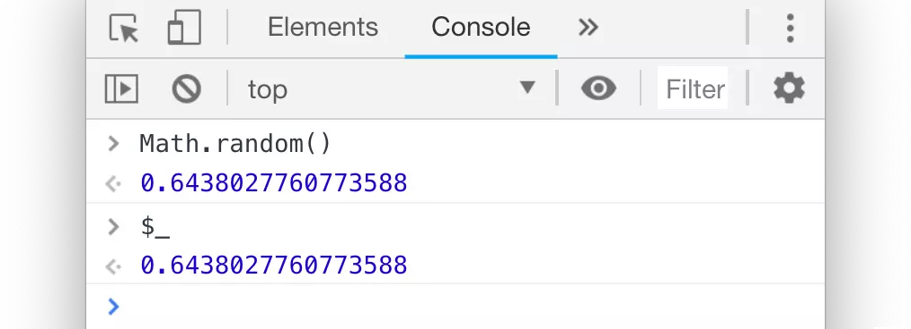
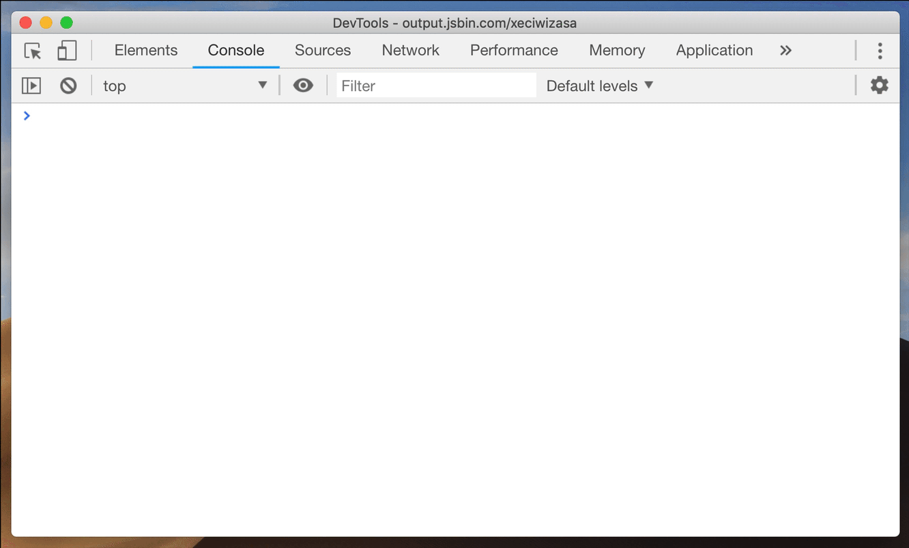

# console 中的 '$'

`$` 作为 `jQuery` 的选择器，承载了一代前端的太多记忆，但是你可能没有想到的是，在我们使用 `Dev Tools` 进行调试的时候，$ 也有大放异彩的一天呢？

## $0

在 `Chrome` 的 `Elements` 面板中，`$0` 是当前我们选中的 `html` 节点的引用。

理所当然，`$1` 就是我们上一次选择的节点的引用，`$2` 是在那之前选择的节点的引用，等等。一直到 `$4`

你可以通过其他引用来尝试相关操作 (例如: `$1.appendChild($0)`)

## `$` 和 `$$`

如果你没有在 `App` 中定义过 `$` 变量 (例如 `jQuery` ) 的话，它在 `console` 中就是对这一大串函数 `document.querySelector` 的别名。

如果是 `$$` 就更加厉害了，还能节省更多的时间，因为它不仅执行 `document.QuerySelectorAll` 并且它返回的是：一个节点的 **数组** ，而不是一个 `Node list`

`Array.from(document.querySelectorAll('div')) === $$('div')` 和 `$$('div')` 哪一种方式更加优雅呢？

## `$_` 引用

`$_` 是对上次执行的结果的引用。

## `$i`

在 [Chrome 插件: Console Importer](https://www.crx4chrome.com/extensions/hgajpakhafplebkdljleajgbpdmplhie/) 的帮助之下，你可以快速的在 `console` 中引入和把玩一些 `npm` 库。

直接运行例如 `$i('lodash')` 或者 `$i('moment')` 几秒钟之后，就可以获取到 `lodash / momentjs` 了。

---

- [上一章：Console 篇](README.md)
- [下一章：异步的 console](async.md)