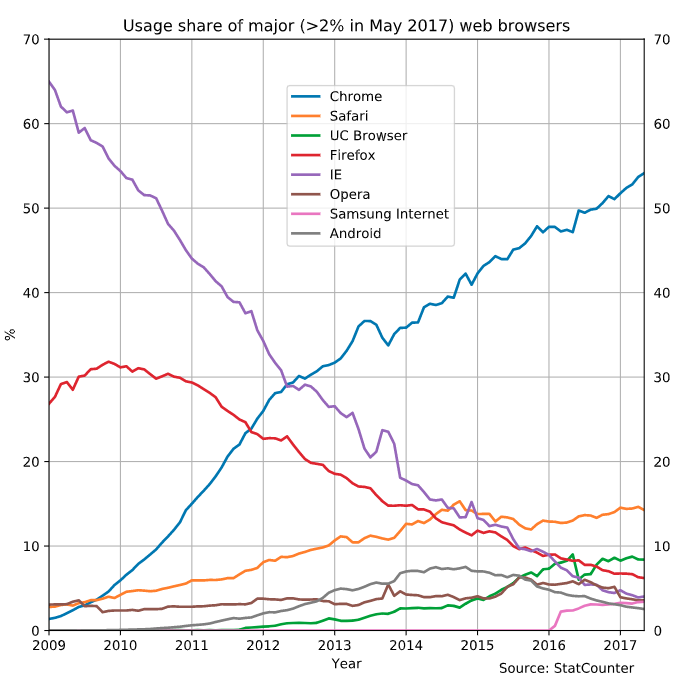
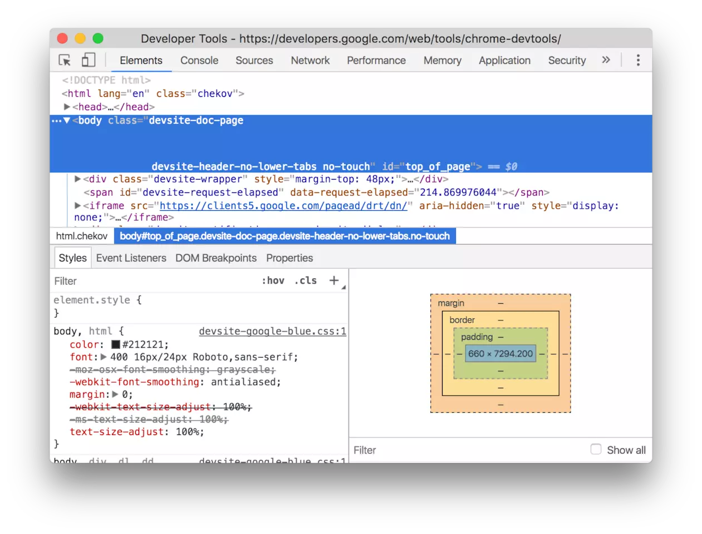
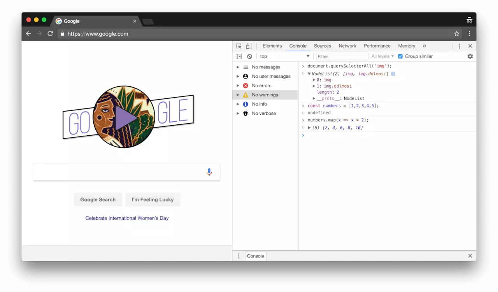
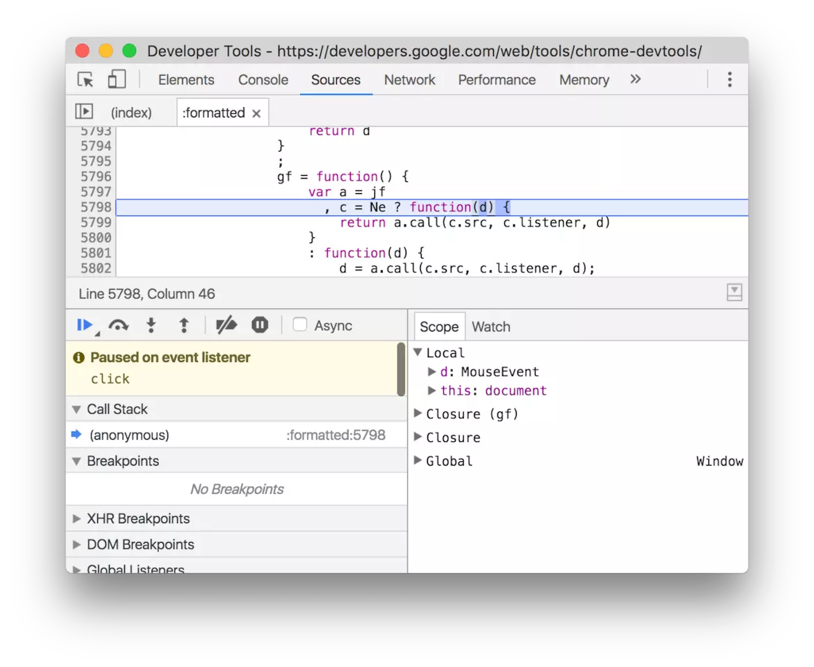
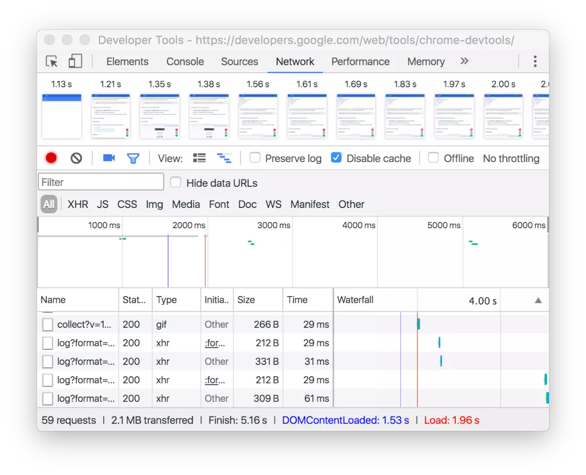
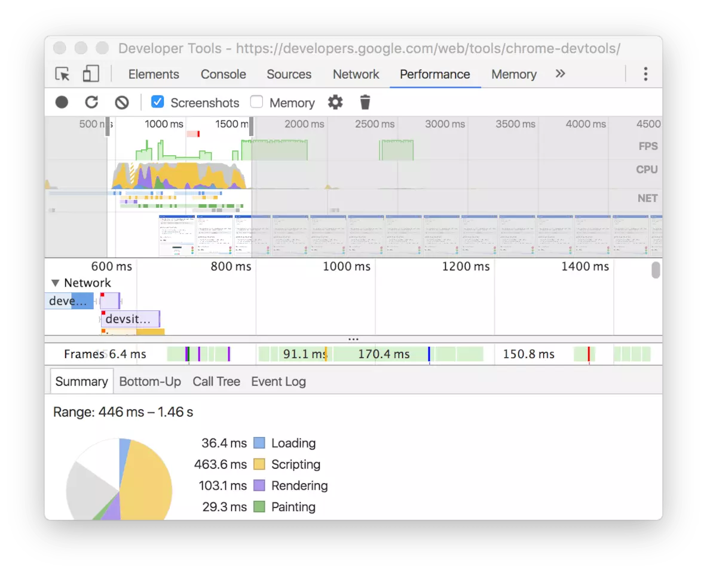
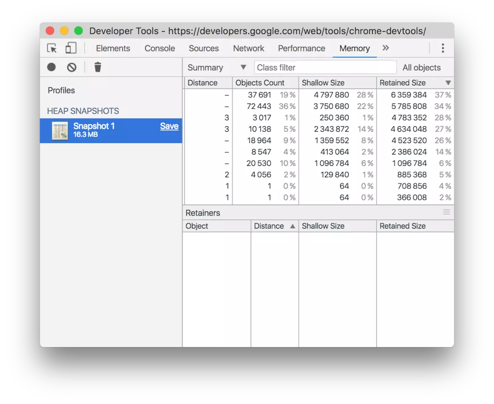
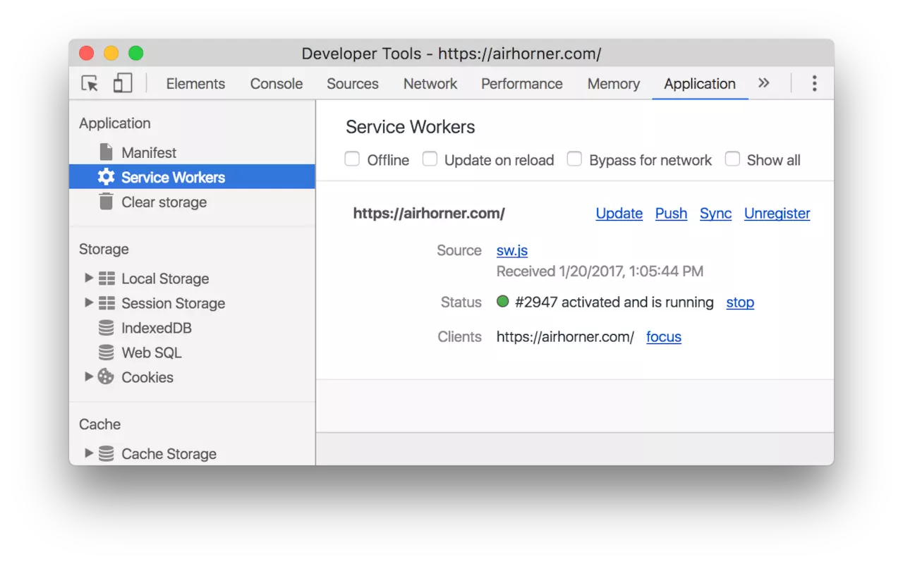

# 前言

## 特别声明

> 本文是作者 [Tomek Sułkowski][] 发布在 [medium][] 上的一个系列。

> 版权归原作者所有。

> 译者 [dendoink][] 在翻译前已经和作者沟通得到了翻译整个系列的授权。

> 为了不影响大家阅读，获得授权的记录会放在本文的最后~

## 从 Chrome 说起

谷歌浏览器（通常简称为 Chrome ）是由谷歌开发的网络浏览器。 它于 2008 年首次针对 Microsoft Windows 发布，后来移植到 Linux ，macOS ，iOS 和 Android 。 浏览器也是 Chrome OS 的主要组件，它可以作为 Web 应用的平台。[Chrome-wikipedia][]

浏览器的市场天下三分，Chorme，Safari和FireFox，从 2008 年 Chrome 横空出世以来，如今已经一家独大占据了半壁江山：

对于大部分人来说，Chrome 可能只是个浏览器，但是对于开发人员来说，它更是一个强大无比的工具，为了方便开发人员调试代码，主流的浏览器都内置了 DevTools， 所以无论你是前端还是后端，掌握 Chrome 的调试技巧意味着效率直接的提高。而这本小册要介绍的，就是 Chrome-DevTools 的使用技巧。

# DevTools 简介
> 本段内容引用于 [Chrome DevTools][] 说明 熟悉的同学可以跳过，也可以选择跳转到原链接访问，这里是为了给没有接触过 chrome-devtools 的同学一些基础概念。

## 打开 Chrome 开发者工具

- 在 Chrome 菜单中选择 更多工具 > 开发者工具

- 在页面元素上右键点击，选择 “检查”

- 使用 快捷键 Ctrl + Shift + I (Windows) 或 Cmd + Opt + I (Mac)

## 了解面板

我将从以下 8 个面板来讲述面板内容：

- 元素面板
- 控制台面板
- 源代码面板
- 网络面板
- 性能面板
- 内存面板
- 应用面板
- 安全面板

### 元素面板
使用元素面板可以自由的操作 DOM 和 CSS 来迭代布局和设计页面。
- 检查和调整页面
- 编辑样式
- 编辑 DOM

### 控制台面板
在开发期间，可以使用控制台面板记录诊断信息，或者使用它作为 `shell` 在页面上与 `JavaScript` 交互。

- 使用控制台面板
- 命令行交互

### 源代码面板
在源代码面板中设置断点来调试 `JavaScript` ，或者通过 `Workspaces`（工作区）连接本地文件来使用开发者工具的实时编辑器

- 断点调试
- 调试混淆的代码
- 使用开发者工具的 `Workspaces`（工作区）进行持久化保存

### 网络面板
使用网络面板了解请求和下载的资源文件并优化网页加载性能。

- 网络面板基础
- 了解资源时间轴
- 网络带宽限制

### 性能面板
使用时间轴面板可以通过记录和查看网站生命周期内发生的各种事件来提高页面的运行时性能。

### 内存面板
如果需要比时间轴面板提供的更多信息，可以使用“配置”面板，例如跟踪内存泄漏。

- `JavaScript CPU` 分析器
- 内存堆区分析器

### 应用面板
使用资源面板检查加载的所有资源，包括 `IndexedDB` 与 `Web SQL` 数据库，本地和会话存储，`cookie` ，应用程序缓存，图像，字体和样式表。

- 管理数据

### 安全面板
使用安全面板调试混合内容问题，证书问题等等。

- 安全

# 授权记录

---

- [推荐：8年前端开发的知识点沉淀(不知道会多少字，一直写下去吧...)](https://juejin.im/post/5d0878aaf265da1b83338f74)

- [下一章：通用篇](common/README.md)

[Tomek Sułkowski]: https://twitter.com/sulco
[medium]: https://medium.com/@tomsu
[dendoink]: https://juejin.im/post/5c09a80151882521c81168a2
[Chrome-wikipedia]: https://en.wikipedia.org/wiki/Google_Chrome
[Chrome DevTools]: https://developers.google.com/web/tools/chrome-devtools/#_1