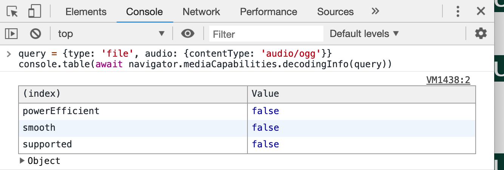

# 异步的 console

如今，越来越多与浏览器有关的 `API` 都是 基于 `Promise` 的 。当你使用 `promise` 的时候通常配套用 `.then`(处理方法) 或者 将 `promise` 包裹在 `async` 方法中，再使用 `await` 来接收结果。

我们在 `JavaScript/TypeScript` 中大量使用的东西，但如果在 `Console` 中书写这样的结构很不方便。

像下面这样

```javascript
fetch('https://jsonplaceholder.typicode.com/todos/1')
  .then(res => res.json())
  .then(json => console.log(json));
// 返回值
{
  "userId": 1,
  "id": 1,
  "title": "delectus aut autem",
  "completed": false
}
```

或者这样

```javascript
(async () => {
	res = await fetch('https://jsonplaceholder.typicode.com/todos/1');
    json = await res.json();
    console.log(json);
})();
```

这样太难用了！不是输入之前就被触发了，就是括号漏写了...

> 但如果 `console` 默认就被 `async` 包裹呢？

你猜怎么着，还真是这样！你可以直接使用 `await` ：

```javascript
res = await fetch('https://jsonplaceholder.typicode.com/todos/1');
json = await res.json();
```

事实上,在 `Console` 中使用 `promise` 比在源码中使用起来还要简单！

## 用你的异步console 来看一些更酷的东西

我和你一样，觉得 `fetch` 的例子相当无聊 -- 所以再来一个新玩法：通过 `console` 来获取到更多有意思的信息。

### `Storage` 系统的 **占用数 和 空闲数**

```javascript
await navigator.storage.estimate();
// 返回
{
  "quota": 16719362457,
  "usage": 0
}
```

### 设备的 **电池信息**

`console.table` 来合并使用：

敲黑板：这是一条不推荐使用的 ``API`,尽管看起来这么酷炫...

```javascript
console.table(await navigator.getBattery())
```


### 媒体能力

```javascript
query = {type: 'file', audio: {contentType: 'audio/ogg'}}
console.table(await navigator.mediaCapabilities.decodingInfo(query))
```


### ...

---

- [上一章：console 中的 '$']($.md)
- [下一章：忍者打印](log.md)