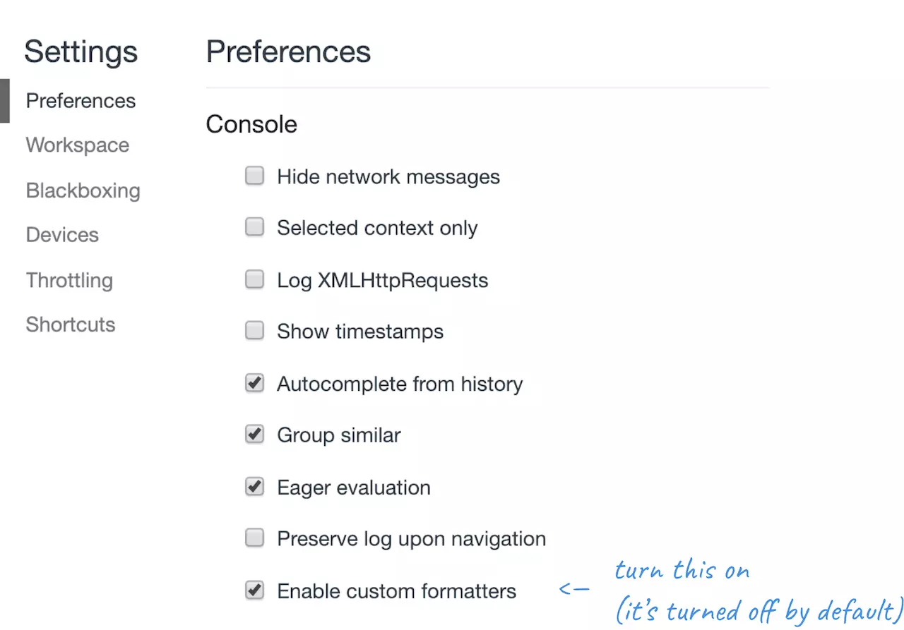
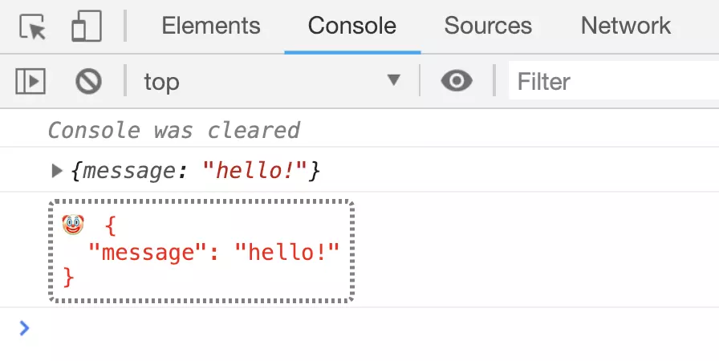

# 自定义格式转换器


大多数的情况下，我们习惯使用 `DevTools` 的 `console` 默认对 `object` 的转换，但有时候我们想用与众不同的方式来处理。 那我们就可以自定义输出对象的函数，它通常被称为 `Custom Formatter` 。

> 请注意: 在我们写一个之前，需要在 DevTools 进行设置 (在 DevTools 的 ⋮ 下拉框找到设置，或者按下 F1 ) 中把对应的设置打开:




`formatter` 长什么样呢？ 它是一个对象，最多包含三个方法：

- `header` : 处理如何展示在 `console` 的日志中的主要部分。
- `hasbody` : 如果你想显示一个用来展开对象的 `▶` 箭头，返回 `true`
- `body` : 定义将会被显示在展开部分的内容中。
- 
一个基础的自定义 `formatter`

```javascript
window.devtoolsFormatters = [{
  header: function(obj) {
    return ['div', {}, `${JSON.stringify(obj, null, 7)}`]
  },
  hasBody: function() {
    return false;
  }
}];
```

> 例子里移除了循环的结构的错误处理，让它看起来更加简洁


`header` 方法返回了一个 `JsonML` (注： `JsonML : JSON Markup Language - JSON` 标记语言) 数组，由这些组成：

- 标签名
- 属性对象
- 内容 (文本值或者其他元素)
(如果看起来很眼熟的话，那可能是因为你之前写过一些 [React](https://reactjs.org/docs/react-without-jsx.html) 代码 :D)

在输出的时候，这个简单的 `formatter` 对于每一层嵌套，直接以 `7` 个空格的缩进打印这个对象。所以现在我们的输出看起来是这样：

勾选 `setting > Enable custom formatter`，运行 `window.devtoolsFormatters = ...` 代码

```javascript
location
// 返回
{
  "href": "http://localhost:4000/console/log.html",
  "ancestorOrigins": {},
  "origin": "http://localhost:4000",
  "protocol": "http:",
  "host": "localhost:4000",
  "hostname": "localhost",
  "port": "4000",
  "pathname": "/console/log.html",
  "search": "",
  "hash": ""
}
```


## 自定义格式化转换器的应用实践

现有好几种 `custom formatter` 可供选择，例如：你可以在这个 `immutable-devtools` 仓库中找到对于 `Immutable.js` 结构的完美展示。但你同样可以自己造一个。

一般来说，每当你遇到结构不寻常的对象时，或大量的日志(最好避免这样的情况，但是有时候很有用)而你想从中做区分时，你可以采用 `custom formatter` 来处理。

一个很实用的窍门：直接将你不关心，不需要区别对待的对象过滤出来，直接在 `header` 方法里面 `return null`。让 `DevTools` 使用默认的格式化方式来处理这些值。

撇开实用性，我们还可以找点乐子：

这是一个关于 `console` 的蠢萌例子：它叫做 `console.clown()` :将打印对象进行转换，而且在对象前面加上一个 `emoji 表情` ...

```javascript
window.devtoolsFormatters = [{
    header: function(obj){
      if (!obj.__clown) {
        return null;
      }
      delete obj.__clown;
      const style = `
        color: red;
        border: dotted 2px gray;
        border-radius: 4px;
        padding: 5px;
      `
      const content = `🤡 ${JSON.stringify(obj, null, 2)}`;

      try {
        return ['div', {style}, content]
      } catch (err) { // for circular structures
        return null;  // use the default formatter
      }
    },
    hasBody: function(){
        return false;
    }
}]

console.clown = function (obj) {
  console.log({...obj, __clown: true});
}

console.log({message: 'hello!'});   // normal log
console.clown({message: 'hello!'}); // a silly log
```

如你所见，我使用 `console.clown` 方法打印出来的对象被添加了一个特殊的属性，便于将它区分出来，并且在 `formatter` 中对它区别处理，但在大部分现实的案例中，这样更好：比如检查这个对象是不是某一个特殊类的实例等等。

对了，`clown` 打印出来了什么东西呢？ 在下面：




---

- [上一章：忍者打印](log.md)
- [下一章：对象&方法](object_function.md)