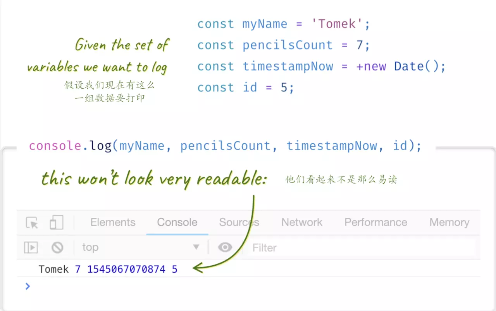
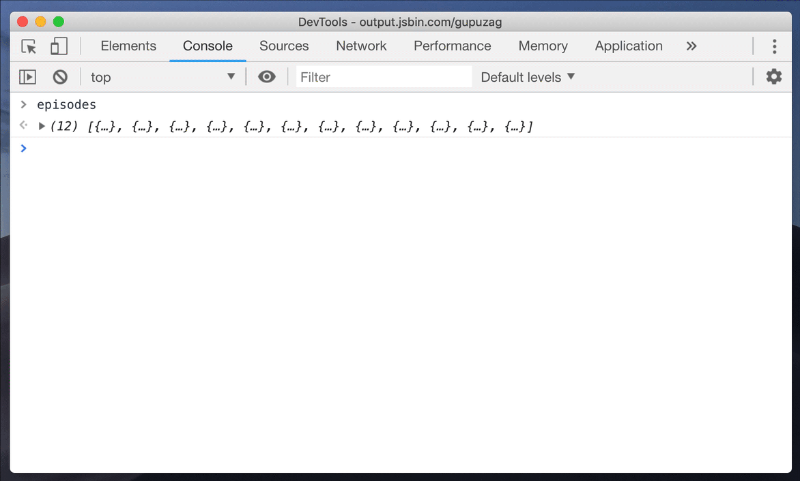
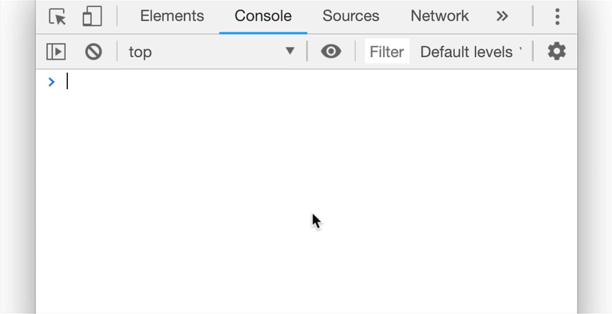
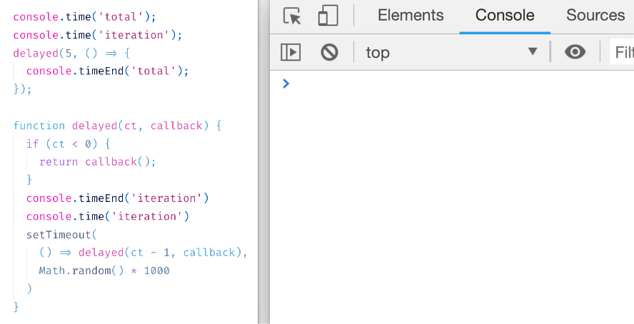
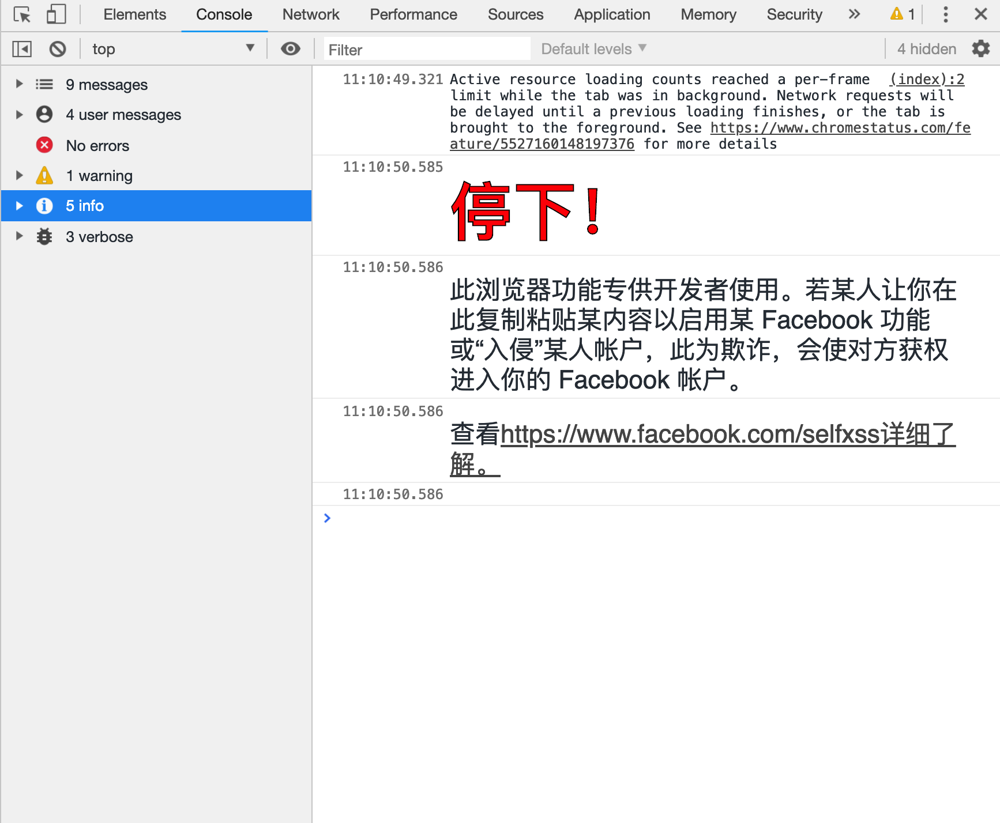
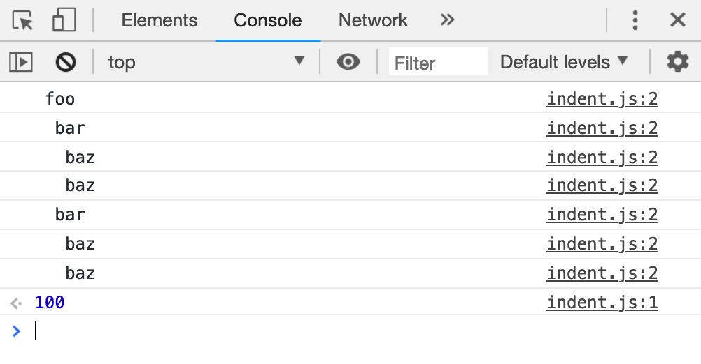

# 骚操作

我最开始接触前端的时候，学会用的就是 `console.log` ，甚至现在，大部分情况也还在用它调试，但是，在不同的场景下，除了 `log` ，其实有更好的选择。

## console.assert

在 [MDN](https://developer.mozilla.org/en-US/docs/Web/API/console/assert) 中是这样定义的

```javascript
console.assert(assertion, obj1 [, obj2, ..., objN]);
console.assert(assertion, msg [, subst1, ..., substN]); // c-like message formatting
```

> 当我们传入的第一个参数为 `假` 时，`console.assert` 打印跟在这个参数后面的值。

这个方法适用于什么情况呢？举个栗子：


通过它，你可以摆脱令人讨厌的 `if` 表达式，还可以获得堆栈信息。

> 请注意，如果你使用的 `NodeJS` 版本 `≤ 10.0` ， `console.assert ` 可能会中断后面代码的执行，但是在 `.10` 的版本中被修复了(当然，在浏览器中不存在这个问题)

## 增强 log 的阅读体验
有时即使你 `console.log` 一个简单的变量，你可能会忘记（或混淆）哪一个是那个。那当你有不同的变量需要打印的时候，阅读起来会更费劲。

假如有这么一堆你想要输出但看起来并不易读的数据`log`



为了让它变得更加易读，你可以打印一个对象 - 只需将所有 `console.log` 的参数包装在大括号中。感谢 `ECMAScript 201`5 中引入了 `enhanced object literal`(增强对象文字面量) ，所以加上 `{}` 已经是你需要做的全部事情了：


> “哪一个值对应哪一个变量来着？”

## console.table

`console.table` 这个小技巧在开发者中可能并没有多少人知道: 如果有一个 数组 (或者是 类数组 的对象，或者就是一个 对象 )需要打印，你可以使用 `console.table` 方法将它以一个漂亮的表格的形式打印出来。它不仅会根据数组中包含的对象的所有属性，去计算出表中的列名，而且这些列都是可以 缩放 甚至 还可以排序!!!

如果你觉得展示的列太多了，使用第二个参数，传入你想要展示的列的名字:



##  table 和 {} 的配合
我们刚刚看到了 `console.table` 这个技巧，也了解了在他上面的 `{}` ，那么我们为什么不将他们结合起来打造一个终极 `log` 呢？`table`


## console.dir
有时候你想要打印一个 `DOM` 节点。 `console.log` 会将这个交互式的元素渲染成像是从 `Elements` 中剪切出来的一样。如果说你想要查看 **这个节点所关联到的真实的js对象** 呢？并且想要查看他的 **属性** 等等？

在那样的情况下，就可以使用console.dir:


##  给 logs 加上时间戳

我们总是需要打印各式各样的信息，之前我们讨论了如何让输出的信息更加直观，但是如果我们需要打印相关的时间信息呢？这就用到了计时的相关操作。

如果你想要给你的应用中发生的事件加上一个确切的时间记录，开启 `timestamps` 。你可以在设置(在调试工具中的 `⋮` 下拉中找到它，或者按下 `F1` )中来开启或者使用 [Commands Menu](https://itnext.io/devtools-tips-day-6-thecommand-menu-449eb3966d9)：

```javascript
// command
> show timestamps
```



## 监测执行时间
与其在所有事上展示一个时间戳，或许你对脚本中的特殊的节点之间执行的时间跨度更加感兴趣，对于这样的情况，我们可以采用一对有效的 `console` 方法

`console.time()` — 开启一个计时器
`console.timeEnd()` — 结束计时并且将结果在 `console` 中打印出来
如果你想一次记录多件事，可以往这些函数中传入不同的标签值。(例如: `console.time('loading')` ， `console.timeEnd('loading')` )


```javascript
console.time('结束');
console.time('迭代');
delayed(5, () => {
  console.timeEnd('结束');
});

function delayed(ct, callback) {
  if(ct < 0) {
    return callback();
  }
  console.timeEnd('迭代');
  console.time('迭代');
  setTimeout(
    () => delayed(ct - 1, callback), 
    Math.random * 1000
  )
}
```



## 给你的 console.log 加上 CSS 样式

如果你给打印文本加上 `%c` 那么 `console.log` 的第二个参数就变成了CSS 规则！这个特性可以让你的日志脱颖而出(例如 [Facebook](https://www.facebook.com/) 在你打开 `console` 的时候所做的一样)

```javascript
console.log('%c牛逼','font-size: 50px; color: red;')
```




## 让 console.log 基于调用堆栈自动缩进

配合 `Error` 对象的 `stack` 属性，让你的 `log` 可以根据堆栈的调用自动缩进：

```javascript
function log(message) {
  console.log(
    // 这句话是重点当我们 new 出来的 Error 对象时，会匹配它的stack 信息中的换行符，换行符出现的次数也等同于它在堆栈调用时的深度。
    ' '.repeat(new Error().stack.match(/\n/g).length - 2) + message
  );
}

function foo() {
  log('foo');
  return bar() + bar();
}

function bar() {
  log('bar');
  return baz() + baz();
}

function baz() {
  log('baz');
  return 25;
}

foo();
```




---

- [上一章：对象&方法](object_function.md)
- [下一章：Network 篇](../network/README.md)
