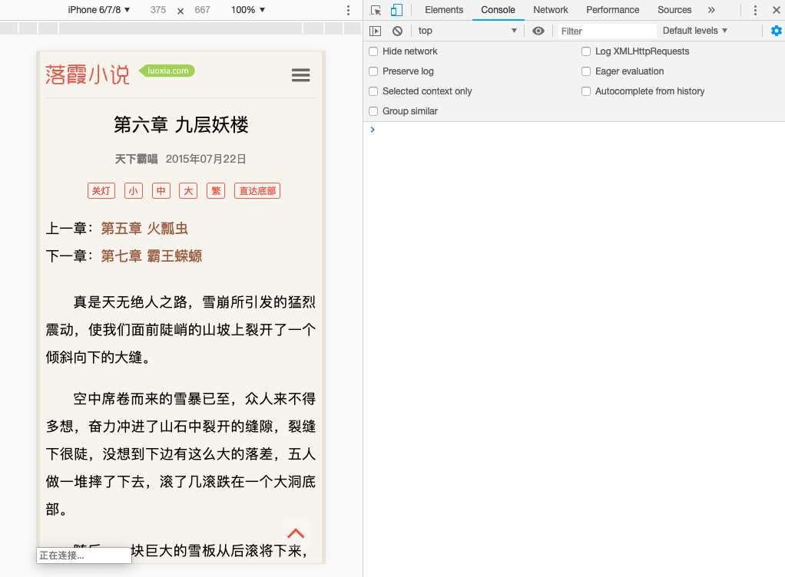
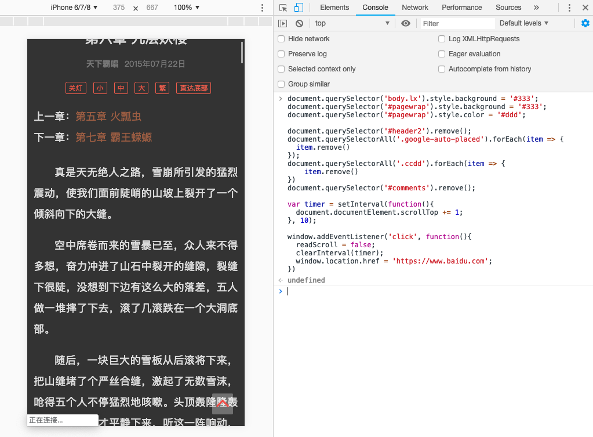
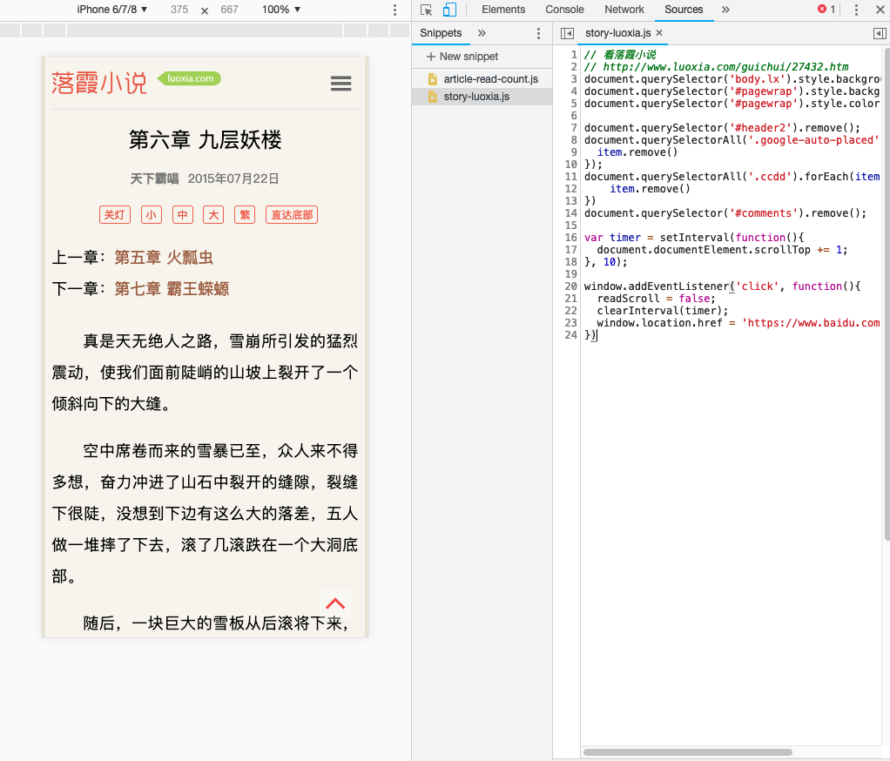
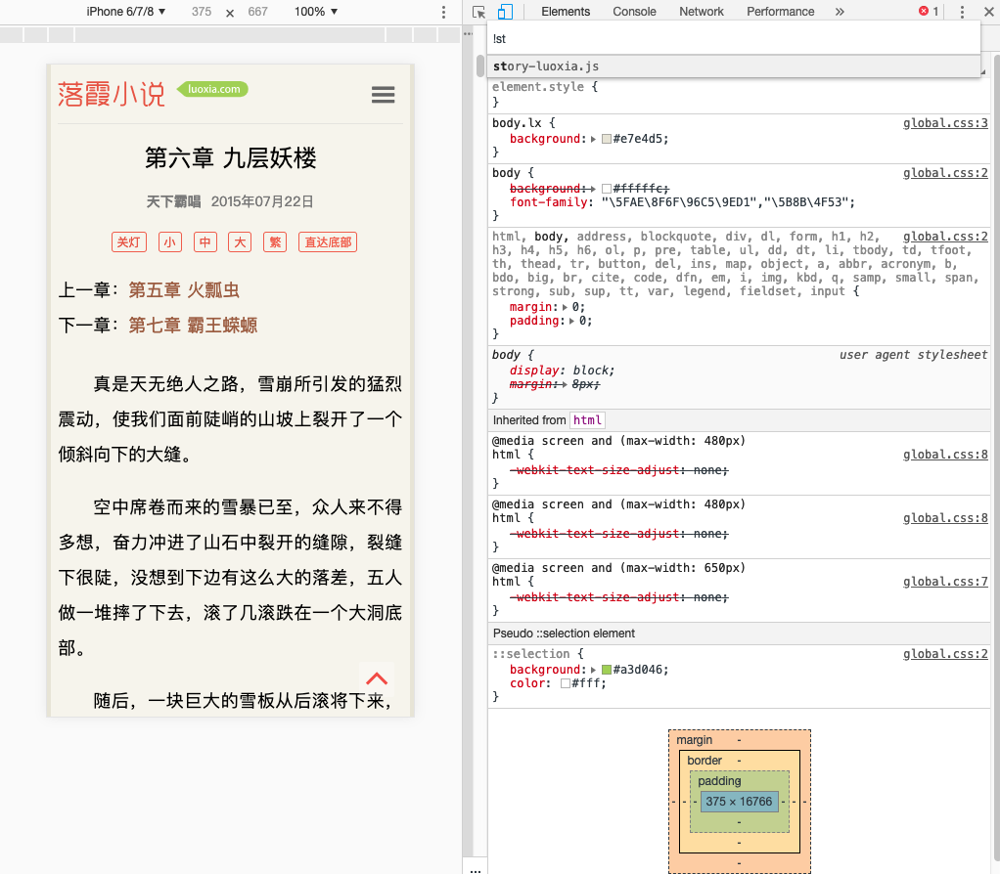

# 代码块的使用

经常使用 `JavaScript` 作为我的自动化工具，来处理第三方网站和应用程序：

比方说，我喜欢看一些不花钱就能看的[小说](http://www.luoxia.com/guichui/27432.htm)，可是免费的东西你懂得，广告到处有：

```javascript
document.querySelector('body.lx').style.background = '#333';
document.querySelector('#pagewrap').style.background = '#333';
document.querySelector('#pagewrap').style.color = '#ddd';

document.querySelector('#header2').remove();
document.querySelectorAll('.google-auto-placed').forEach(item => {
  item.remove()
});
document.querySelectorAll('.ccdd').forEach(item => {
    item.remove()
})
document.querySelector('#comments').remove();

var timer = setInterval(function(){
  document.documentElement.scrollTop += 1;
}, 10);

window.addEventListener('click', function(){
  readScroll = false;
  clearInterval(timer);
  window.location.href = 'https://www.baidu.com';
});
```

当我打开状态页并且输入这段脚本到 `Console` 面板的时候，它将会返回这个数值:



`console` 控制台执行代码后



现在看来，即使这个脚本并没有花费我太多的精力来编写，但也只是偶尔运行一下，所以对于我来说，记住一段这样的脚本会很麻烦：

那怎么解决这个问题呢？

这就是 `Snippets` 的用武之地：它允许你存放 `JavaScript` 代码到 `DevTools` 中，方便你复用这些 `JavaScript` 代码块：

进入到 `Sources` 面板，在导航栏里选中 `Snippets` 这栏，点击 `New snippet`(新建一个代码块) ，然后输入你的代码之后保存，大功告成！现在你可以通过右击菜单 `> run` 或者快捷键：`[ctrl] + [enter]` 来运行它了：




## 运行其他来源的代码块
当我在 `DevTools` 中预设了一组很棒的代码块以后，甚至都不必再通过 Sources 来运行它们。使用 `Command Menu` 才是最快的方式。只需在它的输入框中输入 `!` ，就可以根据名字来筛选预设代码块：




---

- [上一章：命令](command.md)
- [下一章：Console 篇](../console/README.md)
