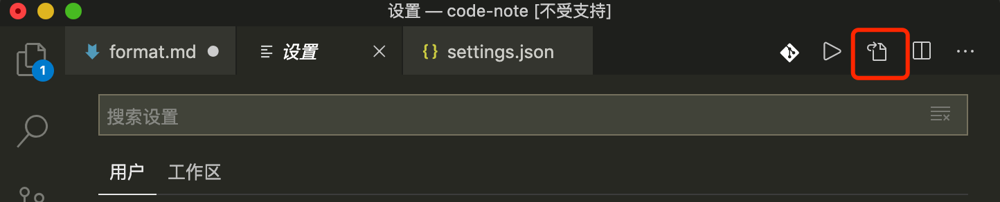

# 格式化

## 打开配置文件

项目开发少不了多人协作，难免会碰到这类问题：由于大家对代码格式化配置不统一，就会产生版本冲突

1.**`Code -> preferences(首选配置) -> setting(设置)`**; 2.快捷键 `command + ,`;

配置模式界面就打开了，点击右上角红色区域按钮，就可以打开 `setting.json` 文件了。



## 编写配置文件

这块配置支持 `html、css、js` 等文件的格式化

## eslint 和 prettier

1.`eslint` 是用来做**代码风格检查**的，比较关注代码质量，并且会提示不符合风格规范的代码。除此之外 `eslint` 也具有一部分代码格式化的功能。这块配置长成这样

```js
// 保存时格式化
"editor.formatOnSave": true,

// 设置 eslint 保存时自动修复
"eslint.autoFixOnSave": true
```

2.`prettier` 本身就是用来做代码格式化的，准确的说它是来美化代码的，所以这方面有更大的优势。同时 `prettier` 也是对 `eslint` 格式化的基础上的一个极好的补充。

- 那么两者都有格式化的功能，就不会有冲突吗？
  有，不过只要简单的配置就可以解决了，比如语句末尾不加分号和强制单引号等 eslint 风格检查

```js
// prettier 设置语句末尾不加分号
"prettier.semi": false,

// prettier 设置强制单引号
"prettier.singleQuote": true,
```

## vue 文件

vscode 对 vue 支持也是很给力的，只需用 **Vetur 插件**，其配置直接用的 prettier 规范。这也是我们选择 **prettier 格式化代码**的另一个原因。

## 冲突

1. eslint 推荐 `function () {}`、prettier 则推荐`function() {}`，如果喜欢用第一种风格那什么都不应该，如果你和我一样喜欢第二种，需要设置 `eslint.validate`, 将自动修复功能注释，保证走 `prettier` 规范。如果项目中也设置了 `eslint`，还需要在 `eslintrc.js` 中配置，

```js
// eslintrc.js
module.exports = {
  rules: {
    'space-before-function-paren': 0
  }
};
```
