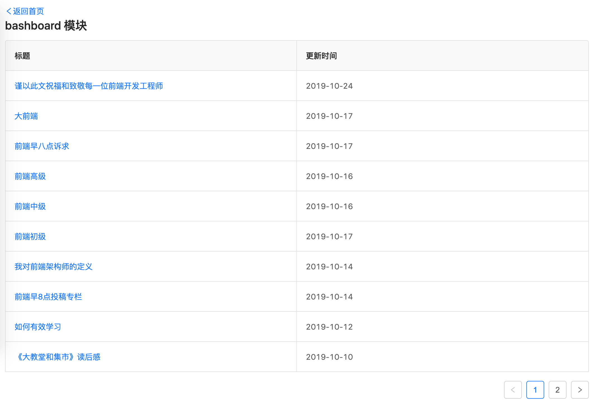
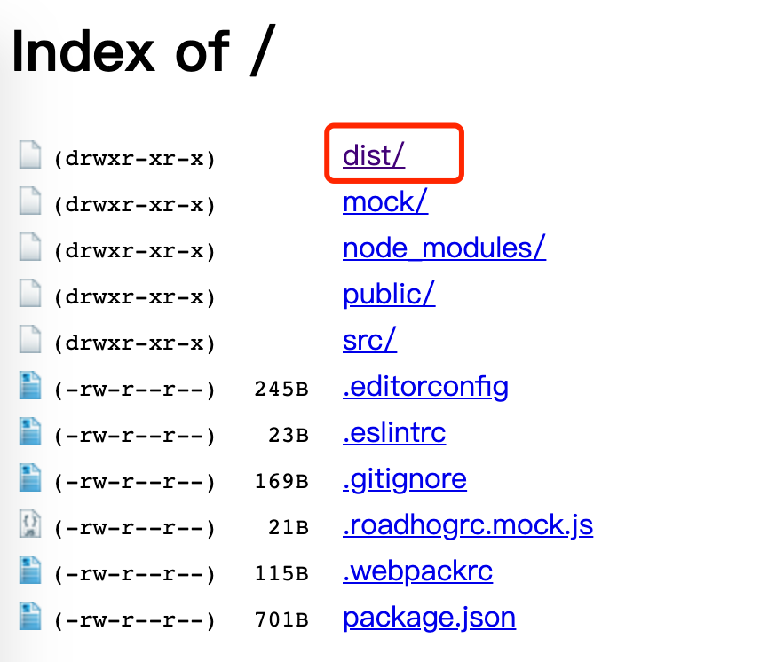

# 为什么要有 Dva

写此小书的目的一是为了熟悉其 API，还有就是方便新人更容易理解。

我们知道 React 是一个 DOM 的抽象层，使用组件来构建虚拟 DOM。如果开发大型应用，如何解决通信问题。

- 向子组件发消息
- 向父组件发消息
- 向其他组件发消息
React 只提供了一种通信手段：传参。对于大应用，很不方便。

## 数据流方案

- 单项数据流 Flux，比如 Reudx;
- 响应式数据流 Reactive，比如 Mobx;
- 其他，比如 rxjs;

## 流行组合打包

- 架构 Redux;
- 异步操作 Redux-saga;
- 路由 React-Router;
自己配置要引入多个库，且项目结构复杂。这就要说说 Dva 了。它是为了简化开发体验，内置了路由 React-Router 和 fetch，是一个轻量级应用框架，更重要的是它是一个 Redux 和 Redux-saga 的数据流方案。

## 数据流图


## 亮点

- **elm 概念**，将 subscriptions、effects 和 reducers 结合起来组织 model；
- **插件机制**，如状态 dva-loading，简化调用接口每次写 showLoading 和 hideLoading；
- **热更新 HMR**，对于组件 components、页面 routes 和模型 model 都能实现 HMR，这主要基于 babel-plugin-dva-hmr；

## 全局安装

```js
npm install dva-cli -g
dva -v
```

> cli，command-line interface，命令行界面的意思

## 创建应用

```js
dva new myapp

dva-cli is deprecated, please use create-umi instead, checkout https://umijs.org/guide/create-umi-app.html for detail.
如果你是蚂蚁金服内部用户，请使用 bigfish 创建项目，详见 https://bigfish.alipay.com/ 。

? Do you insist on using dva-cli? Yes
```

应用创建好后，进入目录 myapp，并启动服务（即 package.json 中 scripts)

```js
cd myapp
npm start
```

若是终端输出下面信息，那就是项目启动成功，会自动在流浪器创建一个标签，其地址是 `http://localhost:8000`（dva 欢迎界面）

```js
Compiled successfully!

You can now view Your App in the browser.

  Local:            http://localhost:8000/
  On Your Network:  http://192.168.0.102:8000/

Note that the development build is not optimized.
To create a production build, use npm run build.
```

## 引入 UI 框架 antd

```js
npm install antd babel-plugin-import --save
```

编辑 `.webpackrc`，使 babel-plugin-import 插件生效（babel-plugin-import 用来按需加载 antd 的脚本和样式）

```js
{
    "extraBabelPlugins": [
        ["import", { "libraryName": "antd", "libraryDirectory": "es", "style": "css" }]
    ]
}
```

## 创建页面和配置路由

在目录 `src/routes` 下新建 `Dashboard/index.js`，内容

```js
import React from 'react';

export default () => {
  return (
    <div>dashboard</div>
  )
}
```

路由在 `src/router.js` 文件中

```js
<Switch>
  <Route path="/" exact component={IndexPage} />
  <Route path="/dashboard" exact component={Dashboard} />
</Switch>
```

## 创建组件

很多教程都告诉我们，组件写在 `src/components` 下，我个人觉得得看情况。多次复用的功能组件放在改目录下没问题（低耦合的软件设计思想），若业务组件只被一个业务模块复用，那放在这个页面目录下比较合适，也符合高内聚的软件设计思想。

```js
// 功能组件 src/components/Title/index.js
import React from 'react';
import Title from '../../components/Title';

export default () => {
  return (
    <div>
      <Title title="bashboard 模块" />
    </div>
  )
}
```

页面 `dashboard` 引用组件 `Title` 

```js
import React from 'react';
import Title from '../../components/Title';

export default () => {
  return (
    <div>
      <Title title="bashboard 模块" />
    </div>
  )
}
```

## model.js

到目前为止我们我们还没有说到对数据的管理，Dva 就是通过 model 这个概念把数据模型管理起来，具体可看[Model][]。

新建文件 `src/routes/Dashboard/model.js`

```js
import { queryList } from './service.js';

export default {
  namespace: 'dashboard',
  state: {
    tableList: []
  },
  subscriptions: {
    setup({ dispatch, history }) {
      history.listen(location => {
        if (location.pathname == '/dashboard') {
          dispatch({
            type: 'queryList',
          });
        }
      });
    },
  },
  effects: {
    *queryList({ payload = {} }, { call, put }) {
      const res = yield call(queryList, payload);
      console.log('res', res)
      yield put({
        type: 'save',
        payload: {
          tableList: res.data || []
        }
      })
    }
  },
  reducers: {
    save(state, action) {
      return { ...state, ...action.payload }
    }
  }
}
```

配置 model `src/index.js`

```js
app.model(require('./src/routes/Dashboard/model').default);
```

## service.js

上面 `model.js` 文件应用了接口，新建文件 `src/routes/Dashboard/service.js`，具体可看[Service][]

```js
import request from '../../utils/request';

export async function queryList(params) {
  return request(`https://api.github.com/repos/ruizhengyun/front-end-note/issues?filter=created&page=1&per_page=15&labels=front-end`)
}
```

## connect

问题来了，`model` 和 `service` 建好也配置好了，怎么将配置好的 `model` 应用到 Dashboard 页面模块中呢？这就要提到 `connect` 方法了，这个不是 `redux` 提供的，而是将 `react` 和 `redux` 串联起来的 react-redux 提供的。具体可查看 [Connect][]。

之前的 `src/Dashboard/index.js` 可以这么改动

```js
import React from 'react';
import { Table, Icon } from 'antd';
import { connect } from 'dva';
import { Link } from 'dva/router';
import Title from '../../components/Title';

const Dashboard = ({
  dashboard: {
    tableList = []
  }
}) => {
  const columns = [
    {
      title: '标题', dataIndex: 'title', key: 'title', width: '10%', render: (text, record) => {
        return (
          <a href={record.html_url} target="_blank">{text}</a>
        )
      }
    },
    {
      title: '更新时间', dataIndex: 'updated_at', key: 'updated_at', width: '10%', render: (text, record) => {
        return (
        <span>{text ? text.split('T')[0] : ''}</span>
        )
      }
    }
  ];

  const tableProps = {
    columns,
    bordered: true,
    dataSource: tableList,
    rowKey: record => record.id,
    paignation: false
  };

  return (
    <div style={{ padding: 12 }}>
      <Link to={'/'}><Icon type="left" />返回首页</Link>
      <Title title="bashboard 模块" />
      <Table {...tableProps} />
    </div>
  )
}

export default connect(({ dashboard }) => ({ dashboard }))(Dashboard);
```

页面最终呈现如下



## 应用构建

上面只是一个页面，实践项目中，复杂的业务逻辑有很多很多。最后，这些都要部署交付给用户，我们就得打个包，将资源 `Javascript、Css、web font、images、html` 等打包到目录 `dist/` 下。

```js
npm run build

# 可以看下是打的包是否正确，你可以
npm install http-server -g
http-server ./ -p 5000
```



[Dva]:https://dvajs.com/guide/getting-started.html#%E4%BD%BF%E7%94%A8-antd

[dva tutorial]: https://github.com/dvajs/dva-docs/tree/master/v1/zh-cn/tutorial

[Model]: ./model.md

[Connect]: ./connect.md