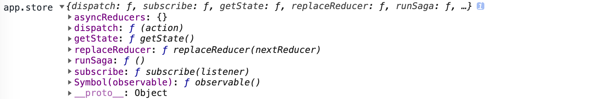
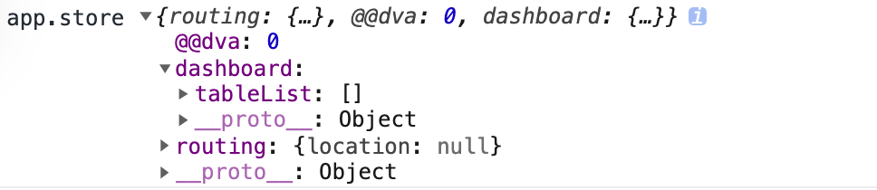

# 数据流向

上小学我们就学过应用题及函数，其实 React 渲染（View 层）就是一个函数 `UI = f(State)`。只要数据发生变化，UI（View） 也就跟着变了，就是这么简单，这也是我们放弃 jquery 的一个重要原因之一。

通常，数据改变是**用户的交互行为和浏览器行为**（路由跳转等）触发的。一旦触发，就会通过 `dispatch` 发起一个 `action`，同步就通过 `reducers` (来自 model) 改变 `state`，如果是异步行为（很多时候也称为副作用）就会比同步多一步，先触发 `effects`，然后再通过 `reducers` 改变 `state`。流程图如下


# Model

- **namespace**，当前 Model 的名称。整个应用的 State 是由多个 model 组成，所以 namespace 不能重复；
- **state**，一个对象，保存整个应用状态，直接决定了视图层的输出
- **action**，一个对象，描述事件
- **dispatch**，一个函数，发送 action 到 state
- **subscription**，
- **reducer**，action 处理器，处理同步动作，用来算出最新的 state
- **effect**，action 处理器，处理异步动作

## 配置在哪儿

```js
const app = dva();

// 新增这一行
app.model({ /**/ });

app.router(() => <App />);
app.start('#root');
```

## 最简结构
```js
// 创建应用
const app = dva();
import * as * from './service.js';

// 注册 Model
app.model({
  namespace: 'home',
  state: {
    data: {}
  },
  reducers: {
    save(state, action) {
      return { ...state, ...action.payload}
    },
  },
  effects: {
    *query(action, { call, put, select }) {
      const { data } = yield select(state => state.home);
      const res = yield call(api.query, {...payload});
      yield put({
        type: 'save',
        payload: {
          data: res.data || {}
        }
      });
    },
  },
});

// 注册视图
app.router(() => <ConnectedApp />);

// 启动应用
app.start('#root');
```

# State
`state` 就是状态数据，即存储数据的地方，通常设置为对象，操作的时候都要当作不可变数据（immutable data），保证每次都是全新对象，没有引用关系，保证 `state` 独立，便于测试和追踪。只有收到 Action 才更新数据。

```js
const app = dva();
console.log('app.store', app._store.getState());
console.log('app.store.getState', app._store.getState());
```






# Actions
描述 UI 层事件的一个对象，是改变 `State` 的唯一途径，通过 `dispatch` 函数调用 `action`。它有 `type` 属性，指明具体行为（Model 中 `effects` 或 `reducers`）。

```js
// model.js
dispatch({
    type: 'queryList'
});
```

# Dispatch
上面也提了，其中 `type` 描述具体行为，model 中直接使用，那在 connect Model 的组件（页面）可通过 `props` 调用 `dispatch`，然后调用 `effects` 或 `reducers`

```js
// connect Model 组件 src/routes/Dashboard/index.js
dispatch({
    type: 'dashboard/queryList', // model 外调用，dashboard 是 namespace 名称
    payload: { }  // 传递参数
});
```

# Subscription
订阅的意思，即订阅数据源。数据源可以是当前时间、服务器 websocket 连接、keyboard 输入、geolocation 变化、history 路由变化等。

```js

// src/routes/Dashboard/model.js
import key from 'keymaster';

export default {
    namespace: 'dashboard',
    subscriptions: {
    setup({ dispatch, history }) {
      history.listen(location => {
        if (location.pathname === '/dashboard') {
          dispatch({
            type: 'queryList',
          });
        }
      })
    },
    keyEvent({ dispatch }) {
      key('⌘+up, ctrl+up', () => {
          console.log('⌘+up, ctrl+up');
      });
    }
  },
}
```


# reducer
action 处理器，处理同步动作，该函数接收 2 个参数，即**之前 `state` 和当前的 `state`**，返回新的 `state`。这个概念来自[函数式编程][]，举个例子

```js
const arr = [{x: 1}, {y: 2}, {z: 3}];
const obj = arr.reduce(function(prev, next) {
    return Object.assign(prev, next);
});
console.log('obj', obj); // {x: 1, y: 2, z: 3}
```

有一个点需要注意下，`reducer` 必须是纯函数，即输入什么就输出什么，不能像 `effects` 那样产生副作用。另外每次计算都要是不可变数据（immutable data），简单来说就是返回新的数据（独立和干净），这也是为什么热加载和时间旅行这些功能使用起来的原因了。


# effect
action 处理器，处理异步动作，基于 Redux-saga 实现。实践中，异步操作很常见。其也来自于函数式编程，之所以叫副作用，这是相对纯函数而言的，可以理解为输入什么不一定就输出什么。失控是不允许的，所以为了控制副作用，dva 底层引入了 [redux-saga][]（后期我也将写一本小书，目的和写这本 dva 小书一样）来做异步流程控制，其采用了 [generator][]，将**异步写法转为同步**，从而将 `effects` 转为纯函数。

- **generator**，内部使用 `yield` 关键字，标识每一步的操作，不管是同步还是异步
- **call**，执行异步函数
- **put**，发出一个 action，类似于 dispatch

[redux-saga]: http://superraytin.github.io/redux-saga-in-chinese 
[generator]: http://www.ruanyifeng.com/blog/2015/04/generator.html
[函数式编程]: https://legacy.gitbook.com/book/llh911001/mostly-adequate-guide-chinese/discussions