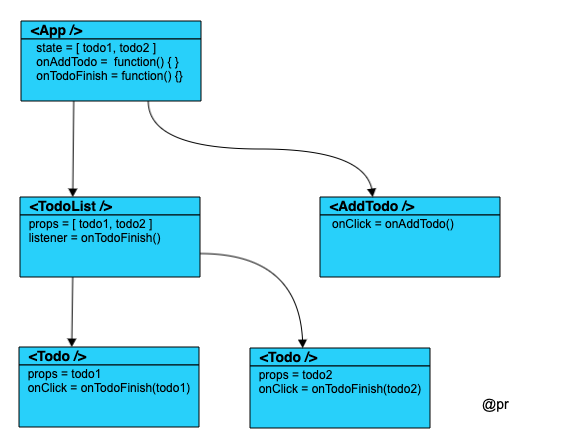
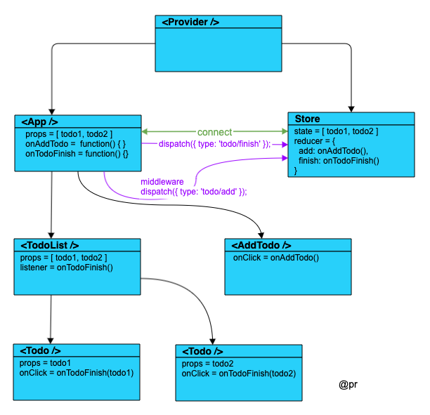
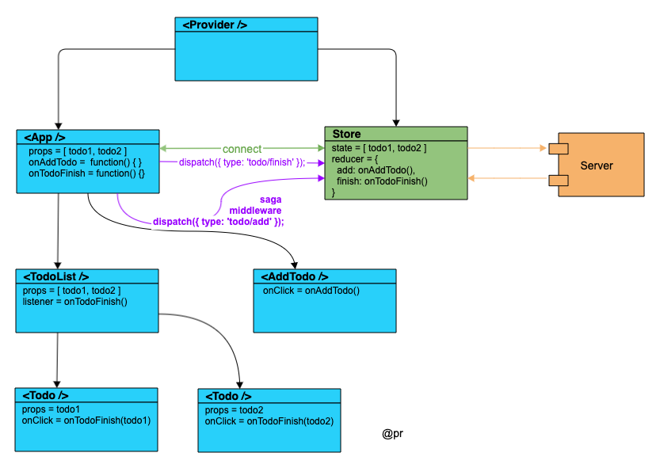
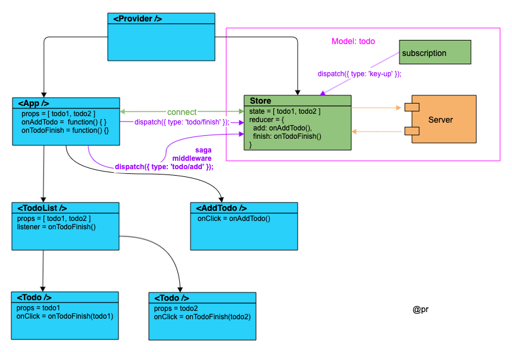

# react 模式

如果多个 Component 之间要发生交互, 那么状态即数据就要维护在这些 Component 的最小公约父节点上, 即示例中的 `<App/>` 组件。

对于 `<AddTodoBtn/>`、`<TodoList/>` 和 `<Todo/>` 组件其本身不维护任何 state, 完全由父组件 `<App/>` 传入 props 以决定其展现, 是一个纯函数的存在形式, 即模板组件、纯组件、木偶组件、Pure Component。

# redux 模式

react 复杂构建页面渲染，至于逻辑部分就交给 store，下图与上图比较，不难得出：
- 状态及逻辑从 `<App />` 组件独立出来，保存在 `store`，逻辑部分就是 `reducer`，通过 `dispatch` 向 `store` 注入 `action` 从而改变 `store` 状态，而状态一旦变化，被 `connect` 的组件就变化；
- `dispatch` 向 `store` 注入 `action` 这个过程是**可以被拦截的**，也就是可以加各类 `middleware` 中间件，实现一些功能，比如**打印日志**；

> 基本实现低耦合、高复用、易扩展。

# redux-saga 模式

到目前为止我们还没涉及到异步请求，既然注入 `action` 过程可以拦截，那本门就用 `redux-sata` 这个类库，发起 `http` 请求，根据返回值调用 `action`，进而改变 `store`。

# dva 模式

通过图形对比，dva 其实是基于 react + redux + saga + ...做了整合，从而提升编码体验和开发效率。
- 把 `store` 及 `saga` 整合到一个 model 文件中;
- 增加 `subscriptions` 功能，收集其他来源的 `action`，比如键盘操作；
- model 文件写法简洁有效，很实用，是程序员喜欢的方式；

