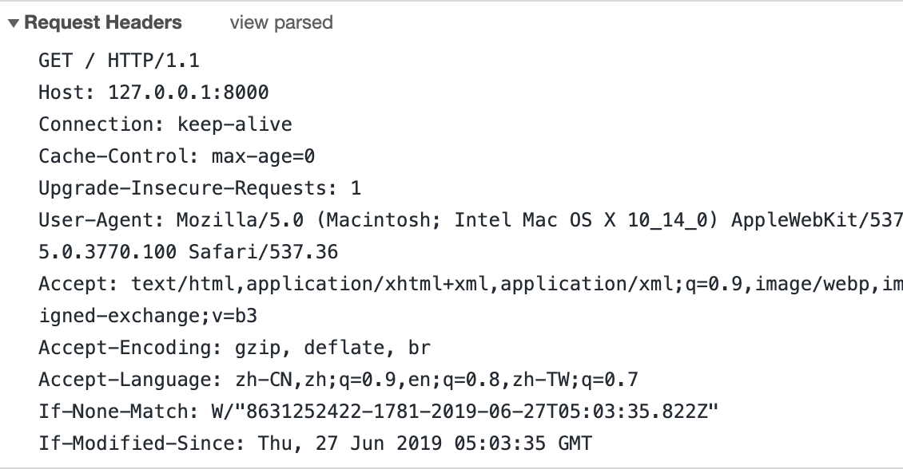
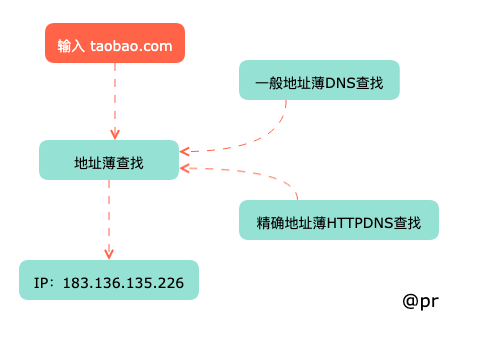
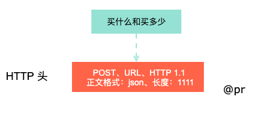
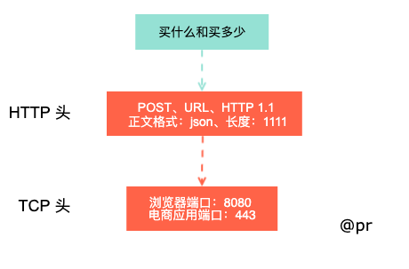
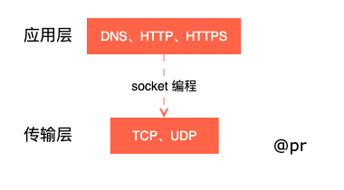
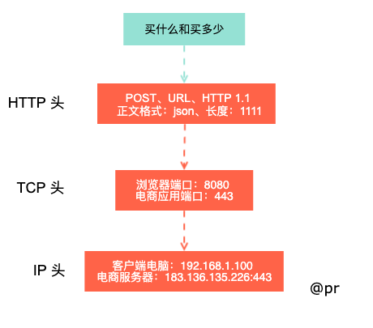
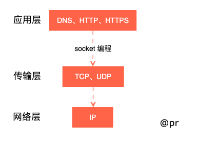
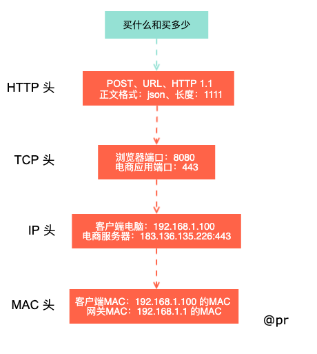
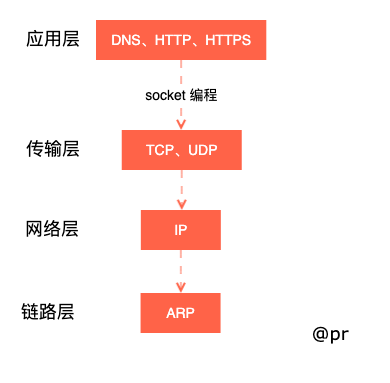

# 协议是啥

>缘起 "你好，世界"

```html
<!DOCTYPE html>
<html lang="en">

<head>
    <meta charset="UTF-8">
    <meta name="viewport" content="width=device-width, initial-scale=1.0">
    <meta http-equiv="X-UA-Compatible" content="ie=edge">
    <title>网络协议</title>
    <style>
        * {
            margin: 0;
            padding: 0;
        }
        body, html {
            height: 100%;
        }
        body {
            align-items: center;
            background: #642b73;
            background: -webkit-gradient(linear,left top,left bottom,from(#c6426e),to(#642b73));
            background: -webkit-linear-gradient(top,#c6426e,#642b73);
            background: linear-gradient(180deg,#c6426e,#642b73);
            display: flex;
            font-family: Open Sans,sans;
            justify-content: center;
            overflow: hidden;
            -webkit-perspective: 1800px;
            perspective: 1800px;
            text-align: center;
            margin: 0 20px;
            flex-flow: column;
            font-size: 16px;
        }
        h1, h2 {
            color: #fff;
        }
        h1 {
            font-size: 30px;
            line-height: 40px;
        }
        h2 {
            font-size: 24px;
            line-height: 36px;
        }
        .margin-bottom {
            margin-bottom: 12px;
        }
    </style>
</head>

<body>
    <h1 class="margin-bottom">你好，世界</h1>
    <script>
        window.onload = render('h2', '你好，网络协议');

        function render(tag, tagContent) {
            const body = document.body;
            const tagWrap = document.createElement(tag);
            const tagNode = document.createTextNode(tagContent);
            tagWrap.append(tagNode);
            body.append(tagWrap)
        }
    </script>
</body>

</html>
```


这是一个很简单的静态页面（加点 css、js ），这是一个前端向计算机表达的方式，这也是一种协议，是人类和计算机沟通的方式。所以说**协议是人类和计算机沟通的一些交流规则**。

## 协议

有个事情你的认同下**接近人类语言计算机不能直接读，计算机能直接读的人类头发要光头**。所以，所以需要中间找个代理来翻译下，这就是编译器（compile）。编译原理涉及到**语义、语法、语序**。

启服务

```javascript
// notes/0.0.1 
sudo npm install http-server -g
http-server -p 8000
```

请求格式规则（控制台）



- 语义，这段内容要表达什么，有什么意义，例子 html、css 和 js 代码都是有意义的，返回状态 200 说明网页成功返回；
- 语法，这段内容符合一定的格式规则，请求和响应格式规则；
- 语序，这段内容按顺序执行，发送 HTTP 请求，然后响应最后渲染；

## 常用的协议都有哪些

### 应用层

> DHCP、HTTP、HTTPS、RTMP、P2P、DNS、GTP、RPC

拿某宝购物并下单这件小事（手机比划几下就搞定了）来说



知道目标地址（拿到 ip）后，浏览器开始打包请求（请求头、请求行、请求体）。普通请求使用 HTTP 协议，对于购物需要用到加密传输就使用 HTTPS 协议。对于购物来说，都需要在写清楚**买什么、买多少**。其中 DNS、HTTP、HTTPS 所在的层是**应用层**。

<table style="border: 0;">
    <tr style="border: 0;">
        <td style="border: 0;"></td>
        <td style="border: 0;"></td>
    </tr>
</table>

### 传输层

> UDP、TCP

应用层封装后，浏览器将应用层的包交给下一层（**传输层**），通过 socket 编程实现。

**传输层**有 2 种协议

- UDP，无连接的协议；
- TCP，连接的协议，支付往往是 TCP 协议，因为 TCP 能保证这个包一定到达目的地（不能到达就重新发送，直至到达）;

TCP 协议有 2 个端口，浏览器监听的端口和电商应用服务器监听的端口（如图）。**操作系统通常是通过端口来判断接收到的包接下来给哪个进程**。应用层到传输层再到网络层都是浏览器提供支持。

<table style="border: 0;">
    <tr style="border: 0;">
        <td style="border: 0;"></td>
        <td style="border: 0;"></td>
    </tr>
</table>

### 网络层（操作系统）

> ICMP、IP、OSPF、BGP、IPSec、GRE

传输层封装后，浏览器又会将包交给**操作系统的网络层**。网络层有 IP 协议，这个协议里有源 IP 地址

- IP 地址（浏览器的 IP 地址，你的电脑）；
- 目标 IP 地址（电商服务器）；

操作系统拿到目标 IP 地址后会经过网关（电商服务器和你的电脑不在一块）。这里网关默认 IP 地址是 192.168.1.1，这是操作系统启动时 DHCP 协议（应用层）配置的，同时也配置 IP 地址（你的电脑）。

<table style="border: 0;">
    <tr style="border: 0;">
        <td style="border: 0;"></td>
        <td style="border: 0;"></td>
    </tr>
</table>

### 链路层或MAC 层

> ARP、VLAN、STP

通常 IP 地址（本国）和目标 IP 地址（国外）不在一个网段（肯定不是一个国家嘛），这个时候要想通过 IP 地址去访问另一网段计算机（国外），就需要网关（护照）。而网关地址总是与计算机的IP地址是同一网段的。

### 那如何通过通过层层网关访问目标 IP 地址呢

- 操作系统将 IP 地址发给网关就是吼一声（ARP 协议）：网关（192.168.1.1）你在哪？
- 网关回答，I am here and 我的本地地址是 xxx，而本地地址就是传说中的 MAC 地址。
- 接着就把包丢给网关。网关扮演的是路由器角色，到某个 IP 怎么走，这个叫路由表。此时网关知道 IP 地址、目标 IP 地址和自己的 MAC 地址，可以理解我从哪儿来要到哪儿去和现在在哪儿（人知道过往、身在何处并有了方向去哪儿都不怕）。
- 网关要到达目标服务器所在网关中间要可能会经过多个网关，网关与相邻网关也是经常沟通的，这种沟通叫路由协议（OSPF、BGP）（假如可以做火车到英国，那中间要经过很多国家，而相邻国家间是有互访记录的）。于是从我的网关（用已有信息）通过多个其他网段网关来到目标服务器所在网关，然后也是大吼一声（忍了好久了，走了这么多路）目标 IP 地址（电商服务器）你在哪？
- 目标服务器淡淡地回复一个 MAC 地址（给你甩包通道，签证）。包（这个沉重包袱）通过这个 MAC 地址找到目标服务器器。
  
<table style="border: 0;">
    <tr style="border: 0;">
        <td style="border: 0;"></td>
        <td style="border: 0;"></td>
    </tr>
</table>

截止目前，每层都在给包加负：HTTP 头 + TCP 头 + IP 头 + MAC 头。

接下来就要给包减负了（网关哥们，辛苦了，来，喝杯水，休息下，剩下的事交给我）

- 目标服务器检查 MAC 地址（刚刚给的）对上了，**获取 MAC 头信息**，发送给操作系统的网络层；
- 发现 IP 对上 了，就**获取 IP 头信息**；
- IP 头信息里会写上一层封装过的 TCP 协议（即获取 TCP 头信息），当网络包到传输层，**获取 TCP 头中电商服务器（一个Tomcat）的进程正在监听的端口**，然后将包发个电商网站；
- 电商的进程得到 HTTP 请求内容（买什么和买多少）。然后由接待员 Tomcat (监听电商服务器端口的家伙) 负责调度处理这个请求。比如告诉订单系统进程买什么和买多少；告诉库存系统进程库存相应减去多少；告诉支付系统进程应该收多少钱；告诉配送系统进程什么时间配送到哪里等等；中间网络互连问题由 RPC 框架统一处理；
- 当接待员 Tomcat 收到各个系统进程都处理完毕后，然后回复一个 HTTPS 包告知下单成功。这个 HTTPS 包开始一段旅程（就是之前客户端发送下单那条路），要经过层层历练达到我们的电脑的浏览器，显示下单成功；

### 物理层（网络跳线）

为设备之间数据通信提供通信媒体和互连设备，给数据传输提供可靠的环境。
