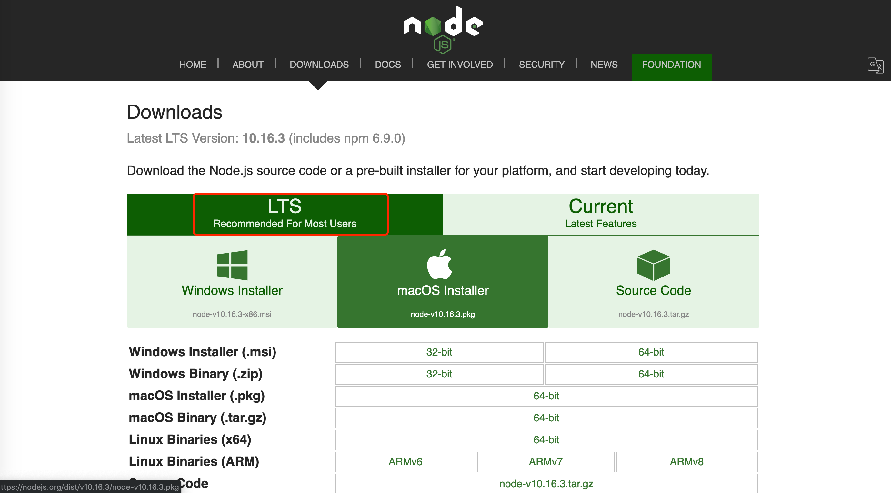

# npm 是什么

后起之秀，荣耀之巅。已然成为世界上最大的软件注册表，周下载量上亿次。来自世界各地的开发者为你护航。

## 组成

- 网站，开发者查找包（package）、配置参数和管理 npm 的站点；
- 注册表（registry），巨大的数据库，保存了每个包的信息；
- 命令行工具（CLI），通过命令行或终端运行；

## 安装

npm 是用 Node.js 编写的，所以你需要安装 Node.js 才能使用 npm。可以通过 Node.js 网站安装 npm，也可以通过 n 或 nvm 安装。

### Node.js 网站安装

访问 [Node.js](https://nodejs.org/en/download/) 站点，到下载页面下载安装程序（下载标有LTS的版本，其他版本尚未经过 npm 测试）。

安装完成后，运行 `node -v`，查看其版本号。

### 使用版本管理器安装 Node.js 和 npm

由于 npm 和 node.js 产品由不同的实体来管理的，因此更新和维护就变得复杂了。另外，Node.js 安装过程将 npm 安装在仅具有本地权限的目录中。当尝试全局运行包时，这可能会导致权限错误。

为解决这类问题，许多开发人员就选择使用节点版本管理器、nvm 或 n 来安装 npm。版本管理器将避免权限错误，并将解决更新 Node.js 和 npm 的复杂性(Node.js 和 npm 多个版本及版本切换)。

## 更新

安装 node.js 时，会自动安装 npm。但是，npm 比 Node.js 更频繁地更新，因此请确保拥有最新版本。

- 运行 `npm -v`，查看其版本号；
- 最新版本安装 `npm install npm@latest -g`；
- 安装将来发布的版本 `npm install npm@next -g`；