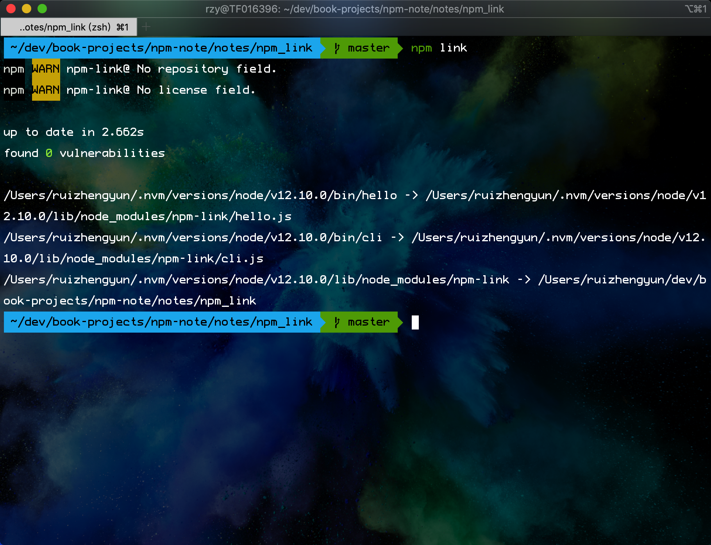

# npm link 实现自定义命令

## 背景

项目开发中，npm 模块开发也是家常便饭。边开发边试用才是我们所希望的。本地调试 `require('moduleName')` 会自动加载本机开发中的模块。但 Node.js 规定，使用一个模块时，需要将其安装到**全局 node_modules 目录或项目的 node_modules 目录**之中。而对于还在开发中的模块，解决方法就是在全局的 node_modules 目录之中，生成一个符号链接，指向模块的本地目录。npm link 就是帮我们自动建立这个符号链接。

## 步骤

1.自定义命令

1）新建 hello.js 文件

```js
#!/usr/bin/env node
console.log('hello');
```

2）再新建 cli.js 文件

```js
#!/usr/bin/env node
console.log('cli');
```

3.新建 package.json，当然你也可以初始化一个 `npm init -y`，重要的是加上 bin 片段

```js
{
  "name": "npm-link",
  "description": "npm link 实现自定义命令",
  "bin": {
    "hello": "./hello.js",
    "cli": "./cli.js"
  }
}
```

4.执行清爽命令 `npm link`



5.在命令行输入 `hello` 或 `cli`

6.修改文件 hello.js 或 cli.js，再在命令行执行 `hello` 或 `cli`

[示例查看](https://github.com/ruizhengyun/npm-note/tree/master/notes/npm_link)