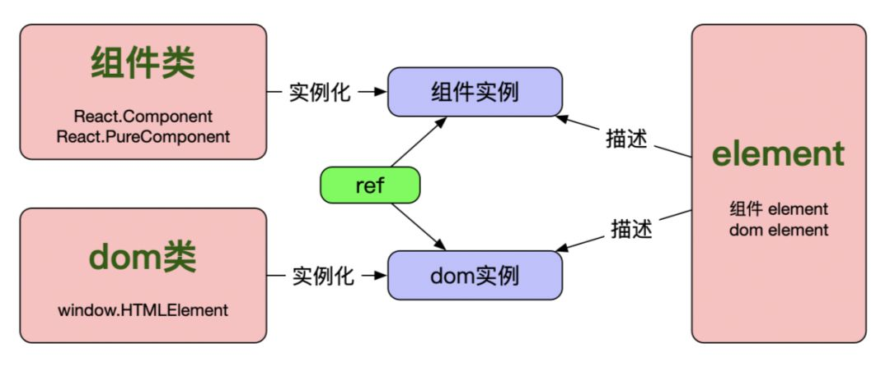

# 组件

<p align="center">
    
</p>

页面卡片组件 `/src/components/Card/index.js` 就是一个组件：

```js
import './index.css';

export default ({
  title = "标题",
  children
}) => {
  return (
    <div className="card">
      <div className="card-header">
        <h2 className="card-title">{title}</h2>
      </div>
      <div className="card-body">
        {children}
      </div>
    </div>
  )
}
```

按照功能划分，一张网页可以由多个互相独立的功能单位组成，这种功能单位就叫做“组件”（component）。比如，典型的网页分成页头、内容、页尾三个部分，就可以写成三个组件：`Header、Content、Footer`。这些组件拼装在一起，就构成了一张页面。

组件内部还可以包含下一级的组件。比如，“文章”组件内部可以包含“表单”组件，“表单”组件内部又可以包含“按钮”组件。

## 特点

组件的好处有很多，下面是其中几点。

- 有利于细化 UI 逻辑，不同的组件负责不同的功能点。
- 有利于代码复用，多个页面可以使用同样的组件。
- 有利于人员分工，不同的工程师负责不同的组件。

## 分类

就是我们经常实现的组件，可以是 **类组件（class component）** 或 **函数式组件（functional component）**。

- 类组件
  - 普通类组件 `React.Component`
  - 纯类组件 `React.PureComponent`
  - 区别在于 `PureComponent` 基于 `shouldComponentUpdate` 做了一些优化
- 函数式组件：用来简化一些组件的时间，用起来就是写一个函数。入参是组件属性 `props`，出参与类组件的`render`方法返回值一样，是 `react element`（一个很重要的概念）。

## 实现方式

下面是通过类组件和函数式组件实现的 **Hello 组件**：

```js
// 普通类 Component
class Hello extends React.Component {
  render() {
    return <h1>你好, {this.props.title}</h1>;
  }
}

// 纯类组件 PureComponent
class Hello extends React.PureComponent {
  render() {
    return <h1>你好, {this.props.title}</h1>;
  }
}

// 函数式组件 functional component
function Hello(props) {
  return <h1>你好, {props.title}</h1>;
}
```

## 语法

虽然输出 JSX 代码的函数就是一个 React 组件，但是这种写法只适合那些最简单的组件。更正式、更通用的组件写法，要使用 ES6 类（class）的语法。

```js
import React from 'react';

class Hello extends React.Component {
  render() {
    return (
      <div className="container">
        <h1>你好, {this.props.title}</h1>
      </div>
    );
  }
}

export default Hello;
```

上面代码定义了一个 **Hello 组件**。自定义的组件必须继承 `React.Component` 这个基类，然后必须有一个 `render` 方法，给出组件的输出。

使用 React 组件也很简单，引入这个组件以后，就可以直接使用。假定上面的组件脚本叫做 Hello.js（为了是组件文件名与普通 js 文件区别，组件文件名首字母大写），那么使用它的代码如下。

```js
import React from 'React';
import Hello from './Hello.js';

class Home extends React.Component {
  render() {
    return (
      <Hello title="这个美丽又遗憾的世界" />
    );
  }
}

export default Home;
```

上面代码中，我们新建了一个 **Home 组件**，里面使用了 **Hello组件**。注意，由于这个组件除了 `title` 参数，没有其他内容，所以可以写成 `<Hello title="这个美丽又遗憾的世界" />` 这种直接闭合的形式。否则，可以写成下面的形式。

```js
import React from 'React';
import Hello from './Hello.js';

class Home extends React.Component {
  render() {
    return (
      <Hello title="这个美丽又遗憾的世界">
        {/* 插入的其他内容 */}
      </Hello>
    );
  }
}

export default Home;
```

## 参数

上一节的 `<Hello title="这个美丽又遗憾的世界" />` 这行代码，**Hello** 是组件名，**title="这个美丽又遗憾的世界"** 表示这个组件的有一个 **title** 参数，值为**这个美丽又遗憾的世界**。

组件内部，所有参数都放在 `this.props` 属性上面。通过 `this.props.title` 就可以拿到传入的值**(这个美丽又遗憾的世界)**。

通过这种参数机制，React 组件可以接受外部消息。

### 用法

```js
import React from 'react';

class Hello extends React.Component {
  render() {
    return (
      <div className="container">
        <h1>Hello, {this.props.title}</h1>
        <p>{this.props.children}</p>
      </div>
    );
  }
}

export default Hello;
```

### 只读性

`props`经常被用作渲染组件和初始化状态，当一个组件被实例化之后，它的props是只读的，不可改变的。如果props在渲染过程中可以被改变，会导致这个组件显示的形态变得不可预测。只有通过父组件重新渲染的方式才可以把新的`props`传入组件中。

### 默认参数

在组件中，我们最好为props中的参数设置一个defaultProps，并且制定它的类型。比如，这样：

```js
Hello.defaultProps = {
  name: 'Hello, world',
};

Hello.propTypes = {
  name: PropTypes.string
};
```

### 类型声明

关于 `propTypes`，可以声明为以下几种类型：

```js
optionalArray: PropTypes.array,
optionalBool: PropTypes.bool,
optionalFunc: PropTypes.func,
optionalNumber: PropTypes.number,
optionalObject: PropTypes.object,
optionalString: PropTypes.string,
optionalSymbol: PropTypes.symbol
```

这些知识基础数据类型，还有一些复杂的，附上链接：
[https://facebook.github.io/react/docs/typechecking-with-proptypes.html](https://facebook.github.io/react/docs/typechecking-with-proptypes.html)

`this.props` 对象有一个非常特殊的参数 `this.props.children`，表示当前组件“包裹”的所有内容。比如，上面代码里面的 `Hello, {this.props.name}`，就是 **&lt;h1&gt; 元素的 this.props.children**。这个属性在 React 里面有很大的作用，它意味着组件内部可以拿到，用户在组件里面放置的内容。

我们还是继续看上面那个例子。完整代码如下，内部使用 `props.children`，获取用户传入的内容。

### 总结

`props`是一个从外部传进组件的参数，主要作为就是从父组件向子组件传递数据，它具有可读性和不变性，只能通过外部组件主动传入新的props来重新渲染子组件，否则子组件的props以及展现形式不会改变。

## 状态

除了接受外部参数，组件内部也有不同的状态。React 规定，组件的内部状态记录在 `this.state` 这个对象上面。

> State is similar to props, but it is private and fully controlled by the component.

### 状态用法

```js
// ./src/components/pages-game/day2/square.js
import React from 'react';
import styles from './square.less';

class Square extends React.Component {
  constructor() {
    super();
    // 设定一个初始状态
    this.state = {
      value: null
    }
  }

  handleClick = () => {
    this.setState({
      value: 'X'
    });
  }

  render() {
    return (
      <button className={styles.square} onClick={this.handleClick}>
        {this.state.value}
      </button>
    )
  }
}

export default Square;
```

上面代码中，组件 Square 的构造方法 `constructor` 里面定义了当前状态 `this.state` 对象。Square 组件的这个对象只有一个 `value` 属性，一开始的值是 `null`。

用户点击按钮以后，`onClick` 监听函数执行 `this.setState()` 方法。React 使用这个方法，更新 `this.state` 对象。这个方法有一个特点，就是每次执行以后，它会自动调用 `render` 方法，导致 UI 更新。UI 里面使用 `this.state.value`，输出状态值。随着用户点击按钮，页面就会显示 `X`。

可以看到，这个例子里面，内部状态用来区分用户是否点击了按钮。

### setState

`state` 不同于 `props` 的一点是，`state` 是可以被改变的。不过，不可以直接通过 `this.state=` 的方式来修改，而需要通过`this.setState()` 方法来修改 `state`。

比如，我们经常会通过异步操作来获取数据，我们需要在 `didMount` 阶段来执行异步操作：

```js
componentDidMount(){
  fetch('url')
    .then(response => response.json())
    .then((data) => {
      this.setState({itemList:item});  
    }
}
```

当数据获取完成后，通过 `this.setState` 来修改数据状态。

当我们调用 `this.setState` 方法时，React会更新组件的数据状态 `state`，并且重新调用 `render` 方法，也就是会对组件进行重新渲染。

**注意：通过 `this.state=` 来初始化 `state`，使用 `this.setState` 来修改 `state`，`constructor`是唯一能够初始化的地方。**

`setState` 接受一个对象或者函数作为第一个参数，只需要传入需要更新的部分即可，不需要传入整个对象，比如：

```js
export default class Page extends React.Component{
  constructor(){
    super();
    this.state = {
      name: '王美丽',
      age: 27
    }
  }

  render() {
    <div>
      <h2>大家好，我是 {this.state.name}</h2>
      <h3>我今年 {this.state.age}</h3>
    </div>
  }

  componentDidMount(){
    this.setState({
      age: 18
    });
  }
}
```

在执行完setState之后的state应该是 `{ name: '王美丽', age: 18 }`。

`setState` 还可以接受第二个参数，它是一个函数，会在 `setState` 调用完成并且组件开始重新渲染时被调用，可以用来监听渲染是否完成：

```js
this.setState({
  age: this.state.age - 9
}, () => console.log('setState finished'));
```

`state` 的主要作用是用于**组件保存、控制以及修改自己的状态**，它只能在 `constructor` 中初始化，它算是组件的**私有属性，不可通过外部访问和修改**，只能通过组件内部的 `this.setState` 来修改，修改 `state `属性会导致组件的重新渲染。

## 参数与状态区别

| 组件参数 props             | 组件状态 state                                             |
| :------------------------- | :--------------------------------------------------------- |
| 不变性，外部传入的数据参数 | 可变，组件自己管理数据，控制自己的状态                     |
|                            | 没有 `state` 的叫做无状态组件，有 `state` 的叫做有状态组件 |

多用 props，少用 state, 及**多写无状态组件**。

## 提取组件

先看看这个 `Comment` 组件

```js
const Comment = props => {
  return (
    <div className="Comment">
      <div className="UserInfo">
        
        <div className="UserInfo-name">
          {props.author.name}
        </div>
      </div>

      <div className="Comment-text">
        {props.text}
      </div>

      <div className="Comment-date">
        {formatDate(props.date)}
      </div>
    </div>
  );
}
```

这个组件接收 `author(对象)`、`text(字符串)`、以及 `date(Date对象)` 作为 `props`，用来描述一个社交媒体网站上的评论。

这个组件由于嵌套，变得难以被修改，可复用的部分也难以被复用。所以让我们从这个组件中提取出一些小组件。

提取 `Avatar` 组件

```js
const Avatar = ({
  avatarUrl,
  name
}) => {
  return (
    
  );
}
```

提取一个 `UserInfo` 组件

```js
const UserInfo = ({
  author
}) => {
  return (
    <div className="UserInfo">
      <Avatar {...author} />
      <div className="UserInfo-name">
        {author.name}
      </div>
    </div>
  );
}
```

此时 `Comment` 组件可以改为

```js
const Comment = props => {
  return (
    <div className="Comment">
      <UserInfo {...props} />

      <div className="Comment-text">
        {props.text}
      </div>

      <div className="Comment-date">
        {formatDate(props.date)}
      </div>
    </div>
  );
}
```

**提取组件**一开始看起来像是一项单调乏味的工作，但是在大型应用中，构建可复用的组件完全是值得的。当你的UI中有一部分重复使用了好几次（比如 `Avatar`），或者其自身就足够复杂（比如 `Comment`），类似这些都是抽象成一个可复用组件的绝佳选择，这也是一个比较好的做法。


## 组件描述



### instance

熟悉面向对象编程的人都知道类和实例的关系。套用下格式，组件实例就是组件类实例化的结果。理论很简单，但是在react中却容易弄不明白，为什么这么说呢？

在react应用过程中，不需要我们自己去实例化一个组件实例，你肯定猜到了，是 react 内部帮助我们做了这件事。因此，我们真正接触组件实例的机会并不多。而实际应用中，接触更多的是即将登场的**element**，因为我们通常写的 jsx 其实就是 element 的一种表示方式。
虽然，组件实例用的不多，但是偶尔也会用到，就是 **ref**。

### refs

凡事总有例外，总会有一些很奇葩的时候我们需要直接去操作页面的真实DOM，这就要求我们有直接访问真实DOM的能力，而Refs就是为我们提供了这样的能力。

**ref可以指向一个 dom 节点或一个类组件（class component）的实例，但是不能用于函数式组件（因为函数式组件不能实例化）**。简单来说 ref 可以指向一个组件实例。

看这个名字也知道，Refs其实是提供了一个对真实DOM（组件）的引用，我们可以通过这个引用直接去操作DOM（组件）

什么时候用？官方建议
> 
- Managing focus, text selection, or media playback.
- Triggering imperative animations.
- Integrating with third-party DOM libraries.
  
简单的来说就是处理DOM元素的focus，文本的选择或者媒体的播放等，以及处罚强制动画或者同第三方DOM库集成的时候。也就是React无法控制局面的时候，就需要直接操作Refs了。

至于 `refs` 如何使用，请[点击这里](/advanced/forwarding_refs.html)

### dom

说道dom，作为一名前端开发人员肯定都熟悉了，

```js
const divDomNode = window.document.createElement('div');
```

其实所有dom节点都是 `window.HTMLElement` 的实例

```js
window.document.createElement('div') instanceof window.HTMLElement
```

重复下关系，dom节点是HTMLElement的实例，组件实例是组件类的实例（react中），element是对组件实例或dom节点的描述。

### 组件描述总结

来自类组件的 render 方法以及函数式组件的返回值，返回一个嵌套结构的视图。

- 简单来说 element 就是一个纯对象（plain object）,不是组件实例。
- 它含有**两个属性 type:(string|ReactClass) 和 props:Object**。
  - type 为 string，则表示 **dom 节点**
  - type 为 function 或 ReactClass，则表示**组件实例**
- 和组件实例的关系是：它是对组件实例或dom节点的描述，实例是react内部帮我们干了（好心人啊）。

```js
// type: string  描述dom节点
const button = (
  <button className={styles.suqare}>戳</button>
);

{
  type: 'button',
  props: {
    className: styles.suqare,
    children: '戳'
  }
}

// type: function|ReactClass 描述组件实例
function Button(props) {
  // ....
}

{
  type: Button,
  props: {
    color: 'primary',
    children: '我是另一个按钮，戳我'
  }
}
```

## JSX 语法

第一次接触 React 的用户，都会有一个共同的疑问，为什么 JavaScript 代码里面可以直接插入 HTML 代码。这难道不会报错吗？

回答是如果你把上面的代码，放到 JavaScript 引擎里面运行，确实会报错。因为这种语法不是 JavaScript，而是 React 为了方便开发者自创的 JSX 语法。

JSX 可以被 Babel 转码器转为正常的 JavaScript 语法（jsx 转为 element 纯对象）。当遇到 `<` JSX就当 **HTML 解析**，遇到 `{` 就当 **JavaScript 解析**。上面的 JSX 语法转码后的结果如下。

```js
exports.default = function () {
  return React.createElement(
    "button",
    {
      className: styles.square
    },
    "戳"
  );
};
```

`React.createElement()` 这个方法首先会进行一些避免 bug 的检查，之后会返回一个类似下面例子的对象（组件描述）：

```js
const element = {
  type: 'button',
  props: {
    className: styles.suqare,
    children: '戳'
  }
};
```

这样的对象被称为 “React 元素”。它代表所有你在屏幕上看到的东西。React 通过读取这些对象来构建 DOM 并保持数据内容一致。

两种写法一比较，就会发现对于复杂的 UI 组件来说，JSX 更易写也更易读。所以，几乎所有的 React 开发者都使用 JSX 语法。在实际开发中，JSX在产品打包阶段都已经编译成纯JavaScript，JSX的语法不会带来任何性能影响。另外，由于JSX只是一种语法，因此JavaScript的关键字 `class, for `等也不能出现在XML中，而要如例子中所示，使用 `className, htmlFor` 代替。

JSX 语法的特点就是，凡是使用 JavaScript 的值的地方，都可以插入这种类似 HTML 的语法。

```js
const element = <h1>Hello, world!</h1>;
```

这里有**两个注意点**:
- 所有 HTML 标签必须是闭合的，如果写成 `<h1>Hello` 就会报错。如果是那种没有闭合语法的标签，必须在标签尾部加上斜杠，比如 ``。
- 任何 JSX 表达式，顶层只能有一个标签，也就是说只能有一个根元素。下面的写法会报错。

```js
// 报错
const element = (
  <h1>hello</h1>
  <h1>world</h1>
);

// 不报错
const element = (
  <div>
    <h1>hello</h1>
    <h1>world</h1>
  </div>
);

// 不报错
const element = (
  <>
    <h1>hello</h1>
    <h1>world</h1>
  </>
);

// 不报错
const element = [
  <h1 key="hello">hello</h1>,
  <h1 key="world">world</h1>
];
```

上面代码中，第一种写法会报错，因为根元素的位置有两个并列的 `<h1>` 标签。在它们外面再包一层，就不会报错了。

一般来说，HTML 原生标签都使用小写，开发者自定义的组件标签首字母大写，比如 `<MyComponent/>`。

JSX 语法允许 HTML 与 JS 代码混写。

```js
const element = (
  <button>
    Hello, {handleFn(title)}!
  </button>
);
```

上面代码中，`<h1>` 标签的文字内容部分嵌入了 JS 代码。每次生成的文本，取决于函数 `handleFn(title)` 执行的结果。

可以看到，JSX 语法的值的部分，只要使用了大括号{}，就表示进入 JS 的上下文，可以写入 JS 代码。
