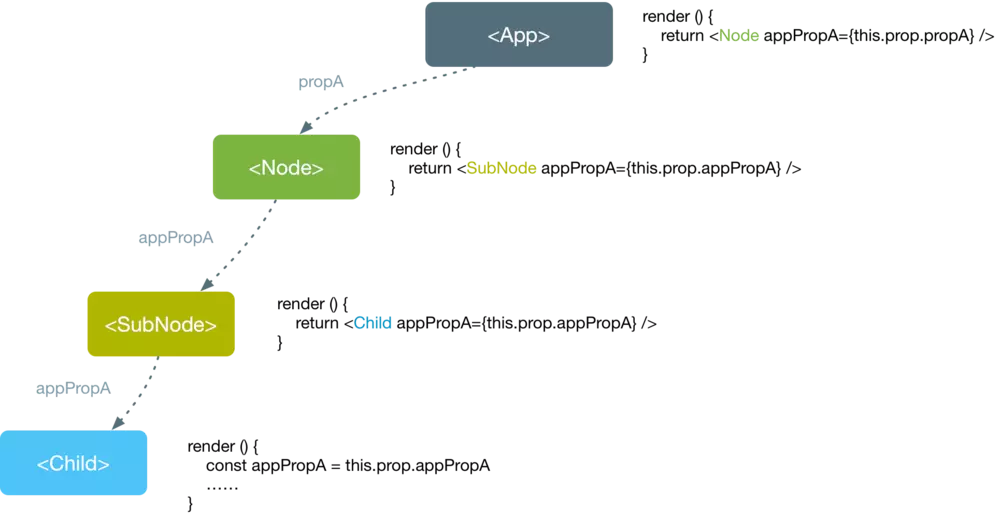
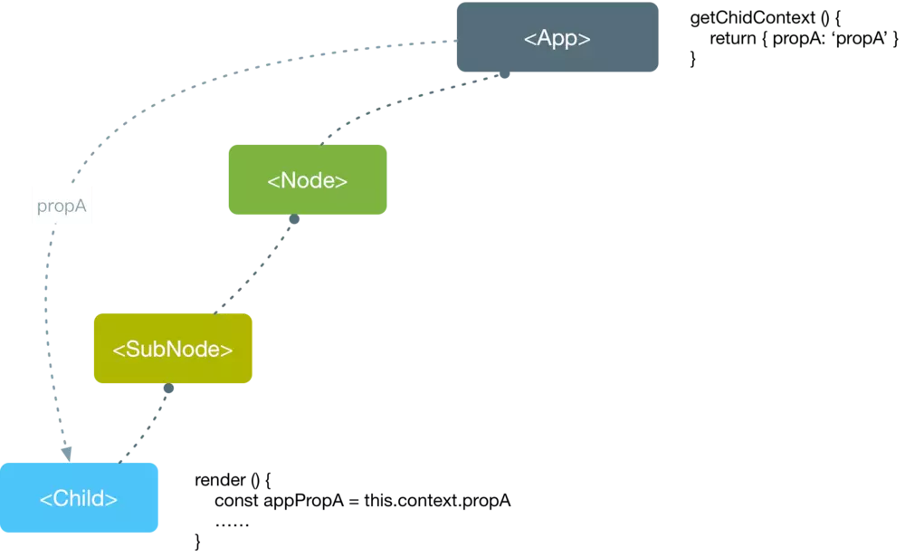

# Hooks

## 起源

React 一直以来有两种创建组件的方式: **Function Components (函数组件)与 Class Components (类组件)**。函数组件只是一个普通的 JavaScript 函数，接受`props` 对象并返回 React Element。在我看来，函数组件更符合 React的思想，数据驱动视图，不含有任何的副作用和状态。在应用程序中，一般只有非常基础的组件才会使用函数组件，并且你会发现随着业务的增长和变化，组件内部可能必须要包含状态和其他副作用，因此你不得不将之前的函数组件改写为类组件。但事情往往并没有这么简单，类组件也没有我们想象的那么美好，除了徒增工作量之外，还存在其他种种的问题。

首先类组件共用状态逻辑非常麻烦。比如我们借用官方文档中的一个场景，`FriendStatus` 组件用来显示朋友列表中该用户是否在线。

```js
class FriendStatus extends React.Component {
  constructor(props) {
    super(props);
    this.state = { isOnline: null };
    this.handleStatusChange = this.handleStatusChange.bind(this);
  }

  componentDidMount() {
    ChatAPI.subscribeToFriendStatus(
      this.props.friend.id,
      this.handleStatusChange
    );
  }

  componentWillUnmount() {
    ChatAPI.unsubscribeFromFriendStatus(
      this.props.friend.id,
      this.handleStatusChange
    );
  }
  
  handleStatusChange(status) {
    this.setState({
      isOnline: status.isOnline
    });
  }

  render() {
    if (this.state.isOnline === null) {
      return '加载中...';
    }
    return this.state.isOnline ? '在线' : '离线';
  }
}

```

上面 `FriendStatus` 组件会在创建时主动订阅用户状态，并在卸载时会退订状态防止造成内存泄露。假设又出现了一个组件也需要去订阅用户在线状态，如果想用复用该逻辑，我们一般会使用 **`render props`** 和**高阶组件**来实现状态逻辑的复用。

采用render props的方式复用状态逻辑

```js
class OnlineStatus extends React.Component {
  constructor(props) {
    super(props);
    this.state = { isOnline: null };
    this.handleStatusChange = this.handleStatusChange.bind(this);
  }

  componentDidMount() {
    ChatAPI.subscribeToFriendStatus(
      this.props.friend.id,
      this.handleStatusChange
    );
  }

  componentWillUnmount() {
    ChatAPI.unsubscribeFromFriendStatus(
      this.props.friend.id,
      this.handleStatusChange
    );
  }

  handleStatusChange(status) {
    this.setState({
      isOnline: status.isOnline
    });
  }

  render() {
    const { isOnline } = this.state;
    return this.props.children({ isOnline });
  }
}

class FriendStatus extends React.Component{
  render(){
    return (
      <OnlineStatus friend={this.props.friend}>
        {
          ({isOnline}) => {
            if (isOnline === null) {
              return 'Loading...';
            }
            return isOnline ? 'Online' : 'Offline';
          }
        }
      </OnlineStatus>
    );
  }
}
```

采用高阶组件的方式复用状态逻辑

```js
function withSubscription(WrappedComponent) {
  return class extends React.Component {
    constructor(props) {
      super(props);
      this.state = { isOnline: null };
      this.handleStatusChange = this.handleStatusChange.bind(this);
    }

    componentDidMount() {
      ChatAPI.subscribeToFriendStatus(
        this.props.friend.id,
        this.handleStatusChange
      );
    }

    componentWillUnmount() {
      ChatAPI.unsubscribeFromFriendStatus(
        this.props.friend.id,
        this.handleStatusChange
      );
    }

    handleStatusChange(status) {
      this.setState({
        isOnline: status.isOnline
      });
    }

    render() {
      return <WrappedComponent isOnline={this.state.isOnline}/>
    }
  }
}

const FriendStatus = withSubscription(({isOnline}) => {
  if (isOnline === null) {
    return 'Loading...';
  }
  return isOnline ? 'Online' : 'Offline';
})
```

上面两种复用状态逻辑的方式不仅需要费时费力地重构组件，而且Devtools查看组件的层次结构时，会发现组件层级结构变深，当复用的状态逻辑过多时，也会陷入组件嵌套地狱(wrapper hell)的情况。可见上述两种方式并不能完美解决状态逻辑复用的问题。

不仅如此，随着类组件中业务逻辑逐渐复杂，维护难度也会逐步提升，因为状态逻辑会被分割到不同的生命周期函数中，例如订阅状态逻辑位于componentDidMount,取消订阅逻辑位于componentWillUnmount中，相关逻辑的代码相互割裂，而逻辑不相关的代码反而有可能集中在一起，整体都是不利于维护的。并且相比如函数式组件，类组件学习更为复杂，你需要时刻提防this在组件中的陷阱，永远不能忘了为事件处理程序绑定this。如此种种，看来函数组件还是有特有的优势的。

## 说说今天主角 Hooks

函数式组件一直以来都缺乏类组件诸如状态、生命周期等种种特性，而 Hooks 的出现就是让函数式组件拥有类组件的特性。

> Hooks（钩子） 是React v16.7.0-alpha中加入的新特性。它可以让你在 class 以外使用 state 和其他 React 特性。

钩子是可以让你与 React 状态以及函数式组件的生命周期特性“挂钩”的函数。钩子是为了让你抛弃类使用 React 的，所以它不能在类中运行。（不推荐立即重写已经存在的组件，但是如果你喜欢的话可以在新的组件中开始使用钩子。）

## 状态

这是我们接触到的第一个“hook”，也是 React Hooks最为经典的内置函数，它会返回一个 `Tuple`，结构为 `[value, setValue]`。先一睹为快吧~

```js
import { useState } from 'react';

const Count = () => {
  const [ count, setCount ] = useState(1); // ()里是初始值
  const handleClick = () => {
    setCount(count + 1);
  }
  return (
    <div>
      <p>你点击了 {count} 次</p>
      <button onClick={handleClick}>点击</button>
    </div>
  )
}
```

我们之前是用 `class` 实现的：

```js
import { Component } from 'react';

class Count extends Component {
  state = {
    count: 1
  }
  handleClick = () => {
    this.setState({
      count: this.state.count + 1
    })
  }
  render() {
    return (
      <div>
        <p>你点击了 {this.state.count} 次</p>
        <button onClick={this.handleClick}>点击</button>
      </div>
    )
  }
}
```

useState可以用来定义一个状态，与state不同的是，状态不仅仅可以是对象，而且可以是基础类型值，例如上面的Number类型的变量。useState返回的是一个数组，第一个是当前状态的实际值，第二个用于更改该状态的函数，类似于setState。更新函数与setState相同的是都可以接受值和函数两种类型的参数，与useState不同的是，更新函数会将状态替换(replace)而不是合并(merge)。
 
函数组件中如果存在多个状态，既可以通过一个useState声明对象类型的状态，也可以通过useState多次声明状态。

```js
// 声明对象类型的状态
const [count, setCount] = useState({
    count1: 0,
    count2: 0
});

// 多次声明
const [count1, setCount1] = useState(0);
const [count2, setCount2] = useState(0);
```

相比于声明对象类型的状态，明显多次声明状态的方式更加方便，主要是因为更新函数是采用的替换的方式，因此你必须给参数中添加未变化的属性，非常的麻烦。需要注意的是，React是通过Hook调用的次序来记录各个内部状态的，因此Hook不能在条件语句(如if)或者循环语句中调用，并在需要注意的是，我们仅可以在函数组件中调用Hook,不能在组件和普通函数中(除自定义Hook)调用Hook。


## 状态(state)-useReducer

当要在函数组件中处理复杂多层数据逻辑时，使用 `useState` 就开始力不从心，`useReducer` 就出场了，来处理函数组件中复杂状态逻辑。如果使用过 `Redux`，那么`useReducer` 可谓是非常的亲切，用 `useReducer` 重写之前的计数器例子:

```js
import React, { useReducer } from 'react';

const reducer = (state, action) => {
  switch(action.type) {
    case: 'increment':
      return { count: state.count + 1 };
    case: 'decrement':
      return { count: state.count - 1 };
    default:
      return { count: state.count };
  }
}

const Count = () => {
  const [ state, dispatch ] = useReducer(reducer, { count: 0 });
  const { count } = state;
  return (
    <div>
      <span>{count}</span>
      <button onClick={()=> dispatch({ type: "increment"})}>+</button>
      <button onClick={() => dispatch({ type: "decrement"})}>-</button>
    </div>
  );
}
```

`useReducer` 接受两个参数: **reducer 函数**和**默认值**，并返回当前状态 `state` 和 `dispatch` 函数的数组，其逻辑与 **Redux** 基本一致。`useReducer` 和 Redux 的区别在于**默认值**，Redux 的默认值是通过给 `reducer` 函数赋值默认参数的方式给定，例如:

```js
// Redux的默认值逻辑
const reducer = function (state = { count: 0 }, action) {
  switch (action.type) {
    case "increment":
      return { count : state.count + 1};
    case "decrement":
      return { count: state.count - 1};
    default:
      return { count: state.count }
  }
}
```

`useReducer` 之所以没有采用 Redux 的逻辑是因为 React 认为 `state` 的默认值可能是来自于函数组件的 `props`，例如:

```js
const Count = ({ initialState = 0 }) => {
  const [state, dispatch] = useReducer(reducer, { count: initialState });
  // 省略...
}
```

这样就能实现通过传递 `props` 来决定 `state` 的默认值，当然 React 虽然不推荐 Redux 的默认值方式，但也允许你类似 Redux 的方式去赋值默认值。这就要接触`useReducer` 的第三个参数: `initialization`。

顾名思义，第三个参数 `initialization` 是用来初始化状态，当 `useReducer` 初始化状态时，会将第二个参数 `initialState` 传递 `initialization` 函数，`initialState` 函数返回的值就是 `state` 的初始状态，这也就允许在 `reducer` 外抽象出一个函数专门负责计算 `state` 的初始状态。例如:

```js
const initialization = (initialState) => ({ count: initialState })

const Count = ({ initialState = 0 }) => {
  const [state, dispatch] = useReducer(reducer, initialState, initialization);
  // 省略...
}
```

所以借助于 `initialization` 函数，就可以模拟Redux的初始值方式

```js
import React, { useReducer } from 'react'

const reducer = (state = { count: 0 }, action) => {
  // 省略...
}

const Count = () => {
  const [state, dispatch] = useReducer(reducer, undefined, reducer());
  // 省略...
}
```

## 副作用(Side Effects)-useEffect

解决了函数组件中内部状态的定义，接下来亟待解决的函数组件中生命周期函数的问题。在函数式思想的React中，生命周期函数是沟通函数式和命令式的桥梁，你可以在生命周期中执行相关的**副作用(Side Effects)**。例如: 请求数据、操作DOM等。React提供了useEffect来处理副作用。例如:

```js
useEffect(() => {
  const subscription = props.source.subscribe();
  return () => {
    // 清理 subscription
    subscription.unsubscribe();
  };
});
```

### 点击更改标题

```js
import React, { useState, useEffect } from 'react';

function Count() {
  const [count, setCount] = useState(0);

  useEffect(() => {
    document.title = `你点击了 ${count} 次`
    return () => {
      console.log('清理!')
    }
  });

  return (
    <div>
      <p>你点击了 {count} 次</p>
      <button onClick={() => setCount(count + 1)}>
        戳我
      </button>
    </div>
  );
}
```

在上面的例子中我们给useEffect传入了一个函数，并在函数内根据count值更新网页标题。我们会发现每次组件更新时，useEffect中的回调函数都会被调用。因此我们可以认为useEffect是componentDidMount和componentDidUpdate结合体。当组件安装(Mounted)和更新(Updated)时，回调函数都会被调用。观察上面的例中，回调函数返回了一个函数，这个函数就是专门用来清除副作用，我们知道类似监听事件的副作用在组件卸载时应该及时被清除，否则会造成内存泄露。清除函数会在每次组件重新渲染前调用，因此执行顺序是:

> render -> effect callback -> re-render -> clean callback -> effect callback

因此我们可以使用useEffect模拟componentDidMount、componentDidUpdate、componentWillUnmount行为。之前我们提到过，正是因为生命周期函数，我们迫不得已将相关的代码拆分到不同的生命周期函数，反而将不相关的代码放置在同一个生命周期函数，之所以会出现这个情况，主要问题在于我们并不是依据于业务逻辑书写代码，而是通过执行时间编码。为了解决这个问题，我们可以通过创建多个Hook,将相关逻辑代码放置在同一个Hook来解决上述问题:

```js
import React, { useState, useEffect } from 'react';

function Example() {
  useEffect(() => {
    ChatAPI.subscribeToFriendStatus(props.friend.id, handleStatusChange);
    return function cleanup() {
      ChatAPI.unsubscribeFromFriendStatus(props.friend.id, handleStatusChange);
    };
  });
  
  useEffect(() => {
    otherAPI.subscribeToFriendStatus(props.friend.id, handleStatusChange);
    return function cleanup() {
      otherAPI.unsubscribeFromFriendStatus(props.friend.id, handleStatusChange);
    };
  });
  // 省略...
}
```

通过多个 Hook 来集中逻辑关注点，避免不相关的代码糅杂而出现的逻辑混乱。但是随之而来就遇到一个问题，假设某个行为确定是要在区分 `componentDidUpdate` 或者`componentDidMount` 时才执行，`useEffect` 是否能区分。好在 `useEffect` 提供了**第二个参数**，如果第二个参数传入一个数组，仅当重新渲染时数组中的值发生改变时，`useEffect` 中的回调函数才会执行。因此如果我们向其传入一个空数组，则可以模拟生命周期 `componentDidMount`。但是如果你想仅模拟`componentDidUpdate`，目前暂时未发现什么好的方法。

`useEffect` 与类组件生命周期不同的是，`componentDidUpdate` 和 `componentDidMount` 都是在 DOM 更新后同步执行的,但 `useEffect` 并不会在 DOM 更新后同步执行，也不会阻塞更新界面。如果需要模拟生命周期同步效果，则需要使用 `useLayoutEffect`，其使用方法和 `useEffect` 相同，区域只在于执行时间上。

### 对比一下 React 版 G2 调用流程：

```js
class Component extends React.PureComponent {
  freshChart(props) {
    this.chart.render();
  }

  componentDidMount() {
    this.rootDom = ReactDOM.findDOMNode(this.rootDomRef);
    this.chart = new G2.Chart({
      container: document.getElementById("chart"),
      forceFit: true,
      height: 300
    });
    this.freshChart(this.props);
  }

  componentWillReceiveProps(nextProps) {
    this.freshChart(nextProps);
  }

  componentWillUnmount() {
    this.chart.destroy();
  }

  render() {
    return <div ref={ref => (this.rootDomRef = ref)} />;
  }
}
```

用 React Hooks 可以这么做：

```js
import { useRef, useEffect } from 'react';
function App() {
  const ref = useRef(null);
  let chart = null;
  useEffect(() => {
    if (!chart) {
      chart = new G2.Chart({
        container: ReactDOM.findDOMNode(ref.current),
        width: 500,
        height: 500
      });
    }

    chart.render();

    return () => chart.destroy();
  });

  return <div ref={ref} />;
}
```

可以看到将细碎的代码片段结合成了一个完整的代码块，更方便维护。

### 生命周期

- 官方在推出这一API时，也告诉了大家一个事实，React 团队将倾向于把 `componentDidMount` 和 `componentDidUpdate` 不作区分。
- React 团队早就有了这一倾向，并通过先前版本的API向开发者传达了这一信号，那就是用 `getDerivedStateFromProps` 替代 `componentWillReceiveProps`。

## 上下文

简单说就是，当你不想在组件树中通过逐层传递 `props` 或者`state` 的方式来传递数据时，可以使用 `Context` 来实现跨层级的组件数据传递。



使用 `props` 或者 `state` 传递数据，数据自顶下流。



使用 `Context`，可以跨越组件进行数据传递。

### 之前如何使用 Context

如果要Context发挥作用，需要用到两种组件，一个是Context生产者(Provider)，通常是一个父节点，另外是一个Context的消费者(Consumer)，通常是一个或者多个子节点。所以Context的使用基于生产者消费者模式。


对于父组件，也就是Context生产者，需要通过一个静态属性childContextTypes声明提供给子组件的Context对象的属性，并实现一个实例getChildContext方法，返回一个代表Context的纯对象 (plain object) 。

```js
import React from 'react'
import PropTypes from 'prop-types';

const MiddleComponent = () => {
  return (
    <div style={{ padding: 24 }}>
      <h3>我是 B 组件</h3>
      <ChildComponent />
    </div>
  )
}

class ParentComponent extends React.Component {
  // 声明Context对象属性
  static childContextTypes = {
    propA: PropTypes.string,
    propB: PropTypes.string,
    methodA: PropTypes.func
  }

  // 返回Context对象，方法名是约定好的
  getChildContext() {
    return {
      propA: 'propA',
      propB: 'propB',
      methodA: () => {
        return 'methodA'
      }
    }
  }

  render() {
    return (
      <>
        <h2>我是 A 组件</h2>
        <MiddleComponent />
      </>
    )
  }
}
```

而对于 `Context` 的消费者，通过如下方式访问父组件提供的 `Context`。

```js
import React from 'react'
import PropTypes from 'prop-types';

class ChildComponent extends React.Component {
  // 声明需要使用的Context属性
  static contextTypes = {
    propA: PropTypes.string,
    propB: PropTypes.string,
    methodA: PropTypes.func
  }

  render() {
    console.log('ChildComponent context', this.context)
    const { propA, propB, methodA } = this.context;
    return (
      <div style={{ padding: 24 }}>
        <h4>我是 C 组件</h4>
        <p>{propA}</p>
        <p>{propB}</p>
        <p>{methodA()}</p>
      </div>
    )
  }
}
```

不难看出

- 子组件需要通过一个静态属性contextTypes声明后，才能访问父组件Context对象的属性，否则，即使属性名没写错，拿到的对象也是undefined。
- 对于无状态子组件(Stateless Component)，可以通过如下方式访问父组件的Context

对于无状态子组件(Stateless Component)，可以通过如下方式访问父组件的Context

```js
const ChildComponent2 = (props, context) => {
  console.log('ChildComponent2 context', context);
  const { propA, propB, methodA } = context;

  return (
    <div style={{ padding: 24 }}>
      <h4>我是 C 组件</h4>
      <p>{propA}</p>
      <p>{propB}</p>
      <p>{methodA()}</p>
    </div>
  )
}

ChildComponent2.contextTypes = {
  propA: PropTypes.string,
  propB: PropTypes.string,
  methodA: PropTypes.func
}
```

### 现在如何使用

```js
import React from 'react';
import ReactDOM from 'react-dom';

const ThemeContext = React.createContext({
  background: 'red',
  color: 'white'
});

```

通过静态方法React.createContext()创建一个Context对象，这个Context对象包含两个组件，`<Provider />` 和 `<Consumer />`。

```js
class App extends React.Component {
  render () {
    return (
      <ThemeContext.Provider value={{background: 'green', color: 'white'}}>
        <Header />
      </ThemeContext.Provider>
    );
  }
}
```

`<Provider />` 的 `value` 相当于现在的 `getChildContext()`。

```js
class Header extends React.Component {
  render () {
    return (
      <Title>Hello React Context API</Title>
    );
  }
}

class Title extends React.Component {
  render () {
    return (
      <ThemeContext.Consumer>
        {context => (
          <h1 style={{background: context.background, color: context.color}}>
            {this.props.children}
          </h1>
        )}
      </ThemeContext.Consumer>
    );
  }
}
```

`<Consumer />` 的 `children` 必须是一个函数，通过函数的参数获取 `<Provider />` 提供的 `Context`。

可见，`Context` 的**新 API** 更加贴近 React 的风格。

## 钩子的使用规则

钩子就是强制实现了两条额外规则的Javascript函数：

- 只能在顶层调用钩子。不要在循环，控制流和嵌套的函数中调用钩子。
- 只能从React的函数式组件中调用钩子。不要在常规的JavaScript函数中调用钩子。（此外，你也可以在你的自定义钩子中调用钩子。我们马上就会讲到它。）

## 构建你自己的钩子

有时你希望在组件之间复用一些状态逻辑。在之前有两种流行的解决方案：[高阶组件][] 和 [Rerder Props][]。现在可利用自定义钩子做到这些而不用在组件树中添加更多的组件。

## Hooks 能解决哪些现有问题

### 跨组件复用 stateful logic（包含状态的逻辑）

React 没有提供一种将可复用的行为“attach”到组件上的方式（比如 Redux 的 connect 方法）。如果你已经使用了一段时间的React，你可能对render props 和 高阶组件有一定的了解，它们的出现就是为了解决逻辑复用的问题。但是这些模式都要求你重新构造你的组件，这可能会非常麻烦。在很多典型的React组件中，你可以在React DevTool里看到我们的组件被层层叠叠的providers, consumers, 高阶组件, render props, 和其他抽象层包裹。


### 复杂的组件难以理解

我们在刚开始构建我们的组件时它们往往很简单，然而随着开发的进展它们会变得越来越大、越来越混乱，各种逻辑在组件中散落的到处都是。每个生命周期钩子中都包含了一堆互不相关的逻辑。比如我们常常在 `componentDidMount 和 componentDidUpdate` 中拉取数据，同时 `compnentDidMount` 方法可能又包含一些不相干的逻辑，比如设置事件监听（之后需要在 `componentWillUnmount` 中清除）。最终的结果是强相关的代码被分离，反而是不相关的代码被组合在了一起。这显然会导致大量错误。

## 问题来了

> 1.一定要用它么？
> 完全可选。如果你喜欢 Hooks，可以在一些组件和已经存在的代码中使用。
>
> 2.兼容性怎么样？
> 100%向后兼容。Hooks 不不包含任何爆炸性的更新。
>
> 3.什么时候能用？
> 立即可用。将 React 版本更新到 16.7 及更高版本。
>
> 4.Hooks 容易理解么？
> Hooks 会将 `props、state、content、refs` 和生命周期整合起来，更加方便对 React 的理解。

[高阶组件]: http://ruizhengyun.cn/tutorial/react/advanced/hoc.html
[[Render Props]]: http://ruizhengyun.cn/tutorial/react/advanced/render_props.html