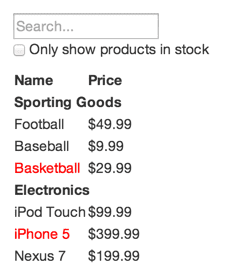

# react理念

> 在我们的理念中，React 最初的目的是使用 JavaScript 创建大型的，快速响应的网络应用。

React的众多优点之一是它让你在编写代码的时候同时也在思考你的应用。在这篇文档中，我们使用 React 一起创建一个可搜索的产品数据表格，并展示思考过程。

## 产品需求

我们已经有一个 JSON 接口和一个设计师给我们的原型图。原型图像下面这样：



JSON 接口返回类似下面的数据：

```js
[
  {category: "Sporting Goods", price: "$49.99", stocked: true, name: "Football"},
  {category: "Sporting Goods", price: "$9.99", stocked: true, name: "Baseball"},
  {category: "Sporting Goods", price: "$29.99", stocked: false, name: "Basketball"},
  {category: "Electronics", price: "$99.99", stocked: true, name: "iPod Touch"},
  {category: "Electronics", price: "$399.99", stocked: false, name: "iPhone 5"},
  {category: "Electronics", price: "$199.99", stocked: true, name: "Nexus 7"}
];
```

## 第一步：将 UI 划分组件层级

如何知道哪一部分应该成为一个组件？想想在编写代码时你在什么情况下需要新建一个函数或对象，思考方式是一样的。例如 单一功能原则，在理想状况下，一个组件应该只做一件事情。如果这个组件功能不断丰富，它应该被分成更小的组件。


一共划分了 5 个组件，每个组件展示的数据用斜体表示

- **FilterableProductTable (橙色)**: 包含了整个例子
- **SearchBar (蓝色)**: 接受所有的用户输入
- **ProductTable (绿色)**: 根据用户输入过滤并展示数据集合
- **ProductCategoryRow (绿松石色)**: 展示每个分类的标题
- **ProductRow (红色)**: 用行来展示每个产品

> 注：表头(包含 Name 和 Price 标签)并没有作为一个组件。这是一个偏好问题，选择哪种方式还得具体情况具体分析。在这个例子中，把它作为 `ProductTable` 的一部分，因为它是渲染数据集合的一部分，而渲染数据集合是 `ProductTable` 的职责。然而，如果头部变得更加复杂(如果我们添加了排序功能)，它就有足够的理由成为**一个单独的 `ProductTableHeader` 组件**。

确定了原型图中的组件，然后把它们整理成层级结构（原型图中的子组件在层级结构中应该作为子节点）。

- FilterableProductTable
  - SearchBar
  - ProductTable
    - ProductCategoryRow
    - ProductRow

## 第二步：用 React 创建一个静态版本

先创建一个静态版本：传入数据模型，渲染 UI 但没有任何交互。最好把这些过程解耦，因为创建一个静态版本更多需要的是码代码，不太需要逻辑思考，而添加交互则更多需要的是逻辑思考，不是码代码。

构建这样一个用于呈现数据模型的静态版本的应用程序，需要创建能够复用其他组件的组件，并通过 `props` 来传递数据。`props` 是一种**从父级向子级传递数据**的方法。如果你熟悉 `state` 的概念，在创建静态版本的时候不要使用 `state`。`state` 只在**交互的时候使用，即随时间变化的数据**。由于这是静态版本的应用，你不需要使用它。

> 注：是自顶向下还是自底向上构建应用？

> - 简单的例子中，通常自顶向下更容易
> - 较大的项目中，自底向上会更容易并且在你构建的时候有利于编写测试

## 定义 UI 状态的最小(但完整)表示

为了正确构建应用，首先你需要考虑应用所需要的最小可变状态集。要点是 DRY：不要重复(Don’t Repeat Yourself)。找出应用程序的绝对最小表示并计算你所需要的其他任何请求。

比如这个例子

- 原产品列表
- 用户输入的搜索文本
- 复选框的值
- 产品的筛选列表

找出哪一个是 `state`。每个数据只要考虑三个问题：

- 它是通过 `props` 从父级传来的吗？如果是，他可能不是 `state`。
- 它随着时间推移不变吗？如果是，它可能不是 `state`。
- 你能够根据组件中任何其他的 `state` 或 `props` 把它计算出来吗？如果是，它不是 `state`。

可推导出

- 原产品列表被作为 `props` 传入，所以它不是 `state`。
- 搜索文本和复选框似乎是 `state`，因为它们随时间改变并且不能由其他任何值计算出来。
- 产品的筛选列表不是 `state`，因为它可以通过将原始产品列表与搜索文本和复选框的值组合计算出来。

## 第四步：确定你的 State 应该位于哪里

现在我们确定了应用 `state` 的最小集合。接下来，我们需要确定哪个组件会改变，或拥有这个 `state`。

记住：React 中的**数据流是单向的**，并在组件层次结构中向下传递。一开始我们可能不是很清楚哪个组件应该拥有哪个 `state`。**在新手理解上这通常是最富有挑战性的部分**，所以按照下面的步骤来辨别：

### 对你应用的每一个 state 的策略

- 确定每一个需要这个 `state` 来渲染的组件；
- 找到一个公共所有者组件(一个在层级上高于所有其他需要这个 `state` 的组件的组件)；
- 这个公共所有者组件或另一个层级更高的组件应该拥有这个 `state`；
- 如果你没有找到可以拥有这个 `state` 的组件，创建一个仅用来保存状态的组件并把它加入比这个公共所有者组件层级更高的地方；

### 用这个策略分析我们的应用

- `ProductTable` 需要根据 `state` 过滤产品列表，`SearchBar` 需要展示搜索文本和复选框状态；
- 公共所有者组件是 `FilterableProductTable`；
- 筛选文本和复选框的值应该放在 `FilterableProductTable`；

### 实操

- 所以我们决定把 `state` 放在 `FilterableProductTable`;
- 为 `FilterableProductTable` 的 `constructor` 添加一个实例属性 `this.state = {filterText: '', inStockOnly: false }` 来表示我们应用的初始状态。
- 把 `filterText` 和 `inStockOnly` 作为 `prop` 传入 `ProductTable` 和 `SearchBar`。最后在 `ProductTable` 中使用这些 `props` 来筛选每行产品信息，在 `SearchBar` 中设置表单域的值。

```js
import React from 'react';
import styles from './index.less';

const data = [
  { category: '体育用品', price: '￥49.99', stocked: true, name: '足球', id: 1001, categoryId: 1 },
  { category: '体育用品', price: '￥9.99', stocked: true, name: '羽毛球', id: 1002, categoryId: 1 },
  { category: '体育用品', price: '￥29.99', stocked: false, name: '篮球', id: 1003, categoryId: 1 },
  { category: '体育用品', price: '￥39.99', stocked: true, name: '篮球', id: 10031, categoryId: 1 },
  { category: '电子类', price: '￥99.99', stocked: true, name: '华为 Mate20', id: 1004, categoryId: 2 },
  { category: '电子类', price: '￥399.99', stocked: false, name: '苹果 6s', id: 1005, categoryId: 2 },
  { category: '电子类', price: '￥199.99', stocked: true, name: '锤子 pro', id: 1006, categoryId: 2 }
];

// 红色-用行来展示每个产品
const ProductRow = ({
  product: {
    stocked,
    name,
    price
  }
}) => {
  return (
    <tr>
      <td>{stocked ? name : (<span style={{ color: 'red' }}>{name}</span>)}</td>
      <td>{stocked ? price : (<span style={{ color: 'red' }}>{price}</span>)}</td>
    </tr>
  );
}

// 绿松石色-展示每个分类的标题
const ProductCategoryRow = ({
  category
}) => {
  return (
    <tr>
      <th colSpan="2">{category}</th>
    </tr>
  )
}

// 绿色-根据用户输入过滤并展示数据集合
const ProductTable = ({
  filterText,
  inStockOnly,
  data
}) => {
  var rows = [];
  var lastCategory = null;
  data.forEach(product => {
    if (product.name.toLowerCase().indexOf(filterText) === -1 || (!product.stocked && inStockOnly)) {
      return;
    }

    if (product.category !== lastCategory) {
      rows.push(<ProductCategoryRow category={product.category} key={product.categoryId} />);
    }

    rows.push(<ProductRow product={product} key={product.id} />);
    lastCategory = product.category;
  });

  return (
    <table className={styles.table}>
      <thead>
        <tr>
          <th>品名</th>
          <th>价格</th>
        </tr>
      </thead>
      <tbody>{rows}</tbody>
    </table>
  );
}

// 蓝色-接受所有的用户输入
const SearchBar = ({
  filterText,
  inStockOnly,
  onFilterTextInput,
  onInStockInput,
}) => {
  const handleFilterTextInputChange = (e) => {
    const value = e.target.value.toLowerCase();
    onFilterTextInput(value);
  }

  const handleInStockInputChange = (e) => {
    onInStockInput(e.target.checked);
  }

  return (
    <form>
      <input
        type="text"
        className={styles.input}
        placeholder="我想..."
        value={filterText}
        onChange={handleFilterTextInputChange}
      />
      <p>
        <label>
          <input
            type="checkbox"
            checked={inStockOnly}
            onChange={handleInStockInputChange}
          />
          {' '}
          仅显示库存产品
        </label>
      </p>
    </form>
  )
}

// 橙色-整个例子
class FilterableProductTable extends React.Component {
  constructor() {
    super();
    this.state = {
      filterText: '',
      inStockOnly: false
    }
  }

  handleFilterTextInput = value => {
    this.setState({
      filterText: value
    })
  }

  handleInStockInput = value => {
    this.setState({
      inStockOnly: value
    })
  }

  render() {
    const searchBarProps = {
      ...this.state,
      onFilterTextInput: this.handleFilterTextInput,
      onInStockInput: this.handleInStockInput,
    };

    const productTableProps = {
      ...this.state,
      data
    };

    return (
      <>
        <SearchBar {...searchBarProps} />
        <ProductTable {...productTableProps} />
      </>
    )
  }
}

export default FilterableProductTable;
```

## 第五步：添加反向数据流

到目前为止，我们已经创建了一个可以正确渲染的应用程序，它的数据在层级中通过函数的 `props` 和 `state` 向下流动。现在是时候支持其他方式的数据流了：层级结构中最底层的表单组件需要去更新在 `FilterableProductTable` 中的 `state`（即子组件向父组件传参）。

- 每当用户更改表单时，更新状态来反应用户输入。因为组件应该只更新自己的状态，`FilterableProductTable` 会将一个回调函数传递给 `SearchBar` ，每当应该更新状态时，它就会触发。使用输入上的 `onChange` 事件来调用它。`FilterableProductTable` 传入的回调函数会调用 `setState()`，这时应用程序就被更新。

## 总结一下

按照上面步骤使用 react 构建组件和应用程序，虽然可能比之前编写更多代码。但是，越是大型组件库或应用，这种方式会让你喜欢上 react 的设计思路和模块化思想，并且随着代码复用性的提高，你会发现之前编写代码量其实并不多。

对于父子组件参数传递，可看[第一个组件-组件参数](http://ruizhengyun.cn/tutorial/react/basics/first_component.html)。