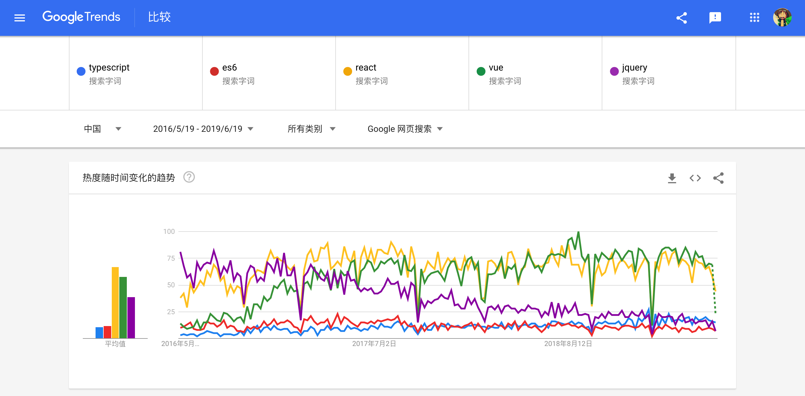
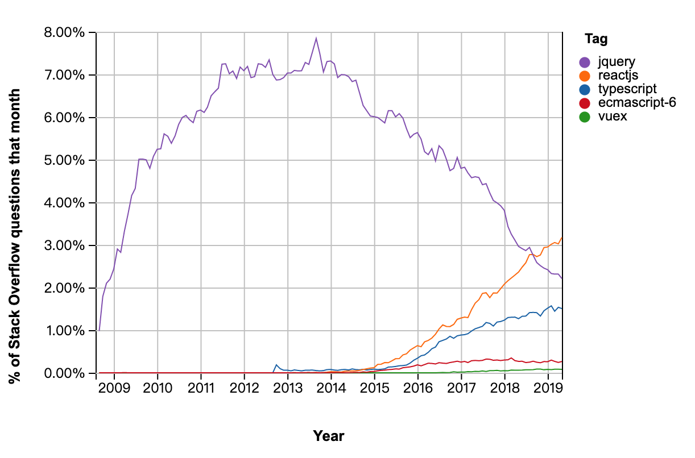
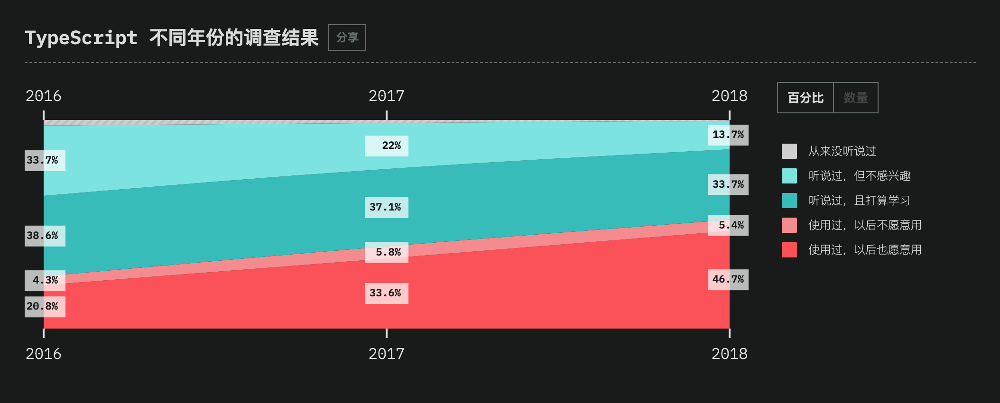

近3年，这家伙很火。🔥 到什么程度？一度没朋友，一度让我心头热了（冷笑话）

# 感性选择（内驱和兴趣使然）

就我来说，我还是一个不太理性的前端，截止到今年，看到哪门语言火热就去凑个热度，然后学学就丢了。3月份加入掘金，就暗暗给自己作了一个规划**前端知识沉淀**。其实也是在自我约束，约束那颗散漫（懒散又漫无目的）的心，要安安静静地做好一件事然后再去做下一件事。

其实 Typescript 基本语法已经撸过一遍，只是一直未在项目中实战，所以又丢了（这个毛病得改，改后还是好前端）。这次决心学并用，是因为本来是想**解读 React 16.8.6 源码**的，可是源码是 Typescript 写的，脑袋翁的一声，只好转头瞄准她了。不可否认，Typescript 本身的魅力也有吸引我，再加上自己也想在 React 项目中将她付诸于实践。综合了这 3 点决定**干（是学）！！！**。

# 理性选择（数据说话）

希望下面几个有影响力的数据趋势站点，能点燃你学习 [Typescript][] 的兴趣。当然了，现在她还不是一门非必学语言。

## Google Trends

第1组就是来自 [Google Trends][] 。题外话，如果你想了解一个或多个事物或技术的发展趋势，[Google Trends][] 是个不错的工具。

这里拿了近3年比较🔥的前端新贵（这里有一个是传统新贵）来做对比的（按火热程度的纬度来对比，虽然她们性质和使用场景的可比性不大），主要目的是想让正在阅读的你有个初步了解，[Typescript][] 是一种趋势。

## Stack Overflow Treads

第2组来自我们熟悉的 [Stack Overflow Treads][]。题外话，Stack Overflow 就是那个遇到任何技术问题都可以去找答案的问答社区。

## The State of JS
第3组报告来自 The State of JS 

## 席卷开源社区

前端开源项目 angular、VScode、Vue3.0、Rxjs、TypeScript（本身）、Mobx、deno、Antd 等都采用了 Typescript 开发，React 采用 flowType，和 Typescript。显然，这是大趋势越，包括 Facebook 自家的 Jest 也宣布从 flowType 转向 typeScript。在这些大厂强力带动下，TypeScript 与我势在必行（没有懒得借口了）。

## 解决之前什么问题

前端报错前几名中必有 `Uncaught TypeError`，然而这是最最低级且不该犯的错误。我们知道 Javascript 是动态语言，运行时才会报错。

如果采用了 Typescript，完整的类型定义会帮助我们
- 能够在编码时很好的规避掉；
- 减少非常多的沟通成本和文档编写成本，最好的文档就是类型嘛（考量一个程序员的自我修养）；
- 前后端合作便利；

阿里 MidwayJs Team 的负责人在 GMTC 上说 “TypeScript，来帮助我们解决这些质量，习惯，方法上的问题，就拿 midway 团队来说，自从使用了 TypeScript，质量提升的非常明显，平常需要测试很久的代码，几乎不会出现低级的问题，反而暴露出的大多都是逻辑问题。” 同事声称 “ 今年，我们希望新应用全量使用 TS”。

# 终于

感性的认识和理性的选择都推动着去学习和应用，那就来吧。

# You can

[前端知识沉淀](https://juejin.im/post/5d0878aaf265da1b83338f74?utm_source=gold_browser_extension)

[上一篇：Typescript 小书入门篇](../README.md)

[下一篇：Typescript 精彩履历](./introduction.md)

[Google Trends]: https://trends.google.com/trends/explore?date=2016-05-19%202019-06-19&geo=CN&q=typescript,es6,react,vue,jquery
[Stack Overflow Treads]: https://insights.stackoverflow.com/trends?tags=typescript%2Creactjs%2Cvuex%2Cecmascript-6%2Cjquery
[Typescript]: http://www.typescriptlang.org/

