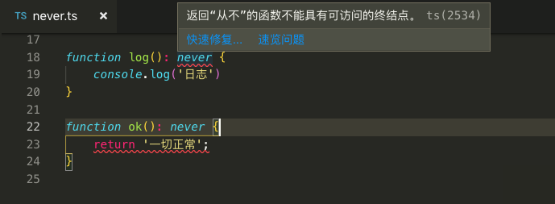
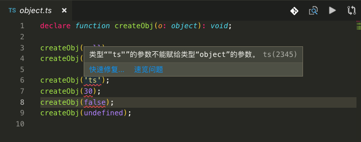

# 任意值

用来表示允许赋值为任意类型。

场景：在编程阶段还不清楚类型的变量指定一个类型。比如来自用户输入或第三方代码库，我们不希望类型检查器对这些值进行检查而是直接让它们通过编译阶段的检查。那么任意值就派上用场了。

```typescript
// any.ts
let notSure: any = 1;
notSure = "换成字符串了";
notSure = false;
```

编译后

```javascript
// any.js
var notSure = 1;
notSure = "换成字符串了";
notSure = false;
```

任意值还有属性和方法，一起看下

## 先看属性

```typescript
// anyAttr.ts
let anyAttr: any = 'typescript';
console.log(anyAttr.name);
console.log(anyAttr.name.firstName);
```

编译后

```javascript
// anyAttr.js
var anyAttr = 'typescript';
console.log(anyAttr.name);
console.log(anyAttr.name.firstName);
```

## 再看方法

```typescript
// anyFn.ts
let anyFn: any = 'typescript';
anyFn.setName('ts');
anyFn.name.setName('name');
```

编译后

```javascript
// anyFn.js
var anyFn = 'typescript';
anyFn.setName('ts');
anyFn.name.setName('name');
```

可推断，**声明一个变量为任意值之后，对它的任何操作（属性和方法），返回的内容的类型都是任意值（就这么无限下去）**。

> 问（猜）：那指定了类型是 `any` 和什么类型都不指定是不是一个意思？

```typescript
// anyNothing.ts
let anyNothing: any;
anyNothing = 'pr';
anyNothing = 30;

let anyNothing1;
anyNothing1 = '江湖再见';
anyNothing1 = 18;
```

编译后

```javascript
// anyNothing.js
var anyNothing;
anyNothing = 'pr';
anyNothing = 30;
var anyNothing1;
anyNothing1 = '江湖再见';
anyNothing1 = 18;
```

下个粗鲁的结论，**就是一样的(变量在声明时未指定其类型，那就默认指定为任意值类型)**。

# Never

表示永不存在的值的类型。使用场景有

- 抛出异常;
- 不会有返回值的函数表达式或箭头函数表达式的返回值类型;
- 变量;

```typescript
// never.ts

// 返回 never 的函数必须存在无法达到的终点
function error(message: string): never {
    throw new Error(message);
}

// 推断的返回值类型为 never
function fail() {
    return error("有错");
}

// 返回 never 的函数必须存在无法达到的终点
function infiniteLoop(): never {
    while (true) {
        // doSomething
    }
}

function log(): never {
    console.log('日志')
}

function ok(): never {
    return '一切正常';
}
```

编译前




编译后


但还是编译出来了

```javascript
// never.js

// 返回 never 的函数必须存在无法达到的终点
function error(message) {
    throw new Error(message);
}
// 推断的返回值类型为 never
function fail() {
    return error("有错");
}
// 返回 never 的函数必须存在无法达到的终点
function infiniteLoop() {
    while (true) {
        // doSomething
    }
}
function log() {
    console.log('日志');
}
function ok() {
    return '一切正常';
}
```

# Object

表示非原始类型（也就是除 `number`，`string`，`boolean`，`symbol`，`null` 或 `undefined` 之外的类型）。

那下面例子说明，在使用 `object` 的时候，可以理解为 `Object.createObj` 这样使用。

```typescript
// object.ts
declare function createObj(o: object): void;

createObj({ name: "typescript" });
createObj(undefined);
createObj(null);

createObj('ts');
createObj(30);
createObj(false);
```

编译前



编译后


但还是编译出来了

```javascript
// object.js
createObj({ name: "typescript" });
createObj(undefined);
createObj(null);
createObj('ts');
createObj(30);
createObj(false);

```

> 注：关键字 `declare` 是用来声明变量，在这里只是一个辅助，后面会有对它做详细说明。

经过测试，`null` 和 `{ name: "typescript" }` 是对象，所以没有什么问题，`undefind` 也没问题，我的理解是它是任何类型的子类型（当然也是 `object` 的子类型）。至于剩下的 3 个有问题已经很明显了。


# 补充说明

本想将**数组类型**和**函数类型**放在这里的，但考虑到以下两点，所以会单独整理成 2 篇内容。

- 会使得本篇篇幅过长；
- 数组类型和函数类型介绍时会牵扯其他概念，所以所牵扯到的概念会在这两篇内容前介绍；

不知正在阅读的你是否赞同我的这种思路和书写方式？请留言...

[本次代码 Github](https://github.com/ruizhengyun/typescript-note/tree/feature_v.0.0.3_20190621/notes/2019-06-21)
