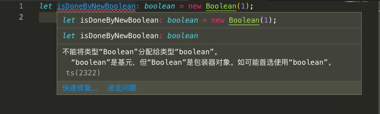

基础类型是我自定义的，主要这章介绍的在 Javascript 中都有的类型。另外，也是区别于下章进阶类型（Javascript 没有或隐性的数据类型）。

# 基础知识脑补下

在 JavaScript 的类型分为两种：
- 原始数据类型（Primitive data types）
- 对象类型（Object types）

其中，原始数据类型包括：**布尔值、数字、字符串、null、undefined** 以及 ES6 中的新类型 **Symbol**。本章选择性讲前 5 种。

# 布尔值

它是最基础的数据类型，其值是 `true/false`。在 JavaScript 和 TypeScript 里都使用 `boolean` 来定义（其它语言中也一样）。

```typescript
// boolean.ts
let isDone: boolean = false;
```

编译（`tsc boolean.ts`）后

```javascript
// boolean.js
var isDone = false;
```

> 问：使用构造函数 `Boolean` 来创造可以么？比如

```typescript
// boolean2.ts
let isDoneByNewBoolean: boolean = new Boolean(1);
```

编译（编辑器里）前



编译后


问题在于 `new Boolean(1)` 返回的是一个对象。

> 再问：直接使用 `Boolean(1)` 怎样？

```typescript
// boolean3.ts
let isDoneByBoolean: boolean = Boolean(1);
```

编译后

```javascript
// boolean3.js
var isDoneByBoolean = Boolean(1);
```

`Boolean(1)` 返回的是个布尔值。


# 数字

和 JavaScript 一样，TypeScript 里的所有数字都是浮点数，类型是 `number`。

```typescript
// number.ts
let decLiteral: number = 6;
let hexLiteral: number = 0xf00d;
let binaryLiteral: number = 0b1010; // ES6 中的二进制表示法
let octalLiteral: number = 0o744;   // ES6 中的八进制表示法
let notANumber: number = NaN;
let infinityNumber: number = Infinity;
```

编译后

```javascript
// number.ts
var decLiteral = 6;
var hexLiteral = 0xf00d;
var binaryLiteral = 10; // ES6 中的二进制表示法
var octalLiteral = 484; // ES6 中的八进制表示法
var notANumber = NaN;
var infinityNumber = Infinity;
```

# 字符串

和 JavaScript 一样，使用 `string` 表示文本数据类型，可以用**双引号（"）或单引号（'）**表示字符串。

```typescript
// string.ts
let str: string = 'Typescript';
let say: string = `Hello, ${str}`;
```

编译后

```javascript
// string.js
var str = 'Typescript';
var say = "Hello, " + str;
```

# null 和 undefined

在 TypeScript 的世界里，`null` 和 `undefined` 可用自身来定义数据类型。不过其用处不大。

```typescript
// null-undefined.ts
let u: undefined = undefined;
let n: null = null;
```

编译后

```javascript
// null-undefined.js
var u = undefined;
var n = null;
```

> 问：那将值 `null` 和 `undefined` 换个位置会怎样呢？

```typescript
// null-undefined2.ts
let u: undefined = null;
let n: null = undefined;
```

编译后

```javascript
// null-undefined2.js
var u = null;
var n = undefined;
```

> 问：那像下面这样呢？

```typescript
// null-undefined3.ts
let nu: number = undefined;
let nn: number = null;

let su: string = undefined;
let sn: string = null;

let bu: boolean = undefined;
let bn: boolean = null;
```

编译后

```javascript
// null-undefined3.js
var nu = undefined;
var nn = null;
var su = undefined;
var sn = null;
var bu = undefined;
var bn = null;
```

从上面 3 个例子，可基本判断，`null` 和 `undefined` 是所有类型的子类型(可以把 `null` 和 `undefined` 赋值给 `number` 等所有类型的变量，也就是赋值没多大意义）。

# 空值

在 JavaScript 的世界里是没有**空值**的概念，但在 TypeScript 中，可以用 `void` 表示没有任何返回值的函数。

```typescript
// void.ts
function sayTs(): void {
    console.log('Hello, Typescript');
}

function sayTs2(): void {
    return 'Hello, Typescript';
}
```

编译前


编译后


但还是编译出来了

```javascript
// void.js
function sayTs() {
    console.log('Hello, Typescript');
}
function sayTs2() {
    return 'Hello, Typescript2';
}
```

> 问：`void` 与 `null`（或`undefined`）间关系如何？

```typescript
// void2.ts
let u: void = undefined;
let n: void = null;
```

编译后

```javascript
// void2.js
var u = undefined;
var n = null;
```

> 问：`void` 与 `string`(`number`、`boolean`)关系如何？

```typescript
// void3.ts
let n: void = 1;
let b: void = false;
let s: void = '1';
```

编译前


编译后


但还是编译出来了

```javascript
// void3.js
var vn = 1;
var vb = false;
var vs = '1';
```

总结下，只能将 `undefined`、`null` 和没有返回值的函数赋值给 `void`（空值）类型。

[本次代码 Github](https://github.com/ruizhengyun/typescript-note/tree/feature_v.0.0.2_20190620/notes/2019-06-20)
