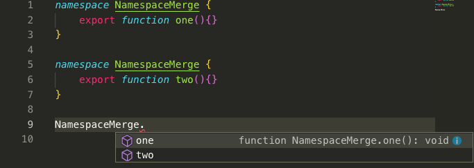

通常我们使用第三方库，可以

- 在 HTML 中通过 `<script>` 标签引入;
- CMD 或 AMD 方式引入;
- ES6 语法 `import` 引入;

# 看那些年我们用过的 jQuery

看惯了之前的引入方式，那 Typescript 咋用的呢？看下面这个例子

```typescript
// declareVar.ts
declare var $$: (selector: string) => any;
$$('#root');
```
编译后

```javascript
// declareVar.js
$$('#root');
```

可见 `declare var` 只是**定义一个全局变量的类型（不是定义一个全局变量）**，仅在编译时用于检查，不会存在与编译的结果中。


# 声明文件

存放声明语句的文件，叫声明文件，通常格式为 `xxx.d.ts`。还是拿 `jQuery` 举例

1.声明文件 `jQuery.d.ts`（抽离出生命语句）

```typescript
// jQuery.d.ts
declare const jQuery2: (selector: string) => any;
```

2.typescript 文件

```typescript
// declareVar2.ts
jQuery2('#root');
```

3.编译后

```javascript
jQuery2('#root');
```

- `jQuery.d.ts` 文件与 `declareVar2.ts` 同处一个目录；
- `declare const jQuery2` 这是全局变量声明模式；
- 通常，ts 会解析所有 `*.ts` 文件（含 `*.d.ts`）,所以 `declareVar2.ts` 可以获得 `jQuery2` 类型定义；


# 第三方声明文件

既然像 `jQuery.d.ts` 这类很多人都需要的声明文件，社区肯定会做些什么，比如 [DefinitelyTyped jQuery][]。既然社区都写好了，那就不造轮子直接下载咯。关于下载，可将其下载到本地 `@types` 目录下，便于识别与统一管理这类声明文件。

```
npm install @types/jquery
```

```typescript
// declareVar3.ts
const jQuery = require('jquery');
const $ = require('jquery');

jQuery('#root')
$('#root')
```

> 对于社区为哪些第三方库写了声明文件，可在这里查询 [https://microsoft.github.io/TypeSearch/](https://microsoft.github.io/TypeSearch/)

# 声明合并

实际场景中，对于定义了两个相同名字的函数、接口或类，它们会合并成一个类型。

## 函数的合并

看个回文的例子

```typescript
// functionMerge.ts
function palindrome(x: string): string;
function palindrome(x: number): number;
function palindrome(x: string | number): number | string {
    if (typeof x === 'number') {
        return Number(x.toString().split('').reverse().join(''));
    } else if (typeof x === 'string') {
        return x.split('').reverse().join('');
    }
}

console.log(palindrome('pr18')); // 81rp
```

## 接口的合并

就是将各接口的属性合并起来。

```typescript
// interfaceMerge.ts
interface Station {
    name: string;
    time: string;
    showName(): string;
}
interface Station {
    name: string;
    time: number;
    showTime(): string;
}

let station: Station = {
    name: '前端工程师',
    time: 18,
    showName: function() {
        return `我是一名${this.name}`;
    },
    showTime: () => {
        return `工作已有${station.time}年了`;
    }
}

console.log(station.showName()); // 我是一名前端工程师
console.log(station.showTime()); // 工作已有8年了

// 0.1.3/interfaceMerge.ts:8:5 - error TS2717: Subsequent property declarations must have the same type.  Property 'time' must be of type 'string', but here has type 'number'.
    // 8     time: number;
      
    // 0.1.3/interfaceMerge.ts:3:5
        // 3     time: string;
        // 'time' was also declared here.

// 0.1.3/interfaceMerge.ts:14:5 - error TS2322: Type 'number' is not assignable to type 'string'.
    // 14     time: 18,
    
    // 0.1.3/interfaceMerge.ts:3:5
        // 3     time: string;
        //   The expected type comes from property 'time' which is declared here on type 'Station'
```

上面报错原因是重复定义 `age` 时改变了其类型。可见，接口的属性在多个接口中可重复定义，但**其类型必须唯一**。

## 类的合并

和接口的合并一样，就不写了。

## 命名空间的合并

```typescript
// namespaceMerge.ts
namespace NamespaceMerge {
    export function one(){}
}

namespace NamespaceMerge {
    export function two(){}
}

NamespaceMerge.one();
```

这里必须要导出，因为不导出就算是合并了，外面也是访问不到，看下图




[本次代码 Github](https://github.com/ruizhengyun/typescript-note/tree/feature_v0.1.3_20190709/notes/0.1.3)

[DefinitelyTyped jQuery]: https://github.com/DefinitelyTyped/DefinitelyTyped/blob/master/types/jquery/JQuery.d.ts
