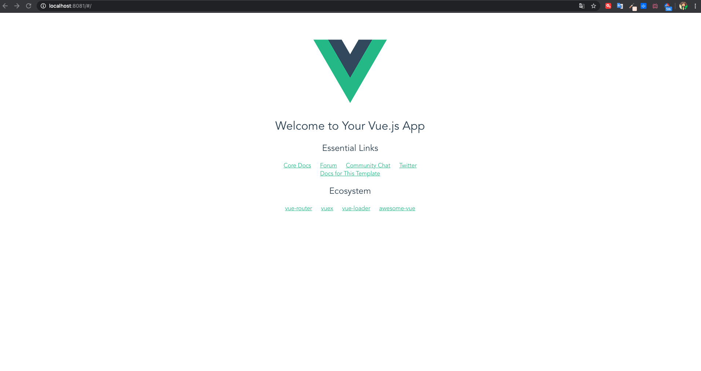

# 安装

## 兼容性

Vue 不支持 IE8 及以下版本，因为 Vue 使用了 IE8 无法模拟的 ECMAScript 5 特性。但它支持所有[兼容 ECMAScript 5 的浏览器](https://caniuse.com/#feat=es5)。

## Vue Devtools

在使用 Vue 时，我们推荐在你的浏览器上安装 [Vue Devtools](https://github.com/vuejs/vue-devtools#vue-devtools)。它允许你在一个更友好的界面中审查和调试 Vue 应用。

## 直接用 `<script>` 引入

::: danger
在开发环境下不要使用压缩版本，不然你就失去了所有常见错误相关的警告!
:::

## CDN

```html
<script src="https://cdn.jsdelivr.net/npm/vue/dist/vue.js"></script>
或
<script src="https://unpkg.com/vue/dist/vue.js"></script>
```

## NPM

在用 Vue 构建大型应用时推荐使用 NPM 安装

```shell
# 最新稳定版
$ npm install vue
```

## 命令行工具 (CLI)

Vue 提供了一个官方的 CLI，为单页面应用 (SPA) 快速搭建繁杂的脚手架。它为现代前端工作流提供了 batteries-included 的构建设置。只需要几分钟的时间就可以运行起来并带有热重载、保存时 lint 校验，以及生产环境可用的构建版本。

```shell
# 全局安装 vue-cli
$ cnpm install --global vue-cli

# 创建一个基于 webpack 模板的新项目
$ vue init webpack myApp

# 然后进行一些配置，默认回车即可
...

# 进入项目，安装并运行
cd myApp
$ cnpm install
```



## 术语

- 完整版：同时包含编译器和运行时的版本。
- 编译器：用来将模板字符串编译成为 JavaScript 渲染函数的代码。
- 运行时：用来创建 Vue 实例、渲染并处理虚拟 DOM 等的代码。基本上就是除去编译器的其它一切。

运行时版本相比完整版体积要小大约 30%，所以应该尽可能使用这个版本。如果你仍然希望使用完整版，则需要在打包工具里配置一个别名，[可参考](https://cn.vuejs.org/v2/guide/installation.html#%E8%BF%90%E8%A1%8C%E6%97%B6-%E7%BC%96%E8%AF%91%E5%99%A8-vs-%E5%8F%AA%E5%8C%85%E5%90%AB%E8%BF%90%E8%A1%8C%E6%97%B6)

## 开发环境 vs. 生产环境

对于 UMD 版本来说，开发环境/生产环境模式是硬编码好的：开发环境下用未压缩的代码，生产环境下使用压缩后的代码。

CommonJS 和 ES Module 版本是用于打包工具的，因此我们不提供压缩后的版本。你需要自行将最终的包进行压缩。CommonJS 和 ES Module 版本同时保留原始的 process.env.NODE_ENV 检测，以决定它们应该运行在什么模式下。由于打包工具 webpack 版本、Rollup 和 Browserify 不同，配置也会不一样，[可参考](https://cn.vuejs.org/v2/guide/installation.html#%E5%BC%80%E5%8F%91%E7%8E%AF%E5%A2%83-vs-%E7%94%9F%E4%BA%A7%E7%8E%AF%E5%A2%83%E6%A8%A1%E5%BC%8F)

## 使用最新开发版本

重要: GitHub 仓库的 /dist 文件夹只有在新版本发布时才会提交。如果想要使用 GitHub 上 Vue 最新的源码，你需要自己构建！

```shell
git clone https://github.com/vuejs/vue.git node_modules/vue
cd node_modules/vue
npm install
npm run build
```

## 镜像

对于墙内用户，建议将 NPM 源设置为[国内的镜像](https://developer.aliyun.com/mirror/NPM?from=tnpm)，可以大幅提升安装速度。

