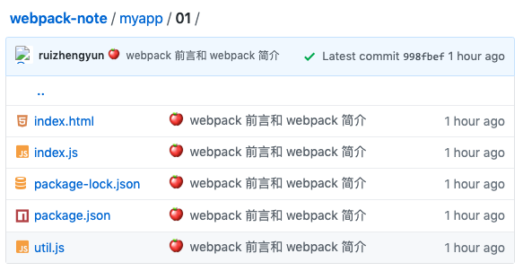
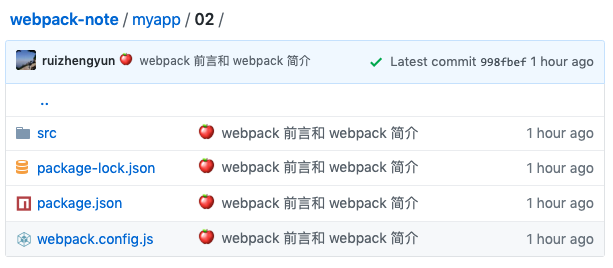
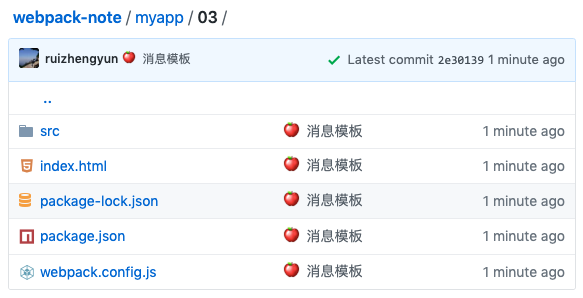

# 简介

首先，Webpack 是一个开源**模块打包**工具，**核心功能**是解决模块间的依赖，将模块按照一定规则组织在一起，合并为一个或多个 `.js` 文件。

了解过 Web 前端开发的小伙伴都知道，我们通常都在与 HTML、CSS 和 JS 等静态资源打交道，直接将工程中的源文件发布到服务器不就可以了吗？中间过程中加了 webpack 环节，有多大意义呢？

## 模块化之前

一个项目在立项后，对于程序结构的设计，要是把所有代码都堆在一个文件中，那将是非常非常非常糟糕的事情（怎么会有人怎么做）。更好的方式是**将这些代码按照特定功能拆分为多个代码段并存到多个文件中**，即么个代码段（文件）只实现特定功能，最终才将所有代码段组合在一起。这就是我们熟悉的**模块化思想**，相信你会不排斥这种设计思路。

像 C、C++、Java 等程序语言，开发者直接可以使用模块化进行开发，可是 Javascript 在很长一段时间内只能通过 script 标签将多个 js 文件插入到页面中。这些都是历史原因了，真要追溯，那是设计 Javascript 的作者最初将 Javascript 定位成脚本语言，实现网页动态效果，所以无需模块化。**随着用户对体验的要求变高，Javascript 原来的设计思路就暴露出许多问题**：

- 手动维护 Javascript 文件加载顺序，以解决文件件的依赖关系；
- 每个 script 标签都需要向服务器请求一次静态资源；
- 全局作用域的泛滥污染；
- ...

## 模块化引入

为了解决上述问题，就不得不引入**模块化设计思路**。

- 通过导出和导入语句来解决模块依赖关系；
- 模块可借助工具打包，合并相似功能资源文件，减少网络开销；
- 模块间的作用域是隔离的，这就解决了命令冲突；
- ...

## 模块化历史

引入模块化思路后，各社区先后开发了 AMD、CommonJS、CMD 等解决方案（这些或许读者都接触过或许都没用过，都没有关系，不用紧张）。2015年，ECMAScript 6.0（就是 ES6）正式定义了 Javascript 模块标准，前前后后 20 年，这一刻终于可以堂堂正正地说 Javascript 拥有模块这个概念了（感动的痛哭而涕，场面一度失控，哈哈）。

可是（我不想听），在得到大多数现代浏览器支持的同时，有些特性和功能还不能直接使用。

- 无法使用 code splitting 和 tree shaking 特性;
- 很多 npm 模块使用 CommonsJS 形式，而浏览器并不支持这类语法，所以无法直接使用；
- 兼容其他浏览器（客户是上帝，我们是开发者，也要考虑用户的体验啊）；

## 终于等到你

既然问题出现了，那就得有方案解决。模块打包工具（module bundler，mb 这不是骂人那个单词的简称）就是保证将打包后的文件正确无误地运行在浏览器中。当下，明星产品有 webpack、parce 和 Rollup 等。

其工作方式：

- 在页面初始化时加载入口模块，其他模块按需异步加载；
- 存在依赖关系的模块按照一定规则合并为单个文件，一次性加载到页面中；

## 为何选择你

那为何选择 webpack 呢？（因为这本书就是讲它啊，这个就不用说了）主要是 webpack 很给力，自带特性如下，容我慢慢道来：

- 支持多种模块标准（AMD、CommonJS、ES6模块）；
- 支持多种类型资源的处理，比如图片、样式等；
- 拥有活跃社区支持，你不是一个人在战斗；
- code splitting（上面刚提过），即代码分割，意思是分割打包后的资源，首屏只加载必要的部分，不太重要部分翻到后面动态（按需）加载。对于体积大的应用来说就是福音啊，可以减小资源体积，提升首页渲染速度；

## 安装

依赖 Node.js 这个就不在赘述，推荐使用 Node.js 的 LTS （Long Term Support）版本。

- 全局安装，好处是绑定一个命令行环境变量，即一次安装、出处运行；
- 本地安装，成为项目中的依赖，只能在项目内部使用，推荐本地安装；
  - 通常项目都不是一个人开发，由于每个开发者系统中的 webpack 版本不同，可能导致输出结果也不同（相信这不是你我所希望看到的）；
  - 部门插件（依赖 webpack）会调用项目中 webpack 的内部模块，此时就得本地安装，若此时你全局安装本地未安装，容易导致问题不明确，耽误时间；

## 代码编写

1.创建 `myapp/01`，然后执行安装命令

```js
npm init -y

npm i webpack webpack-cli -D
```

2.编写 `01/index.html`、`01/index.js` 和 `01/util.js` 文件

```html
<!DOCTYPE html>
<html lang="en">
  <head>
    <meta charset="UTF-8" />
    <meta name="viewport" content="width=device-width, initial-scale=1.0" />
    <meta http-equiv="X-UA-Compatible" content="ie=edge" />
    <title>01 webpack</title>
  </head>
  <body>
    <script src="./dist/bundler.js"></script>
  </body>
</html>
```

```js
// 01/index.js
import util from './util';

document.write('我是主文件');
setTimeout(util, 3000);
```

```js
// 01/util.js
export default function() {
  document.write('我是依赖文件');
}
```

3.打包执行

命令行直接输入执行

```js
npx webpack --entry=./index.js --output-filename=bundler.js --mode=development
```

或修改 `package.json` 中的 `scripts`，然后命令行执行 `npm run build`

```js
// 01/package.json
"scripts": {
  "build": "webpack --entry=./index.js --output-filename=bundler.js --mode=development",
},
```

- **entry**，入口文件，查找模块依赖找到 `util.js`，然后一起打包成一个文件；
- **output-filename**，输出资源名；
- **mode**，打包模式，其中参数有 `development、production、none` 三种；

4.在浏览器打开 `index.html` 文件；

完整代码可[查看目录 01 =>O(∩_∩)O~](https://github.com/ruizhengyun/webpack-note/tree/master/myapp/01)



## 借助配置文件

其实像上面打包方式，参数写在命令中，虽可行但啰嗦不耐看，一旦打包需求复杂，那将是灾难，所以我们得借助配置文件，简化打包命令。可查看 `myapp/02`

```js
// 02/webpack.config.js
const webpackConfig = {
  entry: './src/index.js',
  output: {
    filename: 'bundler.js'
  },
  mode: 'development'
};

module.exports = webpackConfig;
```

此时，对应 `package.json` 中的 `scripts` 可简化为

```js
// 02/package.json
"scripts": {
  "build": "webpack"
}
```

完整代码可[查看目录 02 =>O(∩_∩)O~](https://github.com/ruizhengyun/webpack-note/tree/master/myapp/02)



## 符合人类的开发环境

不知道你可发现，每次改变文件，都要打包，然后才能刷新看到结果（天啊，世上还有更烂的开发环境么？）。所以，我们得改变，`webpack-dev-seaver` 就要登场了，从文件名就可看出其功能提供 webpack 开发服务。既然是开发，那就说明在发生产时不需要此包，那安装就是 `npm install webpack-dev-seraver -D`。

其主要功能是服务启动时，让 webpack 模板打包并生成静态资源，待接收浏览器请求后，进行 url 校验，如果地址正确（即配置参数 `publicPath`），就从打包结果（内存）中找到对应资源（此刻请求的文件 `bundler.js` 只在内存中，未写入到实际硬盘 `bundler.js` 中，验证这点很简单，删除 `03/release` 目录，你会发现即时没有该目录依旧可以访问文件 `/release/bundler.js` ）返回给浏览器，如果不正确，就从硬盘读取资源文件返回给浏览器。写入内存，读取速度很快，如果每次都删除磁盘文件然后再写入，性能明显低下。

```js
// 03/webpack.config.js
const webpackConfig = {
  entry: './src/index.js',
  output: {
    filename: 'bundler.js'
  },
  mode: 'development',
  devServer: {
    publicPath: '/release',
    port: '1989',
    open: true
  }
};

module.exports = webpackConfig;
```

- 配置文件新增了 `devServer` 对象，主要配置 `webpack-dev-server`;
- `publicPath` 是开发环境静态资源的地址（内存中），这里为了能体现出效果，本该设置 `/dist`，现改为 `/release`；
- `port` 就是端口了;
- `open` 设为 `true`，即当服务启动好后，自动打开地址 `http://localhost:1989`（太人性化了，my love）;
- ...（其他参数以后篇幅会涉及，不要着急，年轻人）

既然静态资源地址改了，那我们 HTML (`03/src/index.html`) 也得配合修改

```html
<!DOCTYPE html>
<html lang="en">
  <head>
    <meta charset="UTF-8" />
    <meta name="viewport" content="width=device-width, initial-scale=1.0" />
    <meta http-equiv="X-UA-Compatible" content="ie=edge" />
    <title>03 webpack</title>
  </head>
  <body>
    <script src="./release/bundler.js"></script>
  </body>
</html>
```

此刻，你可以改下 `03/index.js` 和 `03/util.js` 文件，浏览器会自动刷新是不是（我知道你看到了），这是 `webpack-dev-server` 的自动刷新（live-reloading）功能。再一次提升了本地开发的效率。

通过亲自实践，我们可以总结：`webpack-dev-server` 至少有以下几点功能：

- 提供处理静态资源文件请求的本地服务（服务器都该能干的事）；
- 提供 webpack 模块打包；
- live-reloading，自动刷新浏览器功能，即监听文件变化；

完整代码可[查看目录 03 =>O(∩_∩)O~](https://github.com/ruizhengyun/webpack-note/tree/master/myapp/03)


