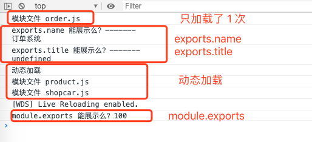
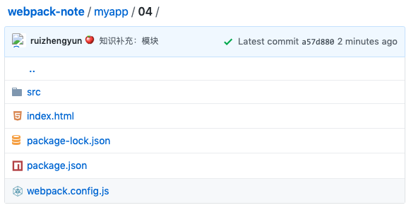
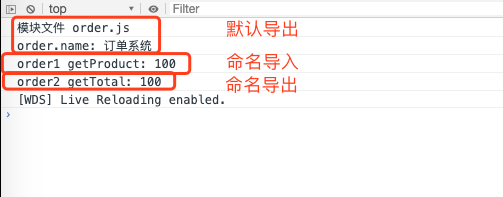
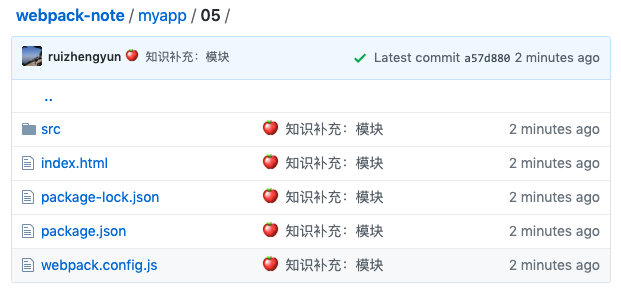
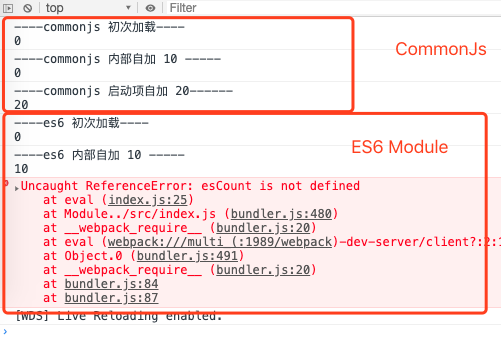
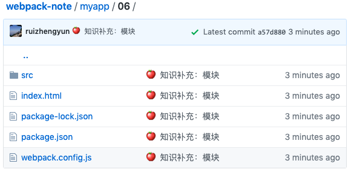
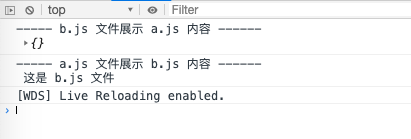
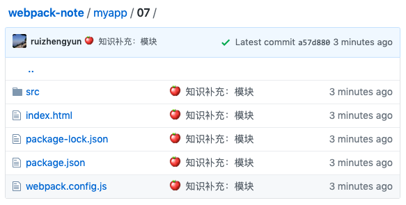
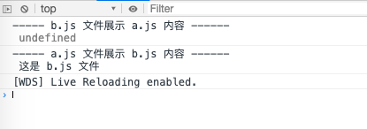
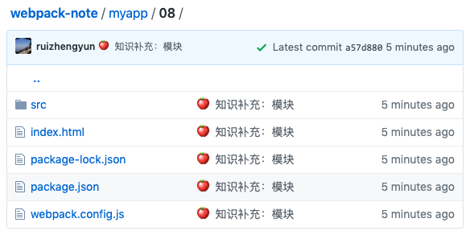

# 模块

## CommonJs

这块标准是在 2009 年提出来的，包含模块、IO、文件等。经过 Node.js 采用并做调整，所以说起 CommonJS 通常是 Node.js 中的版本了。在使用 Node.js 包管理器的年代，CommonJs 成为一颗有流量的明星了。

### 自身作用域

CommonJs 的模块天然有自身的作用域，所有变量和函数声明只能自己访问，外人想都别想，这个保护机制太 nice 了。

```js
// order.js
const name = '订单系统';
```

```js
// index.js
const name = '首页';
require('./order.js');
console.log(`------\n${name}`);
```

### 导出机制

模块对外暴露的方式。对于要暴露的内容可使用 `module.exports` 来导出，其导出内容格式是一个对象。也可使用简化形式 `exports`

```js
// module.exports.js
module.exports = {
  name: '订单系统',
  total: (a, b) => {
    return (a * b);
  }
}
```

```js
// exports.js
exports.name = '订单系统';
exports.total = (a, b) => {
  return (a * b);
}
```

上面两种所要表达的功能是一样的，内在逻辑是 `exports` 指向 `module.exports`，`module.exports` 是初始化时建的一个空对象。所以**千万不要直接给 `exports` 赋值，还有 `module.exports` 和 `exports` 不要并存**。上面第二个文件 `exports.js` 可这么来理解：

```js
// 初始化（便于理解 exports 与 module.exports 的关系）
const module = {
  exports: {}
};
const exports = module.exports;

// exports.js
exports.name = '订单系统';
exports.total = (a, b) => {
  return (a, b);
}
```

### 导入机制

通过 `require` 导入。

```js
// 04/src/order.js
console.log('模块文件 order.js');

exports.name = 'order name';

module.exports = {
  name: '订单系统',
  total: (a, b) => {
    return a * b;
  }
};

exports.title = 'order title';
```

```js
// 04/src/index.js
const title = require('./order.js').title;
const name = require('./order.js').name;

console.log(`exports.name 能展示么？-------\n${name}`);

console.log(`exports.title 能展示么？-------\n${title}`);

const total = require('./order.js').total;
setTimeout(function() {
  console.log(`module.exports 能展示么？${total(10, 10)}`);
}, 3000);

console.log('动态加载');
const modulesName = ['product.js', 'shopcar.js'];
modulesName.forEach(name => {
  require(`./${name}`).name();
});
```

1.**缓存加载**，第二次导入文件时，无需加载，因为第一次导入已经加载过了，第二次直接使用上次导入的结果；
发现没有？`这是 order.js 文件` 这个通知在控制台里面只打印了一次，而文件 `order.js` 实打实的引入了两次。其**原理是**：我们已经知道导出文件有 `module` 这个对象，我们可能不知道的是这个对象有 `loaded` 这么个属性（记录模块是否被夹在过），其默认值是 `false`，即没有加载过。当该模块第一次被加载后，`loaded` 值会变为 `true`，所以第二次引入该模块就不会加载该模块了。

2.加载模块支持动态加载；

3.`exports` 和 `module.exports` 不要混合使用，否则 `exports` 会失效哦；



完整代码可[查看目录 04 =>O(∩_∩)O~](https://github.com/ruizhengyun/webpack-note/tree/master/myapp/04)



## ES6 Module

ES6 Module 同样是将每个文件作为一个模块，模块自身有其作用域。所不同的是，引入了关键字 `import`（导入）和 `exports` (导出)，例子还是前面的例子，语法糖发生了变化。


### 导出机制

1.默认导出，上面例子我们都已接触过了。不过每次只能导出一个，可直接导出对象、字符串、函数等。

```js
// 导出字符串
export default '订单系统';
```

```js
// 导出对象，05/src/order.js
console.log('模块文件 order.js');

export default {
  name: '订单系统',
  total: (a, b) => {
    return a * b;
  }
};
```

2.命名导出，可使用关键字 `as` 对导出变量重命名。

```js
// 方式一，05/src/order1.js
export const name = '订单系统1';

export const total = (a, b) => {
  return a * b;
};
```

```js
// 方式二，，05/src/order2.js
const name = '订单系统2';

const total = (a, b) => {
  return a * b;
};

export { name, total as getTotal };
```

### 导入机制

使用关键字 `import` 导入，也可使用关键字 `as` 对导入变量重命名，也可使用 `as` 将导入变量的属性添加到后面对象（`order1`）中。

```js
// 方式一
import { name, total as getProduct } from './order1';
```

```js
// 方式二
import * as order2 from './order2';
```

### 示例

```js
// 05/src/index.js
import order from './order';
import { total as getProduct } from './order1';
import * as order2 from './order2';

console.log(`order.name: ${order.name}`);
console.log(`order1 getProduct: ${getProduct(10, 10)}`);
console.log(`order2 getTotal: ${order2.getTotal(10, 10)}`);
```



完整代码可[查看目录 05 =>O(∩_∩)O~](https://github.com/ruizhengyun/webpack-note/tree/master/myapp/05)



## CommonJS 与 ES6 Module

两者本质区别在于：**CommonJS 对模块依赖是“动态”的，ES6 Module 是“静态”的**。

1.**动态**，模块依赖关系是在代码**运行**阶段

- `require` 路径可动态指定;
- 支持表达式动判断加载某个模块；

2.**静态**，模块依赖关系是在代码**编译**阶段

- 导入、导出语句是声明式的；
- 路径不支持表达式；
- 导入和导出语句必须位于模块的顶层作用域（不能放在 if 语句中）；

### ES6 Module 优势

咋一看，CommonJS 完美 KO ES6 Module 的方式。可事实并非如此，ES6 Module 这种“静态”方式有优势：

- **僵尸代码检测和排除，减小资源打包体积**。即用静态分析工具检测模块或接口中哪些没有被调用过（比如某个组件只用了部分功能，但有可能所有代码都被加载进来了），这些加载进来未被调用的代码就是僵尸代码。静态分析可以在打包时将这些僵尸代码去掉，减小资源打包体积；
- **编译器优化**，动态模块的导入是一个对象，而 ES6 Module 可直接导入变量，减少引用层级，提高程序效率；

### 值拷贝和动态映射

场景：导入一个模块时，不同模块模式是不一样的。

- CommonJS 是值拷贝，可编辑;
- ES6 Module 是址引用，即映射，只读，即不可编辑； 

```js
// 06/src/commonJs.js
let csCount = 0;

module.exports = {
  csCount,
  csCountAdd: () => {
    csCount += 10;
  }
};
```

```js
// 06/src/es6-module.js
let esCount = 0;
const esCountAdd = () => {
  esCount += 10;
};

export { esCount, esCountAdd };
```

```js
// 06/src/index.js
// CommonJS Module
let csCount = require('./commonJs').csCount;
let csCountAdd = require('./commonJs').csCountAdd;

console.log(`----commonjs 初次加载----\n${csCount}`);
csCountAdd();
console.log(`----commonjs 内部自加 10 -----\n${csCount}`);
csCount += 20;
console.log(`----commonjs 启动项自加 20------\n${csCount}`);

// Es6 Module
import { esCount, esCountAdd } from './es6-module.js';
console.log(`----es6 初次加载----\n${esCount}`);
esCountAdd();
console.log(`----es6 内部自加 10 -----\n${esCount}`);
esCount += 20;
console.log(`----es6 启动项自加 20------\n${esCount}`);
```



通过例子及上图运行结果，可剖析

- CommonJs 是一份值的拷贝，虽然调用了 `csCount()`，但是并没有造成在文件 `index.js` 中副本（`csCount`）的影响；而副本（`csCount`）在文件 `index.js` 中可更改；
- ES6 是一份值的动态映射，调用了 `esCount()`，文件 `index.js` 中副本（`esCount`）的也随之变化；而副本（`esCount`）在文件 `index.js` 中是不可更改，即是只读的；


完整代码可[查看目录 06 =>O(∩_∩)O~](https://github.com/ruizhengyun/webpack-note/tree/master/myapp/06)




## 循环依赖

通常工程中是应该尽量避免这种恶心的循环依赖的产生，因为会带来复杂度。可尽管我们知道这是不好的，也理性地避免发生。但链条长了，业务多了，人员多了，还是不知不觉中“造孽般地”写出这样的代码。

场景: A 依赖 B，B 依赖 C，C 依赖 D，D 依赖 A。其实 A 与 B 就互相依赖了。

### CommonJs Module

```js
// 07/src/a.js
const fileB = require('./b.js');
console.log(`----- a.js 文件展示 b.js 内容 ------\n`, fileB);

module.exports = '这是 a.js 文件';
```

```js
// 07/src/b.js
const fileA = require('./a.js');
console.log(`----- b.js 文件展示 a.js 内容 ------\n`, fileA);

module.exports = '这是 b.js 文件';
```

```js
// 07/src/index.js
require('./a.js');
```

我们脑海中自运行结果是

```js
----- b.js 文件展示 a.js 内容 ------
 这是 a.js 文件
----- a.js 文件展示 b.js 内容 ------
 这是 b.js 文件
```

可控制台是



反复检查了代码，没错啊，可本该显示 `这是 a.js 文件`，为何展示 `{}`？不行，我还是要好好捋一捋

- 文件 `index.js` 导入文件 `a.js`，开始执行文件 `a.js`，第一行导入文件 `b.js`，此时进入文件 `b.js` 内部；
- 文件 `b.js` 第一行又导入文件 `a.js`，循环依赖由此产生。这时执行权并没有交回给文件 `a.js`，而是直接取导出值，此刻文件 `a.js` 还未执行技结束，导出值就默认为空对象，因此文件 `b.js` 执行打印语句时，显示 `----- b.js 文件展示 a.js 内容 ------ {}`;
- 文件 `b.js` 执行结束了，执行权接着交回给文件 `a.js`， 文件 `a.js` 继续执行第二行，然后在控制台打印 `----- a.js 文件展示 b.js 内容 ------ 这是 b.js 文件`。至此，这个流程结束；

完整代码可[查看目录 07 =>O(∩_∩)O~](https://github.com/ruizhengyun/webpack-note/tree/master/myapp/07)



### ES6 Module


```js
// 08/src/a.js
import fileB from './b.js';
console.log(`----- a.js 文件展示 b.js 内容 ------\n`, fileB);

export default '这是 a.js 文件';
```

```js
// 08/src/b.js
import fileA from './a.js';
console.log(`----- b.js 文件展示 a.js 内容 ------\n`, fileA);

export default '这是 b.js 文件';
```

```js
// 07/src/index.js
import a from './a.js';
```

我们脑海中自运行结果自然也是

```js
----- b.js 文件展示 a.js 内容 ------
 这是 a.js 文件
----- a.js 文件展示 b.js 内容 ------
 这是 b.js 文件
```

可控制台是




完整代码可[查看目录 08 =>O(∩_∩)O~](https://github.com/ruizhengyun/webpack-note/tree/master/myapp/08)



我晕，还是不对，这次不是空对象了，却是 `undefined`。那循环依赖该如何解决呢？


## 非模块化文件

说完 CommonJs 模块和 ES6 Module 形式，有些时候我们还需知道如何处理如 AMD、UMD 这类使用不多的模块。这类模块最常见的就是在 script 标签中引入的 jQuery 及其各种插件。可直接引入，这样会直接执行 `jquery.min.js`，其接口直接绑定在全局。

```js
import 'jquery.min.js';
```

## AMD

异步模块定义，Asynchronous Module Definition。社区提出主要是专注于支持浏览器端模块化的标准。与 CommonJS 和 ES6 Module 加载区别在于它的方式是**异步的**。

### 导出

```js
define('getSum', ['calc'], function(){
  return function(a, b) {
    console.log('求和', clac.add(a, b));
  }
})
```

- 定义模块使用 `defined`，接收 3 个参数；
- 第 1 个参数是模块 id，即模块名 `getSum`;
- 第 2 个参数是模块依赖，比如上面模块依赖模块 `calc`；
- 第 3 个参数是描述模块的导出值，函数或对象；

### 导入

和 CommonJS 导入类似，使用 `require`，只不过采用的是异步形式。

```js
require(['getSum'], function(getSum) {
  var sum = getSum(1, 1);
});
```

- 第 1 个参数是加载模块；
- 第 2 个参数是加载模块后执行的回调函数；

### 优劣势

模块加载是非阻塞的，即执行到 `require` 函数不会停止执行后面的代码，也就不会阻塞浏览器。虽然设计思想理念很好，但是写法冗长不易阅读，也易造成回调地狱（callback hell），所以现在 AMD 形式出现的越来越少，更多还是使用 CommonJs 或 ES6 Module 形式。

## UMD

通用模块标准，Universal Module Definition。严格来说，它不能是一种模块标准，而是一组模块的集合。功能是使一个模块能运行在各种环境下（ES6 Module 还未成为正式标准，就没带 ES6 Module 玩）（CommonJS、AMD、非模块化）。看个示例就知道怎么一回事了。

```js
(function(global, main) {
  // 根据模块环境采用不同的导出机制
  if(typeof define === 'function' && define.amd) {
    // AMD
    define();
  } else if(typeof exports === 'object') {
    // CommonJS
    module.exports = {};
  } else {
    // 非模块化
    global.add = function() {};
  }
}(this, function(){
  // 定义模块主体
  return {}
}))();
```

一眼就可以看出，UMD 其本质就是根据当前全局对象中的值判断目前处于何种模块环境。
