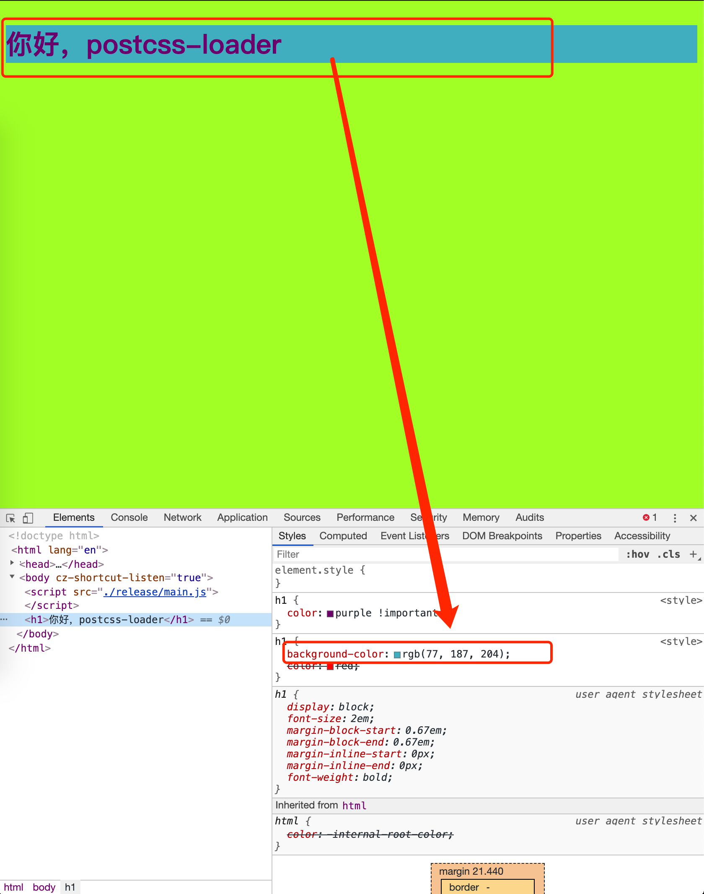
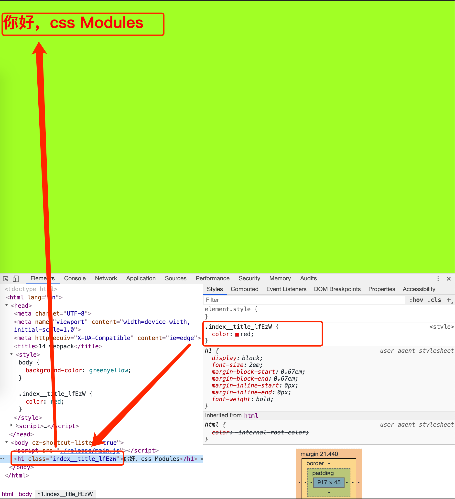

# 样式处理

提起前端，主要围绕处理的就是 HTML、CSS 和 JS。那本篇就说说样式在 Webpack 的配置的一些骚操作。

## 样式预处理

实际开发中，我们不一定会使用 css，为了提高效率降低开发和维护成本，我们会使用预编译语言，比如 scss、less 等，项目打包过程中再将预编译语言装换为 css。

### sass 与 scss

现在使用更多的是 scss，所以文件后缀是 .scss，但是其加载器是 sass-loader，主要起到粘合作用，真正编译 .scss 文件的是 node-sass。

1.安装包

```js
npm install sass-loader node-sass -D
```

2.配置

```js
module.exports = {
  module: {
    rules: [
      {
        test: /\.scss$/,
        use: ['style-loader', {
          loader: 'css-loader',
          options: {
            sourceMap: true
          }
        }, {
          loader:'sass-loader',
          options: {
            sourceMap: true
          }
        }]
      }
    ]
  }
}
```

> 注意，为了能在浏览器的调试工具查看源码，在配置 sass-loader 和 css-loader 的 options 中添加了 sourceMap 配置；

完整代码可[查看目录 10 =>O(∩_∩)O~](https://github.com/ruizhengyun/webpack-note/tree/master/myapp/10)

### less

less 也是对 css 的扩展，和 scss 类似。另外需要安装包 less。

1.安装包

```js
npm install less-loader less -D
```

2.配置

```js
module.exports = {
  module: {
    rules: [
      {
        test: /\.less$/,
        use: [
          'style-loader',
          {
            loader: 'css-loader',
            options: {
              sourceMap: true
            }
          },
          {
            loader: 'less-loader',
            options: {
              sourceMap: true
            }
          }
        ]
      }
    ]
  }
};
```

完整代码可[查看目录 11 =>O(∩_∩)O~](https://github.com/ruizhengyun/webpack-note/tree/master/myapp/11)

## PostCss

它不算是 css 预编译器，而是一个编译插件的容器。主要是接收样式源代码，然后交给编译插件处理，最后输出 css。可以指定一些插件实现一些特定功能。

1.安装包

```js
npm install postcss-loader autoprefixer stylelint -D
```

2.配置

```js
const stylelint = require('stylelint');

module.exports = {
  module: {
    rules: [
      {
        test: /\.css$/,
        use: ['style-loader', 'css-loader', 'postcss-loader']
      }
    ]
  },
  plugins: [
    stylelint({
      config: {
        rules: { 'declaration-no-important': true }
      }
    })
  ]
};
```

3.postcss 配置文件

```js
const autoprefixer = require('autoprefixer');

module.exports = {
  plugins: [
    autoprefixer({
      grid: true,
      browsers: ['> 1%', 'last 3 versions', 'android 4.2', 'ie8']
    })
  ]
};
```

- 上面使用了 style-loader、css-loader、postcss-loader。css-loader 可用也可不用，区别在于，单独使用 postcss-loader 时不建议使用 @import，应为会产生冗余代码。所以建议还是加上 css-loader；
- postcss 需要有单独配置文件 postcss.config.js，可以在里面添加特性，比如添加自动前缀 autoprefixer；
- autoprefixer 添加了支持 grid 特性和兼容浏览器配置；
- styleint，是 css 质量检测工具，和 eslint 一样。可以添加各类规则，从而统一代码风格，确保代码安全与质量；

4.css 文件

编辑 `src/index.css`

```css
body {
  display: grid;
  background-color: greenyellow;
}

h1 {
  color: red;
}

h1 {
  color: purple !important;
}
```

编译后

```css
body {
  display: -ms-grid;
  display: grid;
  background-color: greenyellow;
}

h1 {
  color: red;
}

h1 {
  color: purple !important;
}
```

### CSSNext

postcss 还可以结合使用 cssNext。

1.安装

```js
npm install postcss-cssnext -D
```

2.配置文件 `postcss.config.js`

```js
const postcssCssnext = require('postcss-cssnext');

module.exports = {
  plugins: [
    postcssCssnext({
      browsers: ['> 1%', 'last 2 versions']
    })
  ]
};
```

3.样式文件 `src/index.css`

```css
:root {
  --highlightColor: hwb(188, 30%, 20%);
}

h1 {
  background-color: var(--highlightColor);
  color: red;
}
```



完整代码可[查看目录 12 =>O(∩_∩)O~](https://github.com/ruizhengyun/webpack-note/tree/master/myapp/12)

## CSS Module

近来比较流行的开发模式，让 css 也模块化，支持

- 每个 css 文件模块化，不会有类名冲突；
- 依赖管理，通过相对路径引入 css 文件；
- 通过 composes 复用其他 css 模块；

1.安装
无需安装 loader

2.webpack 配置

```js
module: {
  rules: [
    {
      test: /\.css$/,
      use: [
        'style-loader',
        {
          loader: 'css-loader',
          options: {
            // 开启 CSS Modules
            modules: true,
            // 自定义生成的类名
            localIdentName: '[path][name]__[local]_[hash:base64:5]'
          }
        }
      ]
    }
  ]
}
```

3.文件 `src/index.css`

```css
body {
  background-color: greenyellow;
}

.title {
  color: red;
}
```

4.文件 `src/indec.js`

```js
import style from './index.css';

document.write(`<h1 class="${style.title}">你好，css Modules</h1>`);
```



- `[name]` 指代模块名，即文件 `index.css` 文件名 `index`；
- `[local]` 指代选择器标识符，即类名 `.title` 的名称 `title`;
- `[hash:base:5]` 指代一个 5 位的 hash 值，hash 是更具模块名和标识符计算的，因此不同模块相同的标识符也不会覆盖有命名冲突；

> 注意，css-loader 用的不是最新版本，最新版本有点问题，为了演示，版本降到 css-laoder@2.1.1。

完整代码可[查看目录 13 =>O(∩_∩)O~](https://github.com/ruizhengyun/webpack-note/tree/master/myapp/13)

## 提取样式

前面文章提过 style-loader 和 css-loader，通过 js 引用 css 文件打包，同时可以清晰看出模块间的依赖、高内聚编写提高效率也便于后期代码维护。

前面的方式是在 HTML 文件添加 style 标签方式添加样式，毕竟在生产环境，我们还是要把样式存于 css 文件中而不是 style 标签中，这样有利于客户端进行缓存处理，那如何使用单独的 css 文件？这就涉及到样式提取了，看看下面两个插件，其中 extract-text-webpack-plugin 应用在 webpack4 之前版本中，示例就不演示了，mini-css-extract-plugin 应用在 webpack4 版本及以上，本文有示例。

### extract-text-webpack-plugin

1.安装包

```js
npm install extract-text-webpack-plugin
```

2.单个样式配置

```js
const ExtractTextPlugin = require('extract-text-webpack-plugin');

module.exports = {
  entry: './src/index.js',
  output: {
    filename: 'bundle.js'
  },
  mode: 'development',
  module: {
    rules: [
      {
        test: /\.css$/,
        use: ExtractTextPlugin.extract({
          fallback: 'style-loader',
          use: 'css-loader'
        })
      }
    ]
  },
  plugins: [
    new ExtractTextPlugin('bundle.css')
  ]
};
```

- 配置 css 的模块规则使用的是 ExtractTextPlugin；
- use.fallback，指定当插件无法提取样式时要使用的 loader；
- use.use，指定提取样式前要采用的 loader 预先处理；
- plugins 配置添加该插件，传入提取后的资源文件名；

> plugin，插件机制，是一个数组，可以使用 webpack 提供的各类 API，也可以使用外部插件。其功能是在打包的各环节添加一些额外任务。

3.多样式配置

我们知道 chunk 是对一组有依赖关系的模块的封装。

```js
const ExtractTextPlugin = require('extract-text-webpack-plugin');

module.exports = {
  entry: {
    pageA: './src/srcipts/pageA.js',
    pageB: './src/srcipts/pageB.js'
  },
  output: {
    filename: '[name].js'
  },
  mode: 'development',
  module: {
    rules: [
      {
        test: /\.css$/,
        use: ExtractTextPlugin.extract({
          fallback: 'style-loader',
          use: 'css-loader'
        })
      }
    ]
  },
  plugins: [
    new ExtractTextPlugin('[name].css')
  ]
};
```

- `[name].css` 动态生成 css 文件，其中 name 就是 chunk 的名字； 

### mini-css-extract-plugin

它是 extract-text-webpack-plugin 的升级版，有更多的特性和更好的性能。

1.安装包

```js
npm install mini-css-extract-plugin -D
```

2.配置

```js
const MiniCssExtractPlugin = require('mini-css-extract-plugin');

module.exports = {
  entry: './src/index.js',
  output: {
    filename: '[name].js'
  },
  mode: 'development',
  devServer: {
    publicPath: '/release',
    port: 1989,
    open: true
  },
  module: {
    rules: [
      {
        test: /\.css$/,
        use: [
          {
            loader: MiniCssExtractPlugin.loader,
            options: {
              publicPath: '../'
            }
          },
          'css-loader'
        ]
      }
    ]
  },
  plugins: [
    new MiniCssExtractPlugin({
      filename: '[name].css',
      chunkFilename: '[id].css'
    })
  ]
};
```

extract-text-webpack-plugin 和 mini-css-extract-plugin 区别有：

- loader 规则不同，后者支持配置 publicPath，指定异步 css 的加载路径； 
- 后者不需要设置 fallback；
- plugins 配置中，后者除了指定同步加载 css 资源名（filename），还要指定异步加载 css 资源名（chunkFilename）；

完整代码可[查看目录 14 =>O(∩_∩)O~](https://github.com/ruizhengyun/webpack-note/tree/master/myapp/14)
