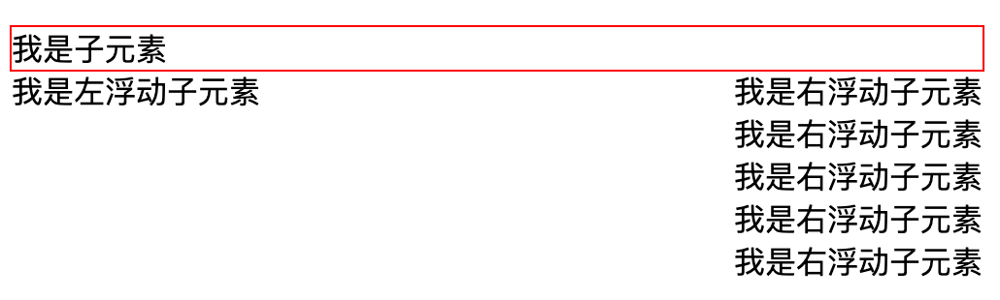

# 布局

## 浮动（float）知识点

浮动主要考察为什么清除浮动和如何清除浮动的问题。

浮动场景：通常对于块级元素我们是不设置高度的（天知道以后会不会加内容，另外设置了高度会带来显示问题），块级元素的高度是靠子元素内容撑开的。这时，子元素设置浮动，子元素就会脱离文档流，此时父元素的高度就不能靠子元素内容撑开了，就会出现显示（体验）问题。

清除浮动是为了解决页面父元素高度塌陷的问题。如何清除呢，这才是我关心的

### 使用 `overflow: hidden`（在父元素操作）

```css
.clearfix {
    overflow: hidden;
}
```

副作用是**离开了这个元素所在的区域以后会被隐藏（ `overflow:hidden` 会将超出的部分隐藏起来）**，不推荐。。

### 添加一个标签

在父元素里面加一个标签，标签样式

```css
.clear {
    clear: both;
}
```

副作用就是添加了一个无用标签，不推荐。

### 使用伪元素来清除浮动

```css
.clearfix {
    zoom: 1; // 为了兼容IE
}
.clearfix: after {
    content: "";
    display: block;
    clear: both;
    height: 0;
    line-height: 0;
    visibility: hidden;
}
```

### 使用双伪元素清除浮动

```css
.clearfix {
    zoom: 1; // 为了兼容IE
}
.clearfix:before,.clearfix:after {
    content: "";
    display: block;
    clear: both;
}
```

<table style="border: 0; background-color: #fff;">
    <tr style="border: 0;">
        <td style="border: 0;">
            
            <p style="text-align: center;">清浮动前</p>
        </td>
        <td style="border: 0;">
            
             <p style="text-align: center;">清浮动后</p>
        </td>
    </tr>
</table>

## 居中知识点

### 使用 flex

```css
.parent {
    width: 520px;
    height: 260px;
    background-color: green;
    display: flex;
    justify-content: center;
    align-items: center;
}

.child {
    background-color: pink;
    width: 300px;
    height: 150px;
}
```

### 使用 transform（css3 属性）

```css
.parent-transform {
    width: 520px;
    height: 260px;
    background-color: green;
    position: relative;
}

.child-transform {
    background-color: pink;
    width: 300px;
    height: 150px;
    position: absolute;
    top: 50%;
    left: 50%;
    transform: translate(-50%, -50%);
}
```

### 使用 `margin` 负值

```css
.parent-margin {
    width: 520px;
    height: 260px;
    background-color: green;
    position: relative;
}

.child-margin {
    background-color: pink;
    width: 300px;
    height: 150px;
    position: absolute;
    top: 50%;
    left: 50%;
    margin-top: -75px;
    margin-left: -150px;
}
```

### 使用 `poaboute` 和 `margin`

```css
.parent-absolute-margin {
    width: 520px;
    height: 260px;
    background-color: green;
    position: relative;
}

.child-absolute-margin {
    background-color: pink;
    width: 300px;
    height: 150px;
    position: absolute;
    top: 0;
    right: 0;
    bottom: 0;
    left: 0;
    margin: auto;
}
```

<table style="border: 0; background-color: #fff;">
    <tr style="border: 0;">
        <td style="border: 0;">
            <p style="text-align: center;"></p>
            <p style="text-align: center;">使用 flex</p>
        </td>
        <td style="border: 0;">
            <p style="text-align: center;"></p>
            <p style="text-align: center;">使用 transform</p>
        </td>
    </tr>
    <tr style="border: 0;">
        <td style="border: 0;">
            <p style="text-align: center;"></p>
            <p style="text-align: center;">使用 margin 负值</p>
        </td>
        <td style="border: 0;">
            <p style="text-align: center;"></p>
            <p style="text-align: center;">absoulte 和 margin</p>
        </td>
    </tr>
</table>

## 三栏布局

### 浮动对策

左右两栏浮动（脱离文档流），中间一栏通过 `margin` 左右值（左右两栏的宽度以及栏外间距）,别忘了清浮动

```css
.three-column-float {
    height: 200px;
    background-color: #ddd;
}

.float-left {
    float: left;
    width: 300px;
    height: 100%;
    background-color: deepskyblue;
}

.float-right {
    float: right;
    width: 300px;
    height: 100%;
    background-color: pink;
}
.float-center {
    height: 100%;
    margin: 0 320px;
}
```

### 绝对定位对策

左右两栏绝对定位（脱离文档流），中间一栏通过 `margin` 左右值（左右两栏的宽度以及栏外间距）

```css
.three-column-absolute {
    position: relative;
    height: 200px;
    background-color: #ddd;
}

.absolute-left {
    position: absolute;
    left: 0;
    top: 0;
    width: 300px;
    height: 100%;
    background-color:deepskyblue;
}

.absolute-right {
    position: absolute;
    top: 0;
    right: 0;
    width: 300px;
    height: 100%;
    background-color: pink;
}

.absolute-center {
    height: 100%;
    margin: 0 320px;
}
```

<table style="border: 0; background-color: #fff;">
    <tr style="border: 0;">
        <td style="border: 0;">
            <p style="text-align: center;"></p>
            <p style="text-align: center;">浮动对策</p>
        </td>
        <td style="border: 0;">
            <p style="text-align: center;"></p>
            <p style="text-align: center;">绝对定位对策</p>
        </td>
    </tr>
</table>

[本次代码 Github](https://github.com/ruizhengyun/interview-note/tree/feature_20190704_0.0.1/notes/0.0.1)
