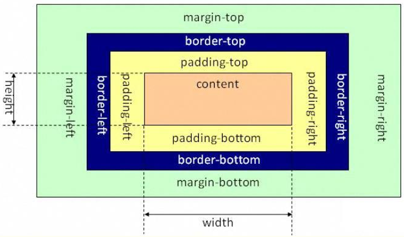
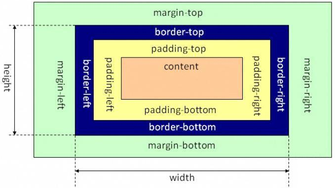

# 盒子模型

主要考察**标准 W3C 盒子模型与 IE 盒子模型**中，属性 `width、height` 与 属性 `content`、`border值` 和 `padding值` 的关系，以 `width` 举例。 

- 标准 W3C 盒子模型，`width` = `content width`；
- IE盒子模型，`width` = `content width` + `border 左右值` + `padding 左右值`；

<table style="border: 0; background-color: #fff;">
    <tr style="border: 0;">
        <td style="border: 0;">
            
            <p style="text-align: center;">标准 W3C 盒子模型</p>
        </td>
        <td style="border: 0;">
            
             <p style="text-align: center;">IE 盒子模型</p>
        </td>
    </tr>
</table>


# `margin` 与 `padding` 等的技巧写法

考察对这类写法技巧的熟悉情况

- 四个值一样 `padding: 24px;`;
- 上下值一样、左右值一样 `padding: 12px 24px`（上下值 `12px`，左右值 `24px`）;
- 上下值不一样、左右值一样 `padding: 12px 24px 0`（上值 `12px`，左右值 `24px`，下值 `0`，值为 `0` 可省略单位）;
- 上下值和左右值都不一样 `padding: 12px 24px 24px 12px`;
- 上下值一样，左右值不一样（这个还真没有），这个主要是写法顺序上实现不了，因为正常赋值顺序是**上右下左**，最有一个是左，如果哪天标准变成 **右下左上**，那就可以了，哈哈；


# display 有哪些值，有何作用

| 值           | 作用                                                                       |
| :----------- | :------------------------------------------------------------------------- |
| block        | 块级元素，独占一行                                                         |
| inline       | 默认。内联元素，以和为贵，共用一行                                         |
| inline-block | 行内块元素，CSS2.1 新增的值。除了不能独占一行，拥有 `block` 块级元素的属性 |
| none         | 元素隐藏，不展示                                                           |
| list-item    | 元素呈列表展示                                                             |
| flex         | 弹性容器                                                                   |

# position 有哪些值，有何作用

| 值       | 作用                                                                                   |
| :------- | :------------------------------------------------------------------------------------- |
| static   | 默认值。无定位，元素处于正常的文档流中，此时忽略 `top、bottom、left、right 和 z-index` |
| inherit  | 继承父元素 `position` 的值                                                             |
| relative | 相对（正常位置）定位，可设置 `top、bottom、left、right 和 z-index`                     |
| absolute | 绝对定位，脱离文档流，可设置 `top、bottom、left、right 和 z-index`                     |
| fixed    | 绝对定位，脱离文档流，相对于浏览器窗口，可设置 `top、bottom、left、right 和 z-index`   |

# 标签元素在浏览器中不显示的几种方法

| 设置                | 作用                                                           |
| :------------------ | :------------------------------------------------------------- |
| `opacity: 0`        | 无副作用，不会改变布局，绑定了事件是会触发的                   |
| `visibility:hidden` | 无副作用，不会改变布局，绑定了事件不会触发                     |
| `display:node`      | 有作用，会改变布局，可理解为移除了元素，当然就无事件触发这一说 |


# CSS 选择器优先级

- 相同场景下：**后者覆盖前者设置的属性值**；

- 不同场景的（应该是最全的了吧）：**!important > 行间样式 > id 选择器 > 类选择器 > 标签 > 通配符 > 继承 > 浏览器默认属性**；

# CSS 实现一个三角形

以倒三角为例吧，倒三角是**上有宽度，下无宽度，左右虚宽**。所以这么设置
<p style="width: 0; height: 0; font-size: 0; border-top: 16px solid green; border-left: 16px solid transparent; border-right: 16px solid transparent;"></p>

- 上边框设置非透明；
- 下边框不做设置；
- 左右边框设置为透明；

```css
.triangle {
  	width: 0;
    height: 0;
    font-size: 0;
    border-top: 16px solid green;
    border-left: 16px solid transparent;
    border-right: 16px solid transparent;
}
```

[本次代码 Github](https://github.com/ruizhengyun/interview-note/tree/feature_20190704_0.0.1/notes/0.0.1)
