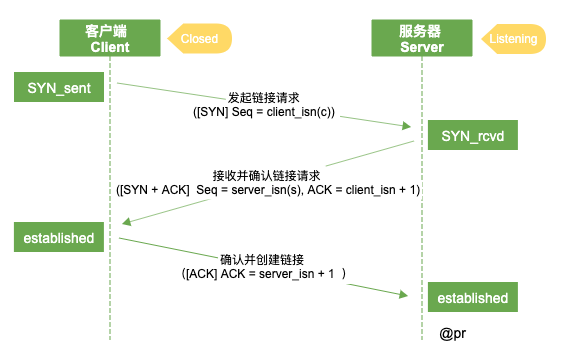

# HTTP 

## 名词解释

- SYN, synchronous 建立联机，同时发生(或存在)的，同步的，共时的，
- SYN_sent: syn package has been sent syn 报文包 SYN 已经发送
- SYN_rcvd: syn package has been received 报文包 SYN 已经接收到
- ACK, acknowledgement 确认
- Seq, Sequence number 顺序号码, 序列号
- establised，已建立
  
## 三次握手

客户端向服务端请求和返回的过程中，需要创建一个 TCP 链接。由于 http 只负责请求和响应一个数据包，不存在链接，而这个链接需要一个传输通道支持，所以就在 TCP 里面创建了这么一个从客户端发起和服务端接收的一个链接，创建过程中经历三次握手（三次网络传输）。

### 时序图

### 握手过程解析

刚开始服务端处于 listening 状态，客户端处于 closed 的状态。接着

- **第一次握手**，客户端主动向服务器发送报文 [SYN](Seq = client_isn(c)), 客户端处于 SYN_send 状态;
- **第二次握手**，服务器被动打开，收到 [SYN]，发送（响应）到客户端 [SYN + ACK](Seq = server_isn(s),ACK = 客户端 Seq + 1 = client_isn(c) + 1), 服务器处于 SYN_revd 的状态;
- **第三次握手**，客户端收到 [SYN + ACK]，检查 ACK 若正确会发送（响应）到服务器 [ACK](ACK = 服务器的 Seq + 1 = server_isn(s) + 1)，客户端处于 establised 状态；服务器收到 [ACK], 检查 ACK 若正确，处于 establised 状态; 此刻，链接建立成功；

### 为什么要三次

1、确认客户端和服务端的接收和发送是否正常；
2、双方指定初始化序列号，为后面的包传输做检查准备；
3、如果是 https 协议，这个过程还会进行数字证书验证和加密密钥的生成；
